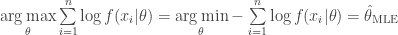

<!--yml

category: 未分类

date: 2024-05-18 13:50:57

-->

# 为什么要最小化负对数似然？ | Quantivity

> 来源：[`quantivity.wordpress.com/2011/05/23/why-minimize-negative-log-likelihood/#0001-01-01`](https://quantivity.wordpress.com/2011/05/23/why-minimize-negative-log-likelihood/#0001-01-01)

机器学习的奇妙之一是它来源于多样化的不同传统，从经典统计学（频率论和贝叶斯论）到信息和控制理论，再加上来自计算机科学的相当大的实用主义。对于那些对统计学和机器学习之间的历史关系感兴趣的人，可以参考布雷曼的[两种文化](http://www.stat.osu.edu/~bli/dmsl/papers/Breiman.pdf)。

这种多样性反映在回答听起来简单的问题时*令人惊讶的复杂性*中，这经常涉及到使用计算机机器学习模型进行交易的核心——从通过 MLE 估计 HMM 模型（*例如*波动率/相关性制度模型）到通过非标准似然或损失函数进行非凸优化（*例如*通过[omega](http://finance.yendor.com/etfviz/2007/0928/Omega-intro.pdf)进行组合优化）：

> 为什么最小化负对数似然等价于最大似然估计（MLE）？

或者，换句话说，在贝叶斯语境中：

> 为什么最小化负对数似然等价于给定均匀先验情况下的最大后验概率（MAP）？

回答这个问题可以揭示机器学习基础，以及与几个数学分支的联系。

经典统计学揭示了答案，从似然函数的定义开始：

在这种情况下应用自然对数函数很方便，有几个原因。首先，数值分析提醒我们，由于可能存在非常小的可能性，对数减少了下溢的可能性。其次，微积分提醒我们，对数允许进行加法技巧：将因子的乘积转换为因子的总和（正如以前在[为什么用对数收益？](https://quantivity.wordpress.com/2011/02/21/why-log-returns/)中看到的那样）。最后，微积分再次提醒我们，自然对数函数是[单调变换](http://en.wikipedia.org/wiki/Monotone_transformation)。

因此，$\mathcal{L}$ 的极值等同于 $\log \mathcal{L}$ 的极值：

从中，最大似然估计器 $\hat{\theta}_{\textnormal{MLE}}$ 定义为：

顺便提一句，贝叶斯学派会提醒我们可以推广为一个 MAP 估计量，假设有均匀先验 ：

从中优化和实分析提醒我们以下等价性，对于所有 ：

因此，以下是等价的：

从这里，我们从技术上回答了上述两个等价性问题。然而，从这里开始，我们有机会继续，通过 [Kullback-Leibler divergence](http://en.wikipedia.org/wiki/Kullback%E2%80%93Leibler_divergence)（KL）揭示 MLE/MAP 与熵和损失之间的关系。为了达到这一点，考虑上述的统计*平均*：

由大数定律收敛到期望值：

![E[- \log f(x|\theta)] ](img/b8ac9258711173ed57fd070378fa01a4.png)

当考虑到  和其对应的真实参数  之间的*分布差异*时，这就很有趣了：

![E[\log f(x|\theta^*) - \log f(x|\theta)] = E[\log\frac{f(x|\theta^*)}{f(x|\theta)}] = \int \log \frac{f(x|\theta^*)}{f(x|\theta)} f(x|\theta^*) dx ](img/b78999766cb5815374665ffde632aa21.png)

这实际上等于无非是 KL 散度，，介于  和  之间：

这就是信息论提醒我们的相对熵，因此也等于由负对数似然定义的损失函数的过度风险。最后，将贝叶斯统计与信息论的基础联系起来：从先验到后验的 [Shannon entropy](http://en.wikipedia.org/wiki/Entropy_(information_theory)#Definition) 的增益确实是 KL 散度。

因此，*最大似然估计和最大后验概率是特殊的损失函数*（有关 ML 中损失语义的更多信息，请参阅 [Loss Function Semantics](http://hunch.net/?p=269)）。
