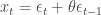
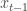
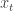
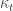
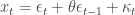
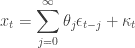
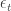
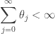

<!--yml

category: 未分类

date: 2024-05-18 13:54:39

-->

# Why Moving Averages | Quantivity

> 来源：[`quantivity.wordpress.com/2010/01/08/why-moving-averages/#0001-01-01`](https://quantivity.wordpress.com/2010/01/08/why-moving-averages/#0001-01-01)

[移动平均](http://en.wikipedia.org/wiki/Moving_average)是金融[计量经济学](http://en.wikipedia.org/wiki/Econometrics)中无处不在的工具，尤其在[技术分析](http://en.wikipedia.org/wiki/Technical_analysis)和[高频交易](http://en.wikipedia.org/wiki/High_frequency_trading)中占主导地位。鉴于这两个领域的复杂性，人们倾向于质疑，为什么像移动平均这样一个看似微不足道的统计技术会构成它们基础的核心。

其中一个解释是基于一个美妙的数学结果，对于构建交易系统具有重大意义。

考虑一阶标准移动平均：

这个模型与任何自身的时移版本之间的协方差都为零，除了（严格来说，与非单位滞后的[自协方差](http://en.wikipedia.org/wiki/Autocovariance)为零）。结合这一点，再加上一个线性的*deterministic*过程，其值可能为零：

现在，将移动平均滞后扩展到无限阶，同时保持零自协方差：

现在，根据这些最小的假设，*许多金融工具的价格序列可以用这样的来表示，特别是高频金融中的那些*（即零均值、自协方差平稳的[白噪声](http://en.wikipedia.org/wiki/White_noise)）。换句话说，许多价格序列是由精确的移动平均过程生成的。这是一个优雅而意想不到的理论结果。

注意，对于低频价格序列（例如日度数据）而言，与技术分析可信度有所损害：这一结论不太适用。低频和高频数据之间的这种差异再次回到了由[三骑士](https://quantivity.wordpress.com/2009/07/25/bias-stationarity-ergodicity/)引入的稳定性原则。

对于那些想深入研究的读者，上述内容的主要结果源自[Wold 定理](http://en.wikipedia.org/wiki/Wold%27s_theorem)和 Ansley、Spivey、以及 Wrobleski（[论移动平均价格的结构](http://econpapers.repec.org/article/eeeeconom/v_3a6_3ay_3a1977_3ai_3a1_3ap_3a121-134.htm)）。对于对高频交易感兴趣的人，Hasbrouck 在[经验市场微观结构](http://books.google.com/books?id=7U3Oo4ldKgYC&dq=empirical+market+microstructure&source=gbs_navlinks_s)中很好地涵盖了这一结果及其与[Roll 微观结构模型](http://www.jstor.org/pss/2327617)的关系。

技术读者应该注意，收敛需要对加一个合理的附加技术约束；即，移动平均权重必须是有限可求和的：

