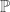

<!--yml

category: 未分类

date: 2024-05-18 13:48:38

-->

# 你没有阿尔法 | Quantivity

> 来源：[`quantivity.wordpress.com/2011/09/29/you-dont-have-alpha/#0001-01-01`](https://quantivity.wordpress.com/2011/09/29/you-dont-have-alpha/#0001-01-01)

[Gappy](http://twitter.com/gappy3000) 在一篇有思想的评论中指出 [P-Q Convergence](https://quantivity.wordpress.com/2011/09/21/p-q-convergence/)，认为  和  是一种“错误的二分法”，并引用标准金融博士教材上的现代资产定价（如 [Cochrane](http://books.google.com/books?id=20pmeMaKNwsC)、[Singleton](http://books.google.com/books?id=pbT66GtSn2QC) 和 [Duffie](http://books.google.com/books?id=f2Wv-LDpsoUC)）。这种说法激励 Quantivity 重新审视 [芝加哥学派](http://www.chicagobooth.edu/)，对于这个学术训练有素的从业者来说，很多年前就对其发展出了相当强烈的实用主义厌恶（例如，任何真实世界中的人都认真地相信折现股利/现金流模型，或者“因子”和“风格”存在异常吗？）。

这次重新审视导致了 Cochrane 最近在 [Discount Rates](http://faculty.chicagobooth.edu/john.cochrane/research/papers/discount_rates_jf.pdf) 上的 AFA 2011 主席致辞（也可在 [video](http://onlinevideoservice.com/clients/afa/2011/01082011-c.html) 上找到）。这个演讲与 French 在 2008 年关于 [The Cost of Active Investing](http://papers.ssrn.com/sol3/papers.cfm?abstract_id=1105775) 的主席致辞形成鲜明对比，后者在金融危机中大声捍卫被动投资的圣杯（想象一下在金融崩溃中不得不为此辩护）。

Cochrane 的讲话中包括现代金融史上*最佳引用之一*，值得每个认真从业者阅读（第 51 页）：

> 我试图告诉一个对冲基金经理：“你没有阿尔法。我可以用价值增长、动量、货币和期限携带，以及做空波动率的策略复制你的回报。”他说：“‘异国情调的β’就是我的α。我理解那些系统性因素，并且知道如何交易它们。你不懂。”他有一定道理。有多少投资者甚至考虑过自己对携带交易或短期波动率“系统性风险”的敞口，更别说有能力编写计算机来执行这样的策略作为“被动”的、机械化投资了？对于从未听说过它并持有市场指数的投资者来说，一个新因子就是α。而且那个α与信息效率无关。
> 
> 大多数积极管理和绩效评估已不再适用于阿尔法-贝塔、信息系统化、选择式分裂等分法。没有“阿尔法”。只有你了解的贝塔和你不了解的贝塔，以及你有意购买的贝塔与你已经暴露的贝塔之间的差异。

虽然 Quantivity 可能对科克兰的术语有异议，但这种观点与对冲基金朋友的观点并不相去甚远。简而言之：通过既定的系统化交易方法交易的制度敏感风险溢价获得异常收益。

虽然科克兰在他的发言中的目的是为该领域提出一个拟议的研究议程，但更有趣的阅读方式是通过一个前瞻性的量化从业者的视角。而不是为了不想破坏读者们自行解释这个发言的乐趣，在这里的评论仅限于一些观察：

+   **循环性**：盈利性交易可以归类为统一的*逻辑框架*，遵循一个循环的知识扩散曲线（风险溢价是最新的），新的想法从高盈利到商品化再到学术界的最终理论协调（可能根据 Gappy 的评论，最近基于基本回报的回归再次兴起）。

+   **不一致性**：支撑法玛-弗伦奇世界的金融业装置日益与框架演进不一致。

+   **拥挤现象**：深度对**策略拥挤**的量化分析（与经典行为兽群行为相对比）在当前商品化风险溢价策略的时代中可能是最有价值的。

+   **博客圈的演变**：许多优秀的金融博客（请参阅博客目录）致力于当前风险溢价框架中的单一策略，其盈利性将随着智力[规模收益](http://en.wikipedia.org/wiki/Returns_to_scale)的进一步下降而下降，由于更多的策略商品化和更多不满意的买入持有投资者转变为噪音交易者。

最后，所有这些观点都反映了 Quantivity 对于金融最终是一个*自我实现的预言*的信念：具有优势的交易更多地是大众所信仰的结果，而不是任何内在的计量经济学真理的衍生物。也许这也涉及到经济物理学：有规范的数学模型，但它们不是时不变的（但是，我们已经从[天真的回测是错误的](https://quantivity.wordpress.com/2009/08/16/naive-backtesting-is-bogus/)中知道了这一点）。

根据读者的兴趣，随后的文章可能会更详细地讨论影响。
