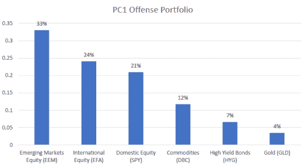
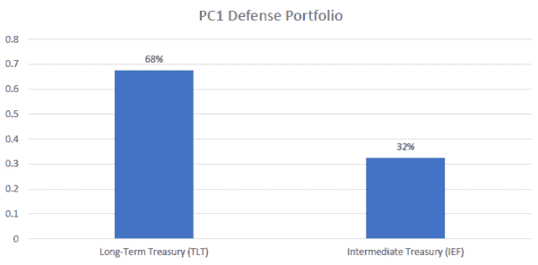
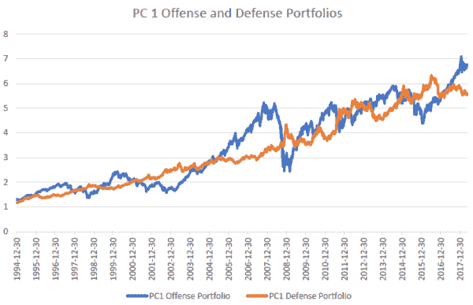
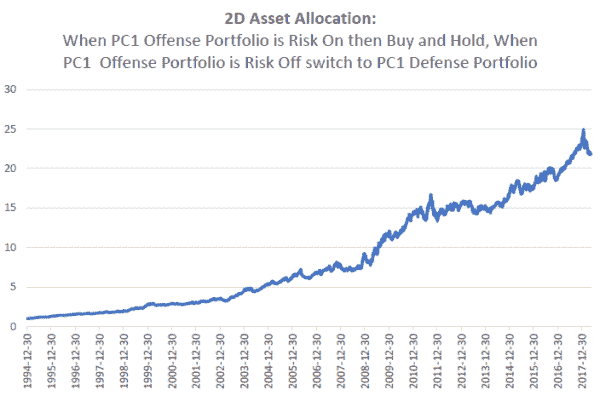
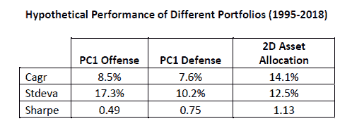

<!--yml
category: 未分类
date: 2024-05-12 17:43:51
-->

# “2D Asset Allocation” using PCA (Part 2) | CSSA

> 来源：[https://cssanalytics.wordpress.com/2018/08/21/2d-asset-allocation-using-pca-part-2/#0001-01-01](https://cssanalytics.wordpress.com/2018/08/21/2d-asset-allocation-using-pca-part-2/#0001-01-01)

In the last post we showed how to use PCA to create Offense and Defense portfolios by focusing on the first principal component or “PC1.” After rotation has been completed it is possible to derive weights or portfolios for each principal component. Another good primer on using PCA for asset allocation is written by a reader of the blog- Dr. Rufus Rankin. The link for this book is [here](https://amzn.to/2NH5XPz). We can separate the PC1 portfolio which represents broad systematic risk by dividing it into two dimensions- Offense (Risk On) and Defense (Risk Off)- by isolating positive versus negative weights. To form each portfolio you would simply take the absolute value of each weight and divide it by the sum of absolute values of weights for each of the Offense and Defense portfolio. In this example we will use 8 core asset classes for the sake of simplicity- Domestic Equity, Emerging Market Equity, International Equity, Commodities, High Yield Bonds, Gold, Intermediate Treasurys, Long-Term Treasurys. Here is the PC1 Offense Portfolio using the in sample period from 1995-2018 on various ETFs with extensions using indices:

This portfolio shows that some of the more aggressive asset classes such as emerging markets have the highest weighting, while international and domestic equity have nearly equal weightings. Equity overall has the highest weighting in the offense portfolio which is logical. Commodities take second spot while assets such as high yield bonds and gold have smaller weightings. In general this portfolio makes sense: for the most part when the market goes down and systematic risk is very high, all of these asset classes have a tendency to fall. However, during a bull market, these asset classes tend to do very well. In contrast when we look at the PC1 Defense Portfolio and it looks predictably like the opposite of the offense portfolio:

The PC1 Defense Portfolio has a high duration portfolio tilted toward long-term treasurys that has historically performed quite well during recessionary periods or other periods when systematic risk is high. The performance of both the PC 1 Offense and Defense Portfolios over time is plotted in the graph below.

In the graph we can clearly see the inverse correlation between the PC1 Offense and Defense Portfolios. Both obviously perform well at different times as we would expect. A simple tactical model would be to hold the PC1 Offense portfolio when systematic risk is low and to hold the PC1 Defense portfolio when risk is high. To do this we can simply use the 200-day simple moving average strategy on the PC1 Offense portfolio on a daily basis (generating an equity curve by using the weights of PC1 and rebalancing this portfolio monthly) and holding the PC1 Offense portfolio when risk is on- the equity curve is above its 200-day sma- and holding the PC1 Defense portfolio when risk is off- the equity curve of PC1 Offense is below its 200-day sma. We can give this simple strategy a name- “2D Asset Allocation”- which represents the two dimensions that we have separated the asset class universe into: Offense and Defense. The performance of this strategy is shown below:

The performance of this simple strategy is quite good, and manages to perform well even during the 2015 period which was difficult for traditional momentum/trend-following strategies. Below is a table showing the summary statistics. A good tactical strategy will ideally perform better than the buy and hold version of its underlying offense/defensive components over a full market cycle. Clearly the 2D Asset Allocation does substantially better than either component in isolation.

The best part about this strategy is that it was by no means “curve-fit” since the 200sma is a well-established strategy and is not the optimal strategy on the PC1 Offense portfolio. Using PCA to reduce dimensionality and derive this portfolio is a well-established statistical practice. The only caveat is that this portfolio was derived “in sample” which is less than ideal but no different than the starting place from which traditional system developers create trading strategies via backtests. Perhaps a better way to do this would be to using a rolling or anchored PCA analysis to derive the two portfolios instead on a walk forward basis. The choice of asset class universe in this case was designed to capture major asset classes, but the good thing about PCA is that you can use just about any asset class universe you want without introducing undue bias by choosing an arbitrary subset. In either case, this is a good example of how tactical asset allocation can be greatly simplified. Refinements to the strategy could include holding a minimum allocation to PC1 Defense for diversification purposes or potentially using momentum within the PC1 Offense and Defense portfolios to overweight/underweight different holdings. The possibilities are endless.

This material is for informational purposes only. It is not intended to serve as a substitute for personalized investment advice or as a recommendation or solicitation of any particular security, strategy or investment product. Opinions expressed are based on economic or market conditions at the time this material was written. Economies and markets fluctuate. Actual economic or market events may turn out differently than anticipated. Facts presented have been obtained from sources believed to be reliable, however, cannot guarantee the accuracy or completeness of such information, and certain information presented here may have been condensed or summarized from its original source.