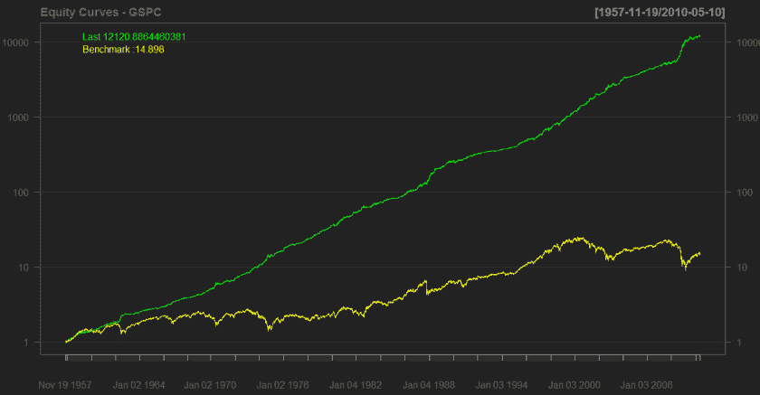
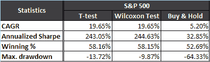

<!--yml
category: 未分类
date: 2024-05-18 14:03:23
-->

# (Part 2) Time Machine Test – Non-parametric Statistical Filter – Quantum Financier

> 来源：[https://quantumfinancier.wordpress.com/2010/05/11/part-2-time-machine-test-%e2%80%93-non-parametric-statistical-filter/#0001-01-01](https://quantumfinancier.wordpress.com/2010/05/11/part-2-time-machine-test-%e2%80%93-non-parametric-statistical-filter/#0001-01-01)

As promised yesterday, I tried a small change to the original “time machine” strategy first introduced by CSS Analytics. Now if you still have not, please go read these background articles on statistical filters and their importance in a trade system:

– [The Adaptive Time Machine: The Importance of Statistical Filters](http://cssanalytics.wordpress.com/2009/09/16/the-adaptive-time-machine-the-importance-of-statistical-filters/) – CSS Analytics

– [Transactional vs Confidence-based Trading Strategies](http://marketsci.wordpress.com/2009/04/01/transactional-vs-confidence-based-trading-strategies/) – MarketSci

In yesterday’s post, I used the student t-test approach to filter the significance of every of the 50 strategies the algorithm can choose from. As you may know, the Student’s t-distribution used to estimate the mean of a *normally distributed population.* Such an assumption on the distribution contradicts the kind of fat tail returns the market throws at us. To relax the normality assumption, one can use a non-parametric statistical test. Non-parametric statistics make fewer assumptions regarding the distribution of the underlying and therefore can be more robust, thus making a prime choice for the “Time Machine” algorithm. More reading on Wilcoxon signed-rank test can be found here: [http://en.wikipedia.org/wiki/Wilcoxon_signed-rank_test](http://en.wikipedia.org/wiki/Wilcoxon_signed-rank_test).

For this test, I used the Wilcoxon signed-rank test instead of the Student’s t-test to establish the significance of strategies. The results below are for the strategy using a 95% significance filter on the S&P 500.

The results obtained are not very different from the previous one. It is interesting to see that the maximum drawdown is smaller when using the Wilcoxon test. This is probably caused by the increased robustness of the statistical test. For the time being I will keep testing the algorithm on different equity indices and asset class stay tuned.

QF