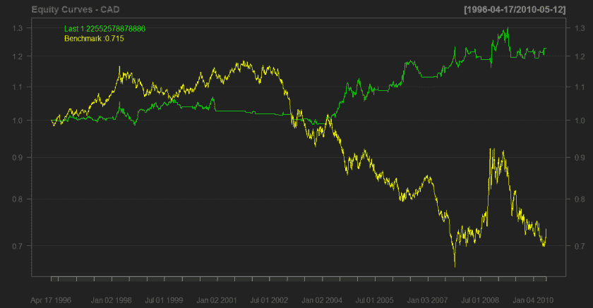
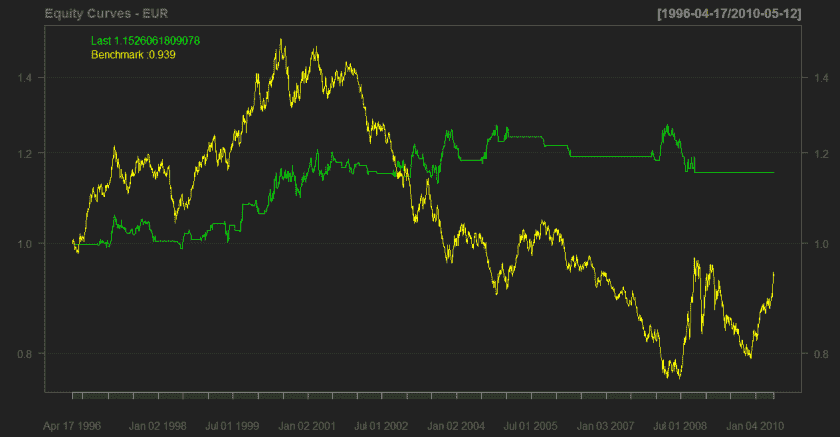
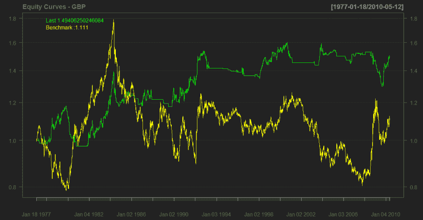
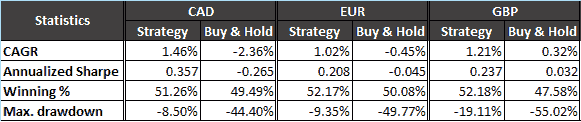

<!--yml
category: 未分类
date: 2024-05-18 14:03:32
-->

# (Part 3) Time Machine Test – Currencies – Quantum Financier

> 来源：[https://quantumfinancier.wordpress.com/2010/05/13/part-3-time-machine-test-currencies/#0001-01-01](https://quantumfinancier.wordpress.com/2010/05/13/part-3-time-machine-test-currencies/#0001-01-01)

*Edit: This is a repost of the previous version of the post for currencies and commodities. When adapting my code for Datastream data, I made an error, the code was peeking which explains the ridiculously straight equity curve. Here is the corrected version of the post. I sincerely apologize to readers for the inconvenience. I also want to assure you that the previous results on equity indices are correct; I had a couple colleagues take a look at it to confirm that there were no bugs left.*

CAD

EUR

GBP

Results

First thing I notice looking at these results is difference between the usefulness of run analysis on currencies. It makes sense since currencies are related in good part to macroeconomics factors. It is also much harder for the algorithm to find significant strategies, the time in the market for the strategy is much less than with equities.. Because of this, it becomes harder to squeeze out alpha out of the strategy with a high confidence level in the analysis.

QF