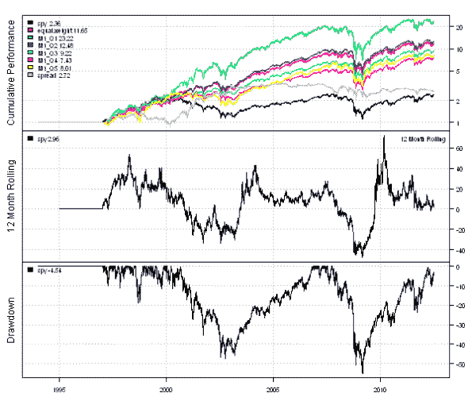

<!--yml
category: 未分类
date: 2024-05-18 14:39:35
-->

# 1-Month Reversal Strategy | Systematic Investor

> 来源：[https://systematicinvestor.wordpress.com/2012/07/13/1-month-reversal-strategy/#0001-01-01](https://systematicinvestor.wordpress.com/2012/07/13/1-month-reversal-strategy/#0001-01-01)

Today I want to show a simple example of the 1-Month Reversal Strategy. Each month we will buy 20% of loosers and short sell 20% of winners from the S&P 500 index. The loosers and winners are measured by prior 1-Month returns. I will use this post to set the stage for my next post that will show how Factor Attribution can boost performance of the 1-Month Reversal Strategy. Following is the references for my next post, in case you want to get a flavor, [Short-Term Residual Reversal by D. Blitz, J. Huij, S. Lansdorp, M. Verbeek (2011)](http://papers.ssrn.com/sol3/papers.cfm?abstract_id=1911449) paper.

Let’s start by loading historical prices for all companies in the S&P 500 and create SPY and Equal Weight benchmarks using the [Systematic Investor Toolbox](https://systematicinvestor.wordpress.com/systematic-investor-toolbox/):

```

###############################################################################
# Load Systematic Investor Toolbox (SIT)
# https://systematicinvestor.wordpress.com/systematic-investor-toolbox/
###############################################################################
setInternet2(TRUE)
con = gzcon(url('http://www.systematicportfolio.com/sit.gz', 'rb'))
    source(con)
close(con)

	#*****************************************************************
	# Load historical data
	#****************************************************************** 
	load.packages('quantmod')	
	tickers = sp500.components()$tickers

	data <- new.env()
	getSymbols(tickers, src = 'yahoo', from = '1970-01-01', env = data, auto.assign = T)
		# remove companies with less than 5 years of data
		rm.index = which( sapply(ls(data), function(x) nrow(data[[x]])) < 1000 )	
		rm(list=names(rm.index), envir=data)

		for(i in ls(data)) data[[i]] = adjustOHLC(data[[i]], use.Adjusted=T)		
	bt.prep(data, align='keep.all', dates='1994::')
		tickers = data$symbolnames

	data.spy <- new.env()
	getSymbols('SPY', src = 'yahoo', from = '1970-01-01', env = data.spy, auto.assign = T)
	bt.prep(data.spy, align='keep.all', dates='1994::')

	#*****************************************************************
	# Code Strategies
	#****************************************************************** 
	prices = data$prices
		n = ncol(prices)

	#*****************************************************************
	# Setup monthly periods
	#****************************************************************** 
	periodicity = 'months'

	period.ends = endpoints(data$prices, periodicity)
		period.ends = period.ends[period.ends > 0]

	prices = prices[period.ends, ]		

	#*****************************************************************
	# Create Benchmarks, omit results for the first 36 months - to be consistent with Factor Attribution
	#****************************************************************** 	
	models = list()

	# SPY
	data.spy$weight[] = NA
		data.spy$weight[] = 1
		data.spy$weight[1:period.ends[36],] = NA
	models$spy = bt.run(data.spy)

	# Equal Weight
	data$weight[] = NA
		data$weight[period.ends,] = ntop(prices, n)
		data$weight[1:period.ends[36],] = NA		
	models$equal.weight = bt.run(data)

```

Next let’s group stocks into Quantiles based on 1-Month returns and create back-test for each Quantile. I will rely on the code in the [Volatility Quantiles](https://systematicinvestor.wordpress.com/2012/06/05/volatility-quantiles/) post to create Quantiles.

```

	#*****************************************************************
	# Create Reversal Quantiles
	#****************************************************************** 
	n.quantiles = 5
	start.t = 1 + 36
	quantiles = weights = coredata(prices) * NA			

	one.month = coredata(prices / mlag(prices))

	for( t in start.t:nrow(weights) ) {
		factor = as.vector(one.month[t,])
		ranking = ceiling(n.quantiles * rank(factor, na.last = 'keep','first') / count(factor))

		quantiles[t,] = ranking
		weights[t,] = 1/tapply(rep(1,n), ranking, sum)[ranking]			
	}

	quantiles = ifna(quantiles,0)

	#*****************************************************************
	# Create backtest for each Quintile
	#****************************************************************** 
	temp = weights * NA

	for( i in 1:n.quantiles) {
		temp[] = 0
		temp[quantiles == i] = weights[quantiles == i]

		data$weight[] = NA
			data$weight[period.ends,] = temp
		models[[ paste('M1_Q',i,sep='') ]] = bt.run(data, silent = T)
	}

```

Finally, let’s construct Q1/Q5 spread and create summary performance report.

```

	#*****************************************************************
	# Create Q1-Q5 spread
	#****************************************************************** 
	temp[] = 0
	temp[quantiles == 1] = weights[quantiles == 1]
	temp[quantiles == n.quantiles] = -weights[quantiles == n.quantiles]

	data$weight[] = NA
		data$weight[period.ends,] = temp
	models$spread = bt.run(data, silent = T)	

	#*****************************************************************
	# Create Report
	#****************************************************************** 	
	plotbt.custom.report.part1(models)

	plotbt.custom.report.part1(models[spl('spy,equal.weight,spread')])

```

[](https://systematicinvestor.wordpress.com/wp-content/uploads/2012/07/plot1-small1.png)

[](https://systematicinvestor.wordpress.com/wp-content/uploads/2012/07/plot2-small1.png)

In the next post I will show how Factor Attribution can boost performance of the 1-Month Reversal Strategy using the methodology presented in the [Short-Term Residual Reversal by D. Blitz, J. Huij, S. Lansdorp, M. Verbeek (2011)](http://papers.ssrn.com/sol3/papers.cfm?abstract_id=1911449) paper.

To view the complete source code for this example, please have a look at the [bt.one.month.test() function in bt.test.r at github](https://github.com/systematicinvestor/SIT/blob/master/R/bt.test.r).