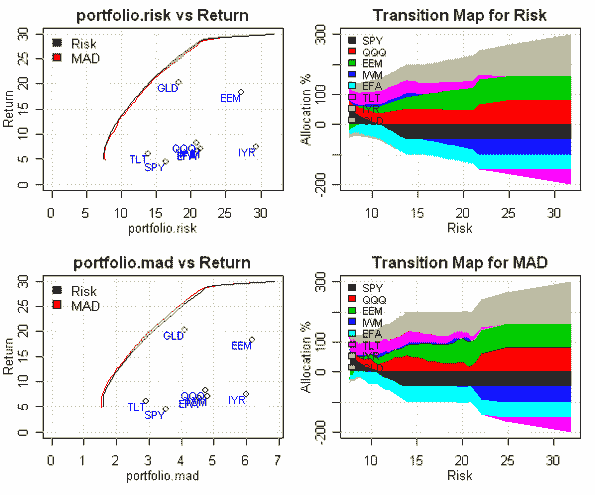
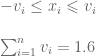
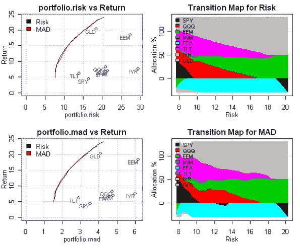
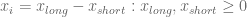
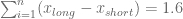
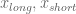
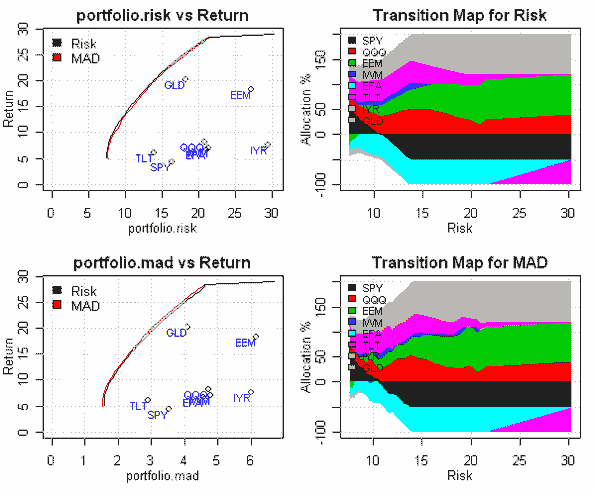
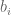
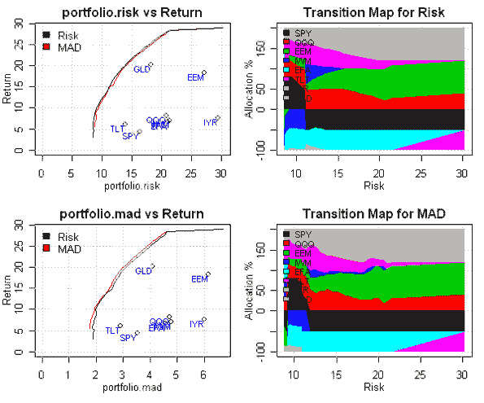

<!--yml
category: 未分类
date: 2024-05-18 14:45:25
-->

# 130/30 Portfolio Construction | Systematic Investor

> 来源：[https://systematicinvestor.wordpress.com/2011/10/18/13030-porfolio-construction/#0001-01-01](https://systematicinvestor.wordpress.com/2011/10/18/13030-porfolio-construction/#0001-01-01)

The [130/30 funds](http://en.wikipedia.org/wiki/130-30_fund) were getting lots of attention a few years ago. The [130/30 fund](http://mutualfunds.about.com/od/typesoffunds/a/130_30_funds.htm) is a long/short portfolio that for each $100 dollars invested allocates $130 dollars to longs and $30 dollars to shorts. From portfolio construction perspective this simple idea is no so simple to implement.

Let’s continue with our discussion from [Introduction to Asset Allocation](https://systematicinvestor.wordpress.com/2011/10/13/introduction-to-asset-allocation/) post and examine effects of allowing short positions on efficient frontier.

```

# load Systematic Investor Toolbox
setInternet2(TRUE)
source(gzcon(url('https://github.com/systematicinvestor/SIT/raw/master/sit.gz', 'rb')))

#--------------------------------------------------------------------------
# Create Efficient Frontier
#--------------------------------------------------------------------------
ia = aa.test.create.ia()
n = ia$n

# -0.5 <= x.i <= 0.8 
constraints = new.constraints(n, lb = -0.5, ub = 0.8)

# SUM x.i = 1
constraints = add.constraints(rep(1, n), 1, type = '=', constraints)

# create efficient frontier(s)
ef.risk = portopt(ia, constraints, 50, 'Risk')
ef.mad = portopt(ia, constraints, 50, 'MAD', min.mad.portfolio)

# Plot multiple Efficient Frontiers & Transition Maps
layout( matrix(1:4, nrow = 2) )
plot.ef(ia, list(ef.risk, ef.mad), portfolio.risk, F)
plot.ef(ia, list(ef.risk, ef.mad), portfolio.mad, F)

plot.transition.map(ef.risk)
plot.transition.map(ef.mad)

```

[](https://systematicinvestor.wordpress.com/wp-content/uploads/2011/10/plot1-small4.png)

Looking at the Transition Maps, the use of leverage increases as the portfolio’s risk and return increase. At the lower risk, the optimizer wants to allocate 150% to longs and 50% to shorts, and at the higher risk the optimizer wants to allocate 300% to longs and 200% to shorts.

This is a good starting point, but for our purposes we want all portfolios on the efficient frontier to have 130% allocation to longs and 30% allocation to shorts. One solution to this problem was mentioned in [Asset Allocation and Risk Assessment with Gross Exposure Constraints for Vast Portfolios by J. Fan, Zhang J., Yu K. (2008)](http://papers.ssrn.com/sol3/papers.cfm?abstract_id=1307423) ( Note 3 on Page 8 )

The first method to construct 130/30 portfolio is to note that

If inequality constraints are **bounding** than  and total portfolio weight is equal to 1.6 (1.3 contribution from long allocation and 0.3 contribution from short allocation)

```

#--------------------------------------------------------------------------
# Create 130:30
# -v.i <= x.i <= v.i, v.i>0, SUM(v.i) = 1.6
#--------------------------------------------------------------------------

# -0.5 <= x.i <= 0.8 
constraints = new.constraints(n, lb = -0.5, ub = 0.8)

# SUM x.i = 1
constraints = add.constraints(rep(1, n), 1, type = '=', constraints)		

# adjust prior constraints, add v.i
constraints = add.variables(n, constraints)

# -v.i <= x.i <= v.i
#   x.i + v.i >= 0
constraints = add.constraints(rbind(diag(n), diag(n)), rep(0, n), type = '>=', constraints)

#   x.i - v.i <= 0
constraints = add.constraints(rbind(diag(n), -diag(n)), rep(0, n), type = '<=', constraints)

# SUM(v.i) = 1.6
constraints = add.constraints(c(rep(0, n), rep(1, n)), 1.6, type = '=', constraints)

# create efficient frontier(s)
ef.risk = portopt(ia, constraints, 50, 'Risk')
	# keep only portfolio weights
	ef.risk$weight = ef.risk$weight[,(1:n)]			

ef.mad = portopt(ia, constraints, 50, 'MAD', min.mad.portfolio)
	ef.mad$weight = ef.mad$weight[,(1:n)]

# Plot multiple Efficient Frontiers & Transition Maps
layout( matrix(1:4, nrow = 2) )
plot.ef(ia, list(ef.risk, ef.mad), portfolio.risk, F)	
plot.ef(ia, list(ef.risk, ef.mad), portfolio.mad, F)	

plot.transition.map(ef.risk)
plot.transition.map(ef.mad)

```

[](https://systematicinvestor.wordpress.com/wp-content/uploads/2011/10/plot2-small4.png)

Looking at the Transition Maps, the use of leverage is constant for all portfolios on the efficient frontier at 130% allocation to longs and 30% allocation to shorts.

Another method to construct 130/30 portfolio is to split

and add  constraint. If  are mutually exclusive (only one of them is greater then 0 for each i) than total portfolio weight is equal to 1.6 (1.3 contribution from long allocation and 0.3 contribution from short allocation)

```

#--------------------------------------------------------------------------
# Create 130:30
# Split x into x.long and x.short, x.long and x.short >= 0
# SUM(x.long) - SUM(x.short) = 1.6
#--------------------------------------------------------------------------
# Split Input Assumptions for x into x.long and x.short 
ia.ls = aa.test.ia.add.short(ia)

# x.long and x.short >= 0
# x.long <= 0.8 
# x.short <= 0.5 
constraints = new.constraints(2*n, lb = 0, ub = c(rep(0.8,n),rep(0.5,n)))

# SUM (x.long - x.short) = 1
constraints = add.constraints(c(rep(1,n), -rep(1,n)), 1, type = '=', constraints)		

# SUM (x.long + x.short) = 1.6
constraints = add.constraints(c(rep(1,n), rep(1,n)), 1.6, type = '=', constraints)		

# create efficient frontier(s)
ef.risk = portopt(ia.ls, constraints, 50, 'Risk')
	# compute x
	ef.risk$weight = ef.risk$weight[, 1:n] - ef.risk$weight[, (n+1):(2*n)]

ef.mad = portopt(ia.ls, constraints, 50, 'MAD', min.mad.portfolio)
	ef.mad$weight = ef.mad$weight[, 1:n] - ef.mad$weight[, (n+1):(2*n)]

# Plot multiple Efficient Frontiers & Transition Maps
layout( matrix(1:4, nrow = 2) )
plot.ef(ia, list(ef.risk, ef.mad), portfolio.risk, F)	
plot.ef(ia, list(ef.risk, ef.mad), portfolio.mad, F)	

plot.transition.map(ef.risk)
plot.transition.map(ef.mad)

```

[](https://systematicinvestor.wordpress.com/wp-content/uploads/2011/10/plot3-small3.png)

Looking at the Transition Maps, the use of leverage is constant for all portfolios on the efficient frontier at 130% allocation to longs and 30% allocation to shorts.

However, it is **important** to note that above two methods only work when there is sufficient volatility in the covariance matrix and optimizer uses additional leverage to generate optimal portfolios. To demonstrate this point, let’s imagine we want to construct 200/100 portfolio : 200% allocation to longs and 100% allocation to shorts. The only change required to create a new efficient frontier is to substitute 1.6 constraint above with 3 ( 3 = 200% allocation to longs plus 100% allocation to shorts)

[](https://systematicinvestor.wordpress.com/wp-content/uploads/2011/10/plot4-small2.png)

Looking at the Transition Maps, in this scenario the optimizer does not use all the leverage at the lower risk region because optimal portfolios exist at the lower leverage levels. If we look at the  at the lower risk region, they are not mutually exclusive, both  are grater than 0.

To enforce that  be mutually exclusive (only one of them is greater then 0 for each i), I will add binary variables. Binary variables  can only take 0 or 1 values. Here is the additional constraint:


```

#--------------------------------------------------------------------------
# Create 200:100 using binary[0/1] variables and Branch and Bound algorithm
# Split x into x.long and x.short, x.long and x.short >= 0
# SUM(x.long) - SUM(x.short) = 3
#
# Solve using branch and bound: add a binary var b.i, x.long.i < b.i, x.short.i < (1-b.i)
#--------------------------------------------------------------------------

# x.long and x.short >= 0
# x.long <= 0.8 
# x.short <= 0.5 
constraints = new.constraints(2*n, lb = 0, ub = c(rep(0.8,n),rep(0.5,n)))

# SUM (x.long - x.short) = 1
constraints = add.constraints(c(rep(1,n), -rep(1,n)), 1, type = '=', constraints)		

# SUM (x.long + x.short) = 3
constraints = add.constraints(c(rep(1,n), rep(1,n)), 3, type = '=', constraints)		

# NEW add binary constraint	
# adjust prior constraints: add b.i
constraints = add.variables(n, constraints)

# index of binary variables b.i
constraints$binary.index = (2*n+1):(3*n)

# binary variable b.i, x.long.i < b.i, x.short.i < (1-b.i)
# x.long.i < b.i
constraints = add.constraints(rbind(diag(n), 0*diag(n), -diag(n)), rep(0, n), type = '<=', constraints)

# x.short.i < (1-b.i)
constraints = add.constraints(rbind(0*diag(n), diag(n), diag(n)), rep(1, n), type = '<=', constraints)

# create efficient frontier(s)
ef.risk = portopt(ia.ls, constraints, 50, 'Risk')
	# compute x
	ef.risk$weight = ef.risk$weight[, 1:n] - ef.risk$weight[, (n+1):(2*n)]

ef.mad = portopt(ia.ls, constraints, 50, 'MAD', min.mad.portfolio)
	ef.mad$weight = ef.mad$weight[, 1:n] - ef.mad$weight[, (n+1):(2*n)]		

# Plot multiple Efficient Frontiers & Transition Maps
layout( matrix(1:4, nrow = 2) )
plot.ef(ia, list(ef.risk, ef.mad), portfolio.risk, F)	
plot.ef(ia, list(ef.risk, ef.mad), portfolio.mad, F)	

plot.transition.map(ef.risk)
plot.transition.map(ef.mad)

```

[](https://systematicinvestor.wordpress.com/wp-content/uploads/2011/10/plot5-small2.png)

Finally, looking at the Transition Maps, the use of leverage is constant for all portfolios on efficient frontier at 200% allocation to longs and 100% allocation to shorts.

A technical note about binary variable. The linear solver from [lpSolve](http://cran.r-project.org/web/packages/lpSolve/index.html) library implements binary variables internally. The quadratic solver from [quadprog](http://cran.r-project.org/web/packages/quadprog/index.html) library does not handle binary variables. To add binary variables to quadratic solver I adapted binary branch and bound algorithm from [Matlab function for solving Mixed Integer Quadratic Programs by Alberto Bemporad, Domenico Mignone](http://www.aut.ee.ethz.ch/~hybrid/miqp/)

To view the complete source code for this example, please have a look at the [aa.long.short.test() function in aa.test.r at github](https://github.com/systematicinvestor/SIT/blob/master/R/aa.test.r).