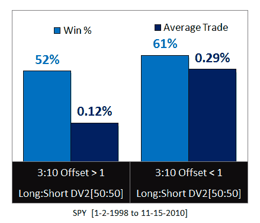

<!--yml
category: 未分类
date: 2024-05-12 18:15:48
-->

# 3/10 Offset HV as a Mean-Reversion Filter | CSSA

> 来源：[https://cssanalytics.wordpress.com/2010/11/18/310-offset-hv-as-a-mean-reversion-filter/#0001-01-01](https://cssanalytics.wordpress.com/2010/11/18/310-offset-hv-as-a-mean-reversion-filter/#0001-01-01)

I am always looking for new and interesting ideas to improve the edges of conventional systems or indicators. One  valuable source of ideas is a subscription to Quantifiable Edges, where I get the opportunity each to review how  Rob Hanna classifies the most relevant situations in today’s market.  The  blog often features studies published in the nightly letter:  [http://quantifiableedges.blogspot.com/2010/10/rare-consolidation.html](http://quantifiableedges.blogspot.com/2010/10/rare-consolidation.html) .

In this case I wanted to look at how the “3/10 offset HV”  could be used as a filter for oscillator trades. I recommend the following link  to learn more about the indicator: [http://quantifiableedges.blogspot.com/2010/10/volatility-contraction-study-in-memory.html](http://quantifiableedges.blogspot.com/2010/10/volatility-contraction-study-in-memory.html) However, as a brief summary, the 3/10 offset measures 3-day volatility in relation to the 10-day volatility 3-days prior. Effectively it is a measure of short-term volatility expansion/contraction relative to a more intermediate volatility measure that is non-overlapping. The purpose of the filter is to identify conditions favorable for  breakouts, especially those that occur intraday or at the open. My question was whether contraction or expansion was favorable for mean-reversion trades. I decided to test the impact of the 3/10 offset  on the “DV2” indicator. An expansion of volatility would be represented by a 3/10 offset above 1, and a contraction occuring below 1\. Below are the results, as you can see the 3/10 offset is a very good filter but it does not function in the manner you might expect:

Clearly range contractions with the 3/10 offset are more positive for mean-reversion trades which is counter to intuition. Typically high volatility is better for mean-reversion using longer term HV measures, but it appears that the opposite is desirable for shorter-term relative measures. After reviewing a few chart examples, it appears that low 3/10 offset HV coupled with overbought/oversold oscillator readings are represented by very shallow  pullbacks or rallies. When paired with the long-term trend, these are the trades that are most likely to be successful with lower risk. It is the deeper breakouts or breakdowns that are unusually severe pose the biggest problem for shallow mean-reversion trades. The above study shows that it is neccessary to think about mean-reversion in multiple dimensions: 1) shallow pullbacks/rallies 2) intermediate conditions that are stretched in either direction and 3) extreme breakouts and breakdowns that are effectively tail-type events.  Optimizing the performance of mean-reversion strategies requires understanding the context and probabilities associated with each type of situation. Finally, in reference to using the 3/10 offset as a means of filtering breakouts intraday it is likely that the direction of the breakout will follow the direction implied by the DV2 oscillator.