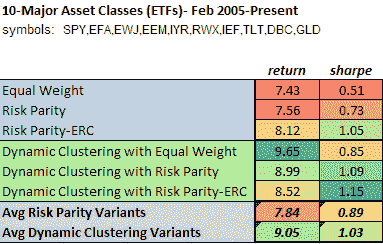

<!--yml
category: 未分类
date: 2024-05-12 18:02:31
-->

# A Backtest Using Dynamic Clustering versus Conventional Risk Parity Methods | CSSA

> 来源：[https://cssanalytics.wordpress.com/2013/01/11/a-backtest-using-dynamic-clustering-versus-conventional-risk-parity-methods/#0001-01-01](https://cssanalytics.wordpress.com/2013/01/11/a-backtest-using-dynamic-clustering-versus-conventional-risk-parity-methods/#0001-01-01)

Here is a backtest that was done using a [dynamic clustering method](http://systematicinvestor.wordpress.com/2012/12/29/clustering-with-selected-principal-components/) introduced by Michael Kapler at  [Systematic Investor](http://systematicinvestor.wordpress.com/) combined with multiple allocation schemes: 1) **equal weight within and across clusters** 2) **risk parity within and across clusters** and 3) **[cluster risk parity](https://cssanalytics.wordpress.com/2013/01/03/cluster-risk-parity/ "Cluster Risk Parity") (CRP):**  equal risk contribution (ERC) is used within and across clusters. For comparison purposes, we show equal weight allocation, [risk parity, and risk parity ERC](https://cssanalytics.wordpress.com/2012/07/19/not-equal-a-comparison-of-risk-parity-and-equal-risk-contribution/ "Not Equal: A Comparison of “Risk Parity” and “Equal Risk Contribution”") without clustering. For testing we used 10 major asset class ETFs.

The performance of the average of dynamic clustering versions versus the average of their non-clustered counterparts is slightly superior on both a return and risk-adjusted basis. All individual clustering methods also outperform their non-clustered counterparts. More significantly, Cluster Risk Parity (CRP)–or Dynamic Clustering with Risk Parity-ERC– was the best performer and outperforms all other allocation methods in terms of risk adjusted return, and has the second-best annualized return. This is only one universe, and the differences are not substantial–but do conform to what we would expect theoretically. There are a lot of moving parts- both the clustering approach, and the inputs (variance/covariance information and returns) can be used to improve performance and reduce turnover. But the most basic methods tend to demonstrate the validity of this sound theoretical approach. In the next post we will look at static versus dynamic clustering on a different universe.