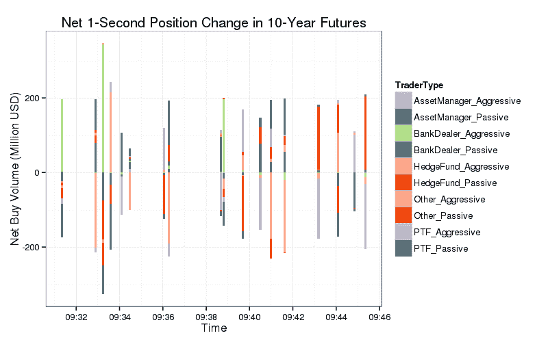
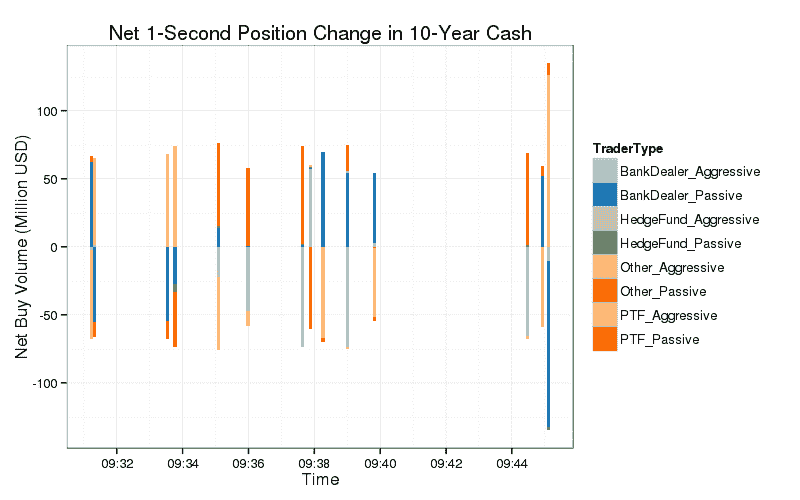
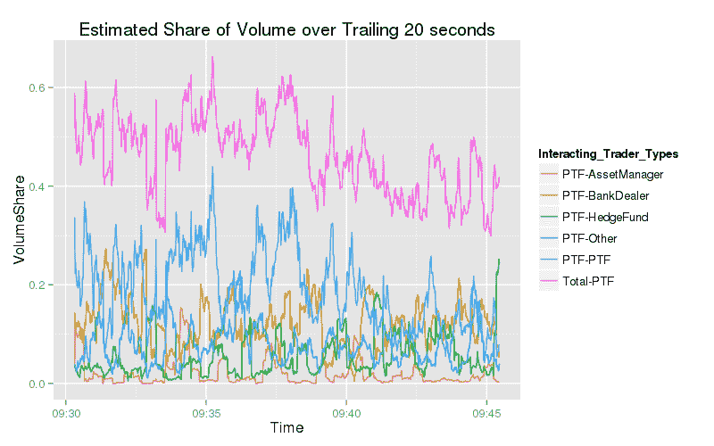
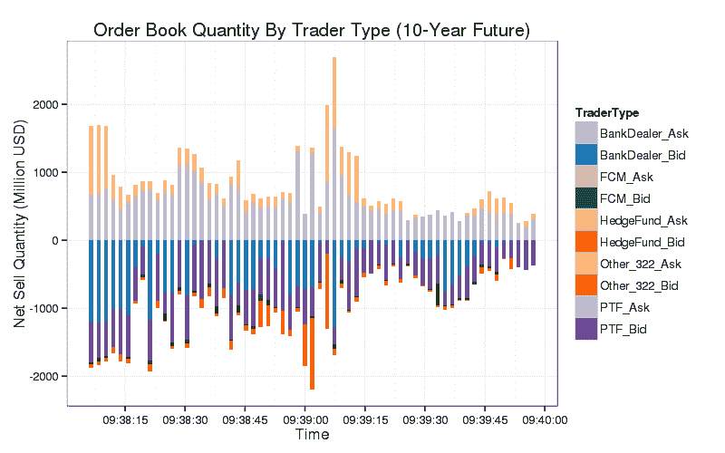

<!--yml
category: 未分类
date: 2024-05-18 06:42:57
-->

# A Close Look at the Treasury Flash Rally Report | Mechanical Markets

> 来源：[https://mechanicalmarkets.wordpress.com/2015/09/28/a-close-look-at-the-treasury-flash-rally-report/#0001-01-01](https://mechanicalmarkets.wordpress.com/2015/09/28/a-close-look-at-the-treasury-flash-rally-report/#0001-01-01)

Flash events, where prices rapidly change and revert to their previous levels, are not well understood. Government reports on these events are immensely helpful, and I was pleased to see a high level of detail in the recent [Joint Staff Report](http://www.treasury.gov/press-center/press-releases/Documents/Joint_Staff_Report_Treasury_10-15-2015.pdf) on the October 15, 2014 flash event in US Treasuries. It’s hard to see by eye, but many of the charts in the report show important market metrics broken down by trader type, with what appears to be 1-2 second resolution. This kind of data is rarely made public, and is a huge treat for a practitioner like me. In this post I will begin to explore the contents of this ~15 minute dataset. The analysis required some moderately difficult image parsing, not an area of expertise for me, so there could be errors.

# Types of Traders in the Report

The report mentions several types of traders, and since each “employs some level of automated trading,” it’s tough to label just one category ‘high-frequency trading,’ though the closest group is probably “Principal Trading Firms” (PTFs), which trade their own capital and do not have customers. [[1](#bottom1report)] But a few algorithmic traders, like Citadel and Renaissance, may be included in the “Hedge Fund” category. Some charts also have “FCM” and “Other” categories, which could contain smaller algorithmic traders that were hard to classify. [[2](#bottom2report)]

# Counterparty-tagged Volume

Given the contents of charts 3.5-3.8, and the large amount of self-trading, it’s a [reasonable guess](http://www.bloombergview.com/articles/2015-07-13/algorithms-had-themselves-a-treasury-flash-crash) that PTFs were trading mostly with other PTFs during the event. But, the data pulled from the charts don’t particularly support this hypothesis. Here is a plot of the net inventory change per second, by trader type and aggressor-flag, for seconds when any group’s aggressively or passively-accumulated inventory changed by more than 100 million dollars:

Net inventory change per second in 10-year futures. Data is from report Figures 3.6 and 3.8\. Assumes that each bar in both figures represents 1-second. There are 928 such bars.

Assuming that the 1-second inventory change is reflective of actual trades [[3](#bottom3report)], this figure shows that, during big seconds, little volume was generated by intra-group trading.

Here’s a similar plot for the cash market [[4](#bottom4report)] which appears to show that PTFs traded more with banks than each other:

Similar to above, from Figures 3.5 and 3.7.

# Volume Between and Within Groups of Traders

Here is the overall share of volume between traders of various types:

|  | AssetManager | BankDealer | HedgeFund | Other | PTF |
| AssetManager | 0.00033 | 0.01446 | 0.00578 | 0.00551 | 0.02042 |
| BankDealer | 0.01446 | 0.03439 | 0.03037 | 0.03146 | 0.11861 |
| HedgeFund | 0.00578 | 0.03037 | 0.00642 | 0.02045 | 0.05794 |
| Other | 0.00551 | 0.03146 | 0.02045 | 0.01953 | 0.07332 |
| PTF | 0.02042 | 0.11861 | 0.05794 | 0.07332 | 0.18269 |
| Total | 0.0465 | 0.22928 | 0.12096 | 0.15028 | 0.45297 |

Estimated portion of 10-year futures volume during the event window attributable to each pair of groups. For example, 2% of volume was from asset managers trading with PTFs. Net inventory change per second is used as a surrogate for volume. Counterparty-tagging is estimated pro-rata, e.g. if PTFs and banks each passively bought 50 in 1 second, when hedge funds and asset managers each aggressively sold 50, then the estimate is that hedge funds sold 25 to PTFs and 25 to banks (and asset managers did the same). Again, data is from figures 3.6 and 3.8\. Volume is single counted.

Only 18% of estimated volume was from PTFs trading with other PTFs. Given that total PTF volume was 45% under this estimate, PTFs were slightly less likely to interact with one another than by random chance (which would be 0.45 * 0.45 = 20%). [[5](#bottom5report)][[6](#bottom6report)] Note that there’s a disparity between this estimate of total PTF volume and what’s in the report, which has PTF share at around 60% during both the event window (p25) and across the day (Table 2). [[7](#bottom7report)]

It might also be interesting to see how these statistics evolved over time:

Estimated portion of total volume in the preceding 20 seconds traded between PTFs and other groups for 10-year futures.

The estimated volume share of PTF-PTF is rarely far from the square of total PTF share, which suggests that [worries](http://www.ft.com/intl/cms/s/0/ab70bdf2-4507-11e5-b3b2-1672f710807b.html) about “PTFs trading almost solely with each other” may be unfounded. [[8](#bottom8report)][[9](#bottom9report)] Plots for the other group-pairs [here](https://mechanicalmarkets.wordpress.com/wp-content/uploads/2015/09/estimatedvolumesharebycounterparty2.png), [here](https://mechanicalmarkets.wordpress.com/wp-content/uploads/2015/09/estimatedvolumesharebycounterparty3.png), and [here](https://mechanicalmarkets.wordpress.com/wp-content/uploads/2015/09/estimatedvolumesharebycounterparty4.png).

We can also use the same method to estimate the volume between aggressive and passive traders in all of the groups:

|  Group | AssetManager Passive | BankDealer Passive | HedgeFund Passive | Other Passive | PTF Passive | Total |
| AssetManager   Aggressive | 0.00034 | 0.02092 | 0.00585 | 0.00567 | 0.02521 | 0.05799 |
| BankDealer Aggressive | 0.00801 | 0.03439 | 0.02758 | 0.03361 | 0.1216 | 0.22519 |
| HedgeFund Aggressive | 0.00576 | 0.03312 | 0.00643 | 0.01864 | 0.05412 | 0.11807 |
| Other                 Aggressive | 0.00537 | 0.02937 | 0.02234 | 0.01954 | 0.07505 | 0.15167 |
| PTF                    Aggressive | 0.01564 | 0.11571 | 0.06172 | 0.07154 | 0.18246 | 0.44707 |
| Total | 0.03512 | 0.23351 | 0.12392 | 0.149 | 0.45844 |  1 |

Estimated portion of 10-year futures volume between passive and aggressive trades from each group.

The estimates show that asset managers tended to trade more aggressively (5.8% of total volume) than passively (3.5%). When trading aggressively, 36% (0.021/0.058) of their volume was executed against a bank-dealer, significantly higher than bank-dealers’ 23% share of overall passive volume. Given that asset managers characteristically have “large directional flows spanning multiple trading sessions,” their tendency to trade with banks may be of interest to people worried about bond market liquidity [because](http://www.rba.gov.au/speeches/2015/sp-ag-2015-09-16.html) “banks now have less risk-warehousing capacity than they did in the past.”

# Group-Identified Book Depth

Large, passive sell orders may have stopped the flash rally. From the report:

> Around 9:39 ET, the sudden visibility of certain sell limit orders in the futures market seemed to have coincided with the reversal in prices… [W]ith prices still moving higher, a number of previously posted large sell orders suddenly became visible in the order book above the current 30-year futures price (as well as in smaller size in 10-year futures).

We don’t know who submitted those orders for the 30-year, but the report may tell us who did for the 10-year. Here is an estimate of ID-tagged order book depth around this time, using data from Figures 3.19 and 3.22:

Estimated visible book depth in top 3 price levels for 10-year futures, by type of trader. Hedge Fund and FCM data from 3.22 is merged into data from Figure 3.19\. The depth quantity from the “Other” trader category in Figure 3.19 appears to be very close to the sum of the quantity from “FCM” and “Other” traders in Figure 3.22; “Other_322” uses the Figure 3.22 data. Aligning, renormalizing, and merging the data from Figure 3.22 into data from Figure 3.19 required some judgment, so there may be errors (and the x-axis is probably off by a few seconds). Time resolution of the data in Figure 3.19 appears to be about 1.8 seconds, but the similar Figure 3.17 from the cash market has an apparent resolution of 1 second; it’s possible that this disparity is because the authors wanted to protect traders’ privacy.

The origin of these large sell orders could have been traders in the “Other” category of Figure 3.22\. I wonder if they may have come from asset managers, which are not separately included in the depth plots.

# Self-Trading

According to the report: “in the 5-year note in the cash market… self-trading accounted for about one-third of net aggressive trade volume between 9:33-9:39 ET.” Levels of self-trading were high on futures markets as well. Regulators are [contemplating](http://blogs.wsj.com/moneybeat/2015/09/17/cftc-official-calls-for-greater-algo-controls/) new, industry-initiated, rules on self-trading. That makes a lot of sense. The usual defense of self-trading argues (correctly) that it can be the accidental by-product of compliant trading, hardly a claim that self-trading is beneficial.

Most major exchanges offer self-match prevention, and it seems easy to enable it for all customers. I understand that some trading firms have a siloed business model, where individual groups fiercely compete with one another. In these companies, self-match prevention could allow rival groups to learn each others’ trading strategies. [[10](#bottom10report)] But that doesn’t strike me as a particularly high price to pay. In contrast, accidental self-trading does impose a cost on market participants — it adds noise to market data. [[11](#bottom11report)] Regardless of whether self-trading had any effect on the flash event, it certainly has fostered suspicion of the industry, which seems like pretty good reason to eliminate it. [[12](#bottom12report)]

# Potential Causes of Flash Events

Andrew Lo discussed the 3 dimensions of liquidity in the recent CFTC [Market Risk Advisory Committee](http://www.cftc.gov/idc/groups/public/@aboutcftc/documents/file/mrac_060215_transcript.pdf):

> [T]here are three qualities of liquidity that really make up the definition. A security is liquid if it can be traded quickly, if it can be traded in large size and if it can be traded without moving prices.

Lo adds that these attributes can be measured. I think he’s right that “liquidity” has a simple, quantitative definition. But there’s an additional wrinkle that makes it prone to sudden changes, and challenging to measure. Liquidity is also about expectations, and its three components (price, time, and size) evolve in response to any anticipated change in them. This evolution may be especially important in flight-to-safety markets. If you want protection from volatility, and worry that bond market liquidity could dry up, you might accelerate your purchase of treasuries. If others decide the same, then there could be a rapid, cascading deterioration in liquidity. [[13](#bottom13report)]

Many models of liquidity involve a book of “latent orders,” which are orders that exist in traders’ imaginations and are not yet live. A trader with latent orders might think, for example: “X is over-valued by 15%, so if it drops 20% with little change in my outlook, I’ll buy it.” Donier, Bonart, Mastromatteo, and Bouchaud [propose](http://arxiv.org/abs/1412.0141) a model where traders instantly submit latent orders as real orders when the market price gets close to their desired price. [[14](#bottom14report)] Their model exhibits many properties found in real markets. But, there’s no reason to expect that latent traders watch markets full-time, and as the authors say in a footnote, these traders’ slow reaction time could be a factor in flash events:

> It is very interesting to ask what happens if the conversion speed between latent orders and real orders is not infinitely fast, or when market orders become out-sized compared to the prevailing liquidity.  As we discuss in the conclusion, this is a potential mechanism for crashes

I think that our markets tend to have a layer of liquidity provided by professional intermediaries, and a much thicker layer provided by slower latent traders, far from the top of book. In rare occasions that intermediary layer could be exhausted and, if sufficient time isn’t available for latent traders to step in, a flash event may occur. If so, I’m not sure that there’s an easy remedy. Some people may think that slowing down our markets would prevent these flash events, but I suspect it wouldn’t be that straightforward. Latent traders might check prices once a day (or less), which would mean that our markets would need to be made *a lot* slower. Also, some latent traders may pay attention to the market only after significant volume has transacted at their target price, so slower markets could still have episodes of extreme volatility, they’d just last for days instead of minutes.

Some flash events probably have more rectifiable causes. The August 24, 2015 event was likely exacerbated by temporary changes in market structure from [LULD halts](http://www.wsj.com/articles/stock-market-tumult-exposes-flaws-in-modern-markets-1440547138), NYSE [Rule 48](http://www.wsj.com/articles/for-stock-markets-the-moment-when-humans-matter-1441148923), [futures being limit-down](http://blogs.barrons.com/focusonfunds/2015/08/25/many-etfs-saw-wacky-trading-in-mondays-selloff/), and futures’ price limits changing simultaneously with the equity opening. These measures are intended to give markets time to attract latent liquidity. But because they alter market structure, they may shutdown some professional intermediaries, which aren’t set up to trade in one-off conditions. Increased volatility isn’t surprising with intermediary liquidity missing, and still insufficient time for most latent traders to become active.

Many people think that “HFT Hot Potato,” where HFTs panic as their inventory devalues and then dump it on other HFTs, is a factor in flash events. [[15](#bottom15report)] For the October 15 event, that seems pretty unlikely. PTFs do not appear to have preferentially traded with each other. And figures 3.9-3.12 in the report show that the bulk of aggressive volume from PTFs and Bank-Dealers consisted of exposure-increasing buy orders. [[16](#bottom16report)] Exposure-decreasing aggressive orders were, for the most part, selling the 10-year. [[17](#bottom17report)]

# The Utility of Fine-Grained Data

I’ve [argued](https://mechanicalmarkets.wordpress.com/2015/02/26/ending-market-abuse-limits-on-anonymous-trading/) in the past that more post-trade disclosure would dispel conspiracy theories and ensure that our markets stay clean. This Joint Staff Report included data with a resolution that surprised me. I hope that trend continues. Even if it doesn’t, there is a possibility that data with this level of precision can be matched with real market data messages to a limited extent. That isn’t an easy problem technically, but I intend to give it a try.

[[1](#1report)] IEX has used a similar definition. From a 2014 [blog post](http://blogs.wsj.com/moneybeat/2014/08/11/debate-over-high-frequency-trading-on-iex-muddied-by-trade-counting/) by Bradley Hope:

> IEX says that in July 17.7% of trading on its platform is done by proprietary trading firms, which it says are firms that have no clients and trade for their own account. It places HFT firms in this category.

As an aside, this percentage appears to have [risen](http://www.bloomberg.com/news/features/2015-08-23/brad-katsuyama-s-next-chapter) in the last year:

> Brokers trading their own principal—they include both HFT firms and the big banks’ proprietary trading desks—account for 23 percent of IEX’s trades.

Though this second definition may be different than the one given in 2014, since it includes banks’ supposedly [shrinking](http://www.wsj.com/articles/market-bets-abound-but-where-are-the-banks-1441166730) prop-trading desks and also appears to be restricted to broker-dealers. The Joint Staff Report’s definition says that PTFs “**may** be registered as broker-dealer[s]” (emphasis added), and certainly not all high-speed traders are broker-dealers.

[[2](#2report)] The report makes it clear that classifying firms was not easy:

> Categorizing the firms requires some judgment, particularly given that they sometimes share certain characteristics or may act in multiple capacities… [S]ome bank-dealer and hedge fund trading patterns exhibit characteristics of PTFs, while many smaller PTFs clearly are not trading rapidly.

[[3](#3report)] This should be close, but not identical, to the aggressive and passive volume of each group. For example, Bank A may aggressively buy from PTF B, then Bank A may aggressively sell to PTF B. If these trades occur in the same second, there would be no net change in Bank-Dealers’ aggressively accumulated inventory, or PTFs’ passively accumulated inventory. This 15-minute period is exceptional, and I couldn’t say how often that kind of trading occurs even normally, but we have a hint from a nice [paper](http://www.cftc.gov/ucm/groups/public/@economicanalysis/documents/file/oce_automatedtrading.pdf) by CFTC staffers Haynes and Roberts.

In that paper, Table 8 provides a measure of holding times for different types of traders. It shows that, for the 10-year bond future, 42% of the volume executed by large, automated traders is typically netted with trades on the opposing side within 1 minute. We can crudely estimate the portion of these traders’ volume that is held for under a second by considering the distribution of order resting times, given in Table 7\. Summing the appropriate values for the 10-year, about 8.6% of double-counted volume is generated by passive, automated orders that are executed within 1 second, and 23.5%  within 1 minute. The ratio of these two numbers is 37%, which may also be reflective of the ratio between trades that have a 1 second holding time (or less) and trades that have a 1 minute holding time (or less). So we can (very roughly) estimate that 0.37 * 0.42 ~ 15% of a typical high-speed trader’s volume is turned over in a second. This estimate applies to single traders’ turnover, not the aggregate of their group.

[[4](#4report)] With a 50 million dollar threshold instead of the 100 used for the futures plot, because the cash market is less active than futures.

[[5](#5report)] One of the first things [discussed](https://mechanicalmarkets.wordpress.com/2015/01/13/trader-type-and-order-age/) on this blog is that algorithms generally want to avoid trading with one another. Table 4 from the [above-linked](http://www.cftc.gov/ucm/groups/public/@economicanalysis/documents/file/oce_automatedtrading.pdf) paper says that total volume for 10-year futures is typically composed of: 43% algorithms trading with algorithms, 41% algorithms trading with humans, 12% humans trading with humans. These statistics show algorithms interacting with other algorithms about as often as you’d expect by random chance, which surprises me slightly — I’d have expected algos to tend towards interacting more with humans.

[[6](#6report)] If you’re interested in the correlation matrix of inventory changes:

|   | AssetManager Aggressive | AssetManager Passive | BankDealer Aggressive | BankDealer Passive | HedgeFund Aggressive | HedgeFund Passive | Other Aggressive | Other Passive | PTF Aggressive | PTF Passive |
| AssetManager Aggressive | 1 | 0.099 | -0.028 | -0.3 | -0.033 | -0.04 | -0.021 | -0.013 | -0.012 | -0.12 |
| AssetManager Passive | 0.099 | 1 | -0.11 | 0.017 | -0.083 | 0.000065 | -0.067 | 0.033 | -0.2 | 0.095 |
| BankDealer Aggressive | -0.028 | -0.11 | 1 | -0.17 | 0.0043 | -0.24 | -0.078 | -0.34 | -0.029 | -0.45 |
| BankDealer Passive | -0.3 | 0.017 | -0.17 | 1 | -0.29 | 0.08 | -0.11 | 0.25 | -0.44 | 0.22 |
| HedgeFund Aggressive | -0.033 | -0.083 | 0.0043 | -0.29 | 1 | 0.099 | -0.044 | -0.28 | 0.012 | -0.43 |
| HedgeFund Passive | -0.04 | 0.000065 | -0.24 | 0.08 | 0.099 | 1 | -0.18 | 0.11 | -0.47 | 0.099 |
| Other Aggressive | -0.021 | -0.067 | -0.078 | -0.11 | -0.044 | -0.18 | 1 | -0.14 | 0.096 | -0.34 |
| Other Passive | -0.013 | 0.033 | -0.34 | 0.25 | -0.28 | 0.11 | -0.14 | 1 | -0.41 | 0.4 |
| PTF Aggressive | -0.012 | -0.2 | -0.029 | -0.44 | 0.012 | -0.47 | 0.096 | -0.41 | 1 | -0.33 |
| PTF Passive | -0.12 | 0.095 | -0.45 | 0.22 | -0.43 | 0.099 | -0.34 | 0.4 | -0.33 | 1 |

Correlation between trader groups’ 1-second (aggressor-flagged) inventory changes. Data again from Figures 3.6 and 3.8\. A large positive (negative) number means that the two groups are more likely to be trading on the same (opposite) side during the same second.

Nothing immediately struck me about the lagged cross-correlations or auto-correlations; except perhaps that asset managers tend to persistently trade on the same side, which I think we already knew.

[[7](#7report)] The reasons for that disparity could include:

1.  Sub-second, group-wide turnover, when it is make-make or take-take (sub-second turnover for individual HFTs was estimated to be roughly 15% in [[3](#bottom3report)]). Sub-second turnover should appear in the charts if it’s make-take or take-make, because net inventory in the charts is split by aggressor flag.
2.  The y-axis resolution of the charts. The smallest visible changes in net inventory are $2.4M for the aggressive chart and $1.9M for the passive chart. So small executions may be under-represented. Algorithms are known for sending [smaller orders](https://mechanicalmarkets.wordpress.com/2015/02/09/order-size-in-the-hft-era-identifying-trade-type-pt-3/) than humans.
3.  Self-trades could conceivably have been excluded from these charts.
4.  Data omitted from the charts.
5.  An error on my part.

The total volumes in the aggressive and passive charts differ by about 15%. That may give an idea of the margin of error.

[[8](#8report)] For specific seconds, the estimated level of intra-group trading is higher. As the time resolution increases, intra-group share should become more volatile (at the finest resolution, it will frequently spike to 100%, whenever a single intra-group match occurs). If you’re interested, here’s a table of seconds when more than $30M traded and the intra-group share was above 75% (estimated). This will happen by random chance most often for the largest trader group (PTFs). I won’t pretend that there’s a way to test statistical significance without control data, but there is possibly a cluster of PTF-PTF trading around 9:33:40 (the timestamps could be off by a couple seconds).

| Time | Group | Intra-Group 1-Second Volume (Million USD) | Intra-Group Share of Total 1-Second Volume |
| 09:30:39 | PTF | 25 | 0.79 |
| 09:33:38 | PTF | 25 | 0.76 |
| 09:33:39 | PTF | 45 | 0.87 |
| 09:33:42 | PTF | 32 | 0.94 |
| 09:38:19 | PTF | 42 | 0.88 |
| 09:44:02 | BankDealer | 25 | 0.79 |

[[9](#9report)] Similar statistics [published](http://www.eurexchange.com/static/dav/Screencasts/HFT/01_HFT_and_non-HFT_participation_in_liquidity/01_HFT_and_non-HFT_participation_in_liquidity.htm) by Eurex show HFTs tending not to trade with each other, during a flash crash in DAX futures. (If videos test your patience, skip a little over halfway through, until the timestamp on the left is 3:38)

[[10](#10report)] It could also create awkwardness in the company cafeteria. If one group has been making money off of another, that might become obvious if self-match prevention were enabled.

[[11](#11report)] Manipuative self-trading imposes a much higher cost on market participants, because the “noise” is specifically designed to deceive. Though, some people [think](http://www.bloombergview.com/articles/2015-01-23/high-frequency-trading-spoofers-and-front-running) that noise in market data can reduce “front-running” and is beneficial. [I don’t](https://mechanicalmarkets.wordpress.com/2015/04/12/spoofing-corrupts-markets-a-reply-to-john-arnold/) agree.  If you think transaction costs [would be lower](http://www.ft.com/intl/cms/s/0/80ce4970-527c-11e5-8642-453585f2cfcd.html) with more limited data, paring data feeds makes more sense than corrupting them. I also suspect that, for most markets, realtime order and trade transparency [lowers costs](http://www.bloombergview.com/articles/2015-09-11/banks-wanted-to-keep-the-cds-market-to-themselves).

[[12](#12report)] This is just speculation, but I wouldn’t be surprised if most non-manipulative self-trading in these markets is from just one or two firms. A rumored (and disputed) [report](http://www.businessinsider.com/high-frequency-traders-dominate-the-treasuries-market-2015-9) on BrokerTec shows that two firms execute 40% of volume there, Jump and Citadel.

Saijel Kishan and Matt Leising have [reported](http://www.bloomberg.com/news/articles/2014-07-23/don-t-tell-anybody-about-this-story-on-hft-power-jump-trading) that:

> Jump rents out computers and other infrastructure to its traders, who are organized into independent trading teams. The groups operate as separate cost centers… Jump applies its secrecy ethic within the firm. The teams don’t share information about trading strategies with each other

Citadel also has a [reputation](http://www.chicagomag.com/Chicago-Magazine/October-2005/Hedge-Fun/) for internal [secrecy](http://www.cnbc.com/2014/07/17/citadel-ceo-hft-firms-need-to-be-secretive.html).

[[13](#13report)] It’s easy to see how liquidity anxiety would affect asset prices negatively, especially for flight-to-safety products, which are considered “safe” partly because of their liquidity. Say, hypothetically, that money markets are 100% liquid today, but you suspect that they could freeze up in the next year. You’d probably empty your account immediately, right? If enough people did the same, then liquidity could evaporate in a run.

Less intuitive is the possibility that the very safest assets could increase in value when liquidity is expected to disappear. In such situations, there are probably even worse fears about other markets. Long-term treasury prices actually [went up](https://research.stlouisfed.org/fred2/graph/?g=1UOk) during the 2011 debt ceiling crisis, despite some [pessimistic speculation](http://www.ft.com/intl/cms/s/0/190a2cd6-b925-11e0-bd87-00144feabdc0.html). If this phenomenon contributed to the treasury flash rally, there would presumably have been changes in other assets’ liquidity measures, cross-asset lead-lag relationships, or correlation structure.

[[14](#14report)] A consequence of this model is that the order book will be skewed in the opposite direction of a meta-order, e.g. as someone buys a large block of AAPL, there will usually be more quantity available on AAPL’s offer than its bid (near the top of book). That could be an important detail in the [“front-running”/HFT/spoofing](http://www.bloombergview.com/articles/2015-04-22/why-is-spoofing-bad-) debate, because the traders who use skewed order books to predict price may actually be trading on the other side of large meta-orders — offering fundamental traders cheaper fills, rather than pushing the price away from them. Strategies that use order book signals may still compete with other mean-reversion traders, but complaints about that don’t sound very compelling.

[[15](#15report)] Kirilenko, Kyle, Samadi, and Tuzun [write](http://www.cftc.gov/ucm/groups/public/@economicanalysis/documents/file/oce_flashcrash0314.pdf) that “hot potato” trading contributed to the equity flash crash (of 2010):

> After buying 3,000 contracts in a falling market in the first ten minutes of the Flash Crash, some High Frequency Traders began to aggressively hit the bids in the limit order book. Especially in the last minute of the down phase, many of the contracts sold by High Frequency Traders looking to aggressively reduce inventories were executed against other High Frequency Traders, generating a “hot potato” effect and a rapid spike in trading volume.

[[16](#16report)] I don’t know what sort of analysis the authors did to determine whether a given order increased or decreased a trader’s exposure. It seems likely that they considered a trader’s “position” to be a combination of their 10-year cash and futures holdings. That wouldn’t be the only measure of market exposure. For example a trader that is short the 30-year may consider buying the 10-year to be a partial hedge. Likewise for a trader long stocks, or another correlated basket.

[[17](#17report)] With the exception of Bank-Dealers, which aggressively covered short futures positions to the tune of about $200M across 3 minutes, a number that does not sound particularly high.