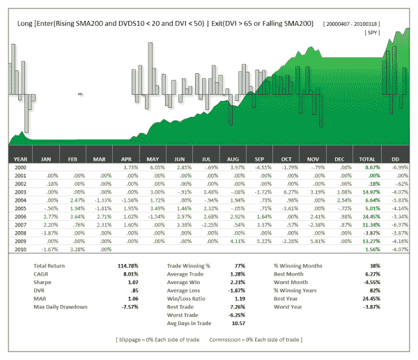

<!--yml
category: 未分类
date: 2024-05-12 18:33:31
-->

# A Conservative Long Only Strategy | CSSA

> 来源：[https://cssanalytics.wordpress.com/2010/03/23/a-conservative-long-only-strategy/#0001-01-01](https://cssanalytics.wordpress.com/2010/03/23/a-conservative-long-only-strategy/#0001-01-01)

Friday will be our official release day for **DV Indicators for Amibroker**. Expect different packages covering filters as well as oscillators and other categories to follow.  Next week on Thursday or Friday will be the official release of the **DVixL Excel** platform (with real-time) as well as **DV Indicators Excel Plug-In** (with real-time).

In the test below, we used two DV Indicators that were longer-term: the **DVI** which is an intermediate smooth momentum oscillator and the **DVDS** or Super-Smoothed Double-Stochastic as it is otherwise known. The goal was to create a simple and fairly low-risk/low maintenance long only strategy. We used a rising/falling 200sma as a trend filter. We bought when the DVDS was less than 20 indicating a near cycle bottom, and DVI was below .5 –indicating intermediate oversold conditions. The position was sold when DVI rose above .5 or if the 200sma started to fall to protect against having to be stuck in a long trade. The results below are pretty good and exposure is very low and do not include the yield on T-bills (which would improve the results). The maximum drawdown is very acceptable, and the percentage of winners are high enough to stick with the strategy. There are many ways to increase the gains per trade as well as returns without increasing risk–but I will leave that up to creative researchers to figure out.

