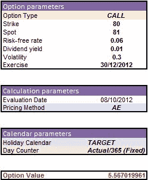

<!--yml
category: 未分类
date: 2024-05-18 08:09:10
-->

# A European-type option pricer with QuantLibXL | Quant Corner

> 来源：[https://quantcorner.wordpress.com/2012/10/08/a-european-type-option-pricer-with-quantlibxl/#0001-01-01](https://quantcorner.wordpress.com/2012/10/08/a-european-type-option-pricer-with-quantlibxl/#0001-01-01)

Some time ago, we wrote a **C++/QuantLib** code for [a European-style options pricer](https://quantcorner.wordpress.com/2011/01/27/a-pricer-for-european-style-options-on-stocks-a-smooth-start-with-quantlib/ "A pricer for European-style options on stocks. A smooth start with Quantlib") . Today, we jump into [**QuantLibXL**](http://quantlib.org/quantlibxl/ "QuantLibXL"), a wrapper that exports **QuantLib** functions to **Excel**.

We provide a [QLXL European Option](https://quantcorner.wordpress.com/wp-content/uploads/2012/10/qlxl-european-option.xlsx) workbook. Hopefully, close examination of the second tab will provide guidance on how to build option pricers with **QuantLibXL**.

