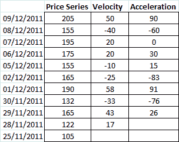
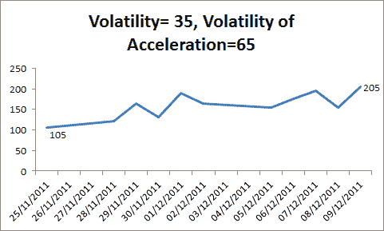
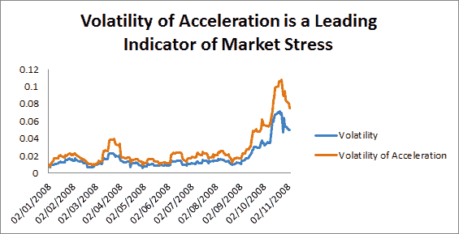
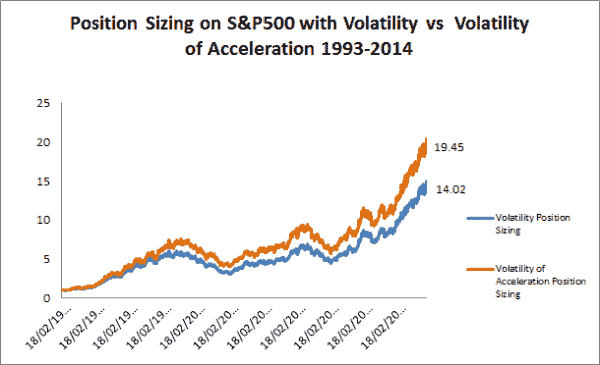

<!--yml
category: 未分类
date: 2024-05-12 17:51:11
-->

# A New (Better?) Measure of Risk and Uncertainty: The Volatility of Acceleration | CSSA

> 来源：[https://cssanalytics.wordpress.com/2014/11/28/a-new-better-measure-of-risk-and-uncertainty-the-volatility-of-acceleration/#0001-01-01](https://cssanalytics.wordpress.com/2014/11/28/a-new-better-measure-of-risk-and-uncertainty-the-volatility-of-acceleration/#0001-01-01)

Momentum is one of the most popular subjects in the financial media. From a physics perspective it is analogous to a measure of average velocity (the rate of change with respect to time). While measures of instantaneous velocity (the derivative of distance with respect to time) are more accurate they are rarely used in practice. One topic that is rarely discussed is the concept of acceleration- or the rate of change in velocity (instantaneous velocity is the derivative of velocity with respect to time). A simple method to calculate velocity and acceleration is to take the first difference or returns of a time series. The table below shows the difference between velocity and acceleration using this simple method of first differences of price, however returns could also be used:

Acceleration is perhaps a more interesting avenue for quantitative research because it signals changes in momentum. Given two stocks with the same momentum, a parabolic rise tends to be riskier than a short-term deceleration in performance. Furthermore, a stock that rises consistently without much change in velocity tends to be less risky than one that constantly changes directions. Unfortunately, volatility on its own tends to penalize changes around a constant slope which may reflect normal ebbs and flows in a persistent trend. For trend-following, traders want a risk measure that is be able to capture the stability of the trend. Various risk measures have been promoted as superior alternatives such as downside standard deviation or conditional value at risk, but their downside- to excuse the pun- is that they fail to reflect risk that can be created on the upside of the distribution. Furthermore, by focusing on the downside of the distribution you have fewer samples to work with. Ideally an alternative risk metric would be bi-directional and indifferent to up or down returns. One such measure is using the volatility of acceleration- or the volatility of the velocity in returns using the first difference between the return today and the return yesterday as a proxy. The following charts of artificially generated time series data show the difference between the volatility of price differences (rather than returns) and the volatility of acceleration to give readers a sense for how the two measures differ. In this case, both time series start and end at the same price but have different profiles:

In the first chart, the trend is very consistent and both measures are very close- and considering the volatility of acceleration tends to be 50% greater than volatility on average- the volatility of acceleration is showing that risk is actually **lower** than what volatility is saying. In the second chart, the trend is highly inconsistent with several false moves up and down. In this case both volatility and the volatility of acceleration show an increase in risk versus the first time series. However, the volatility of acceleration shows that risk is significantly higher than volatility- even adjusting for scale- which makes intuitive sense. Essentially, the volatility of acceleration is boosted by the changes in direction in momentum. What is even more interesting is that when we apply this volatility of acceleration measure to real time series data, we see that it tends to **lead** volatility- in other words it tends to provide an early warning signal for risk. The chart below shows the 10-day volatility on the S&P500 (SPY) versus the 10-day volatility of acceleration during the financial crisis in 2008:

Notice that the volatility of acceleration spikes well in advance of the standard volatility readings. Obviously this is a valuable feature for good risk management. But does this translate to practical use in trading systems? As it turns out, it does, and there are a lot of different ways to apply this concept. One simple method is to look at standard volatility position sizing. In this case we use the same 10-day measure for both and a 1% daily target risk (1.5% for volatility of acceleration to reflect difference in scale):

Using the volatility of acceleration measure results in consistently superior returns over time and also higher risk-adjusted returns (higher sharpe ratio). Creative exploration could yield numerous areas of fruitful research. One additional application can be to create an alternative to the popular sharpe ratio. By calculating the annualized volatility of acceleration and dividing this result by 1.5, one can compute what I like to call the “return-to-uncertainty ratio” which may improve the evaluation of trading strategies.