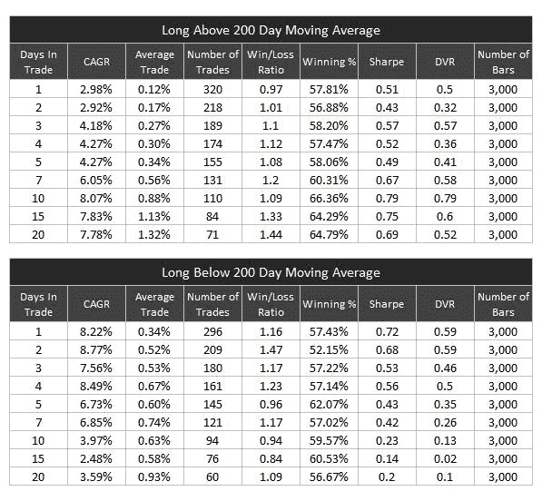

<!--yml
category: 未分类
date: 2024-05-12 18:28:42
-->

# A New DV Blog and a Cool New Tool | CSSA

> 来源：[https://cssanalytics.wordpress.com/2010/04/13/a-new-dv-blog-and-a-cool-new-tool/#0001-01-01](https://cssanalytics.wordpress.com/2010/04/13/a-new-dv-blog-and-a-cool-new-tool/#0001-01-01)

Please note that the **DV Indicators Excel Plug-In** is currently available in the store.  [http://dvindicators.cssanalytics.com/indicators/dv-excel-plug-in/](http://dvindicators.cssanalytics.com/indicators/dv-excel-plug-in/)

I would like to introduce our first **DV Indicators Blog** post which will be an ongoing site dedicated to posting internal DV Indicators research and future ideas/concepts. This blog will be maintained by Enn Kuutan–  who is currently enrolled in the CMT program and is a serious student of the markets.

Cross-posted at [DV Indicators](http://dvindicators.cssanalytics.com/blog/) by Enn Kuutan

Markets go through different phases, bulls rule one month, bears the next. There are many different strategies to navigating the markets but following the long term trend in terms of the 200dma is a favourite that is helpful in maximizing profitability. Waiting for an oversold condition to enter positions is one way of getting on board. Here we are *looking at long trade entries above and below the 200dma* using **extremes in the DV2 oscillator, initiating on entries below 20**. But what should be our exit criteria? Let’s look at the effects of time based exists, holding periods of 1-5,7,10,15 and 20 days. Hat tip to Rob Hanna of [Quantifiable Edges](http://quantifiableedges.blogspot.com/) ([http://quantifiableedges.blogspot.com](http://quantifiableedges.blogspot.com/)/) for inspiring the time based analysis and tables! To stick with what Rob typically does in his analysis, I used a fixed $10,000 bet size without reinvestment.

Interestingly enough the long trades below the 200dma outperform those above the 200dma for short holding periods, presumably because of the high volatility and compressed cycle length associated with market conditions under the 200dma/in a bear market (see [https://cssanalytics.wordpress.com/2010/04/07/a-simple-adaptive-change-to-daily-follow-through-to-capture-cycle-changes/](https://cssanalytics.wordpress.com/2010/04/07/a-simple-adaptive-change-to-daily-follow-through-to-capture-cycle-changes/)). However holding on to those entries above the 200dma leads to much higher gains per trade when holding above 7 days. The old ***Livermore*** saying ***“It never was my thinking that made the big money for me. It always was my sitting.”*** comes to mind, but **only when the trend in a higher time frame is your friend**.

Looking into the  risk-adjusted analysis details we see a fascinating picture emerge: as the holding period above the 200dma increases, the DVR, a measure of reward to risk which specifically is the linearity-adjusted Sharpe ratio, increases up to an optimal holding period of 10 days while below the 200dma the DVR peaks at 2 days and deteriorates rapidly. This is exactly what you would expect trading counter to the trend.

Looking at another measure of reward to risk, the Win/Loss ratio we see the same effect, although in a less pronounced fashion than with looking at the DVR.

In the next post we’ll look at the same type of time based exit analysis only with short positions, stay tuned….