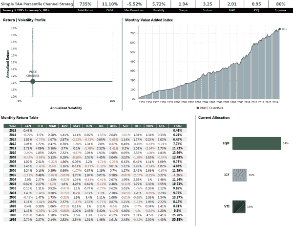

<!--yml
category: 未分类
date: 2024-05-12 17:49:14
-->

# A Simple Tactical Asset Allocation Portfolio with Percentile Channels | CSSA

> 来源：[https://cssanalytics.wordpress.com/2015/01/26/a-simple-tactical-asset-allocation-portfolio-with-percentile-channels/#0001-01-01](https://cssanalytics.wordpress.com/2015/01/26/a-simple-tactical-asset-allocation-portfolio-with-percentile-channels/#0001-01-01)

I prefer presenting new tools and concepts, but I know that there are a lot of readers that would like to see how they can be applied to creating strategies. So here is a very simple strategy that applies [Percentile Channels](https://cssanalytics.wordpress.com/2015/01/21/percentile-channels-a-new-twist-on-a-trend-following-favorite/ "Percentile Channels: A New Twist On a Trend-Following Favorite") from the last post to a tactical asset allocation strategy. The strategy starts with only 4 diversified asset classes:

Equities– VTI (or SPY)
Real Estate– IYR (or ICF)
Corporate Bonds– LQD
Commodities–DBC

for Cash we will use SHY

Here are the rules:

1) Use 60,120,180, 252-day percentile channels- corresponding to 3,6,9 and 12 months in the momentum literature- (4 separate systems) with a .75 long entry and .25 exit threshold with long triggered above .75 and holding through until exiting below .25 (just like in the previous post)
2) If the indicator shows that you should be in cash, hold SHY
3) Use 20-day historical volatility for risk parity position-sizing among active assets (no leverage is used). This is 1/volatility (asset A) divided by the sum of 1/volatility for all assets to determine the position size.
4) rebalance monthly

Here are the results for this simple strategy:

This is a very consistent strategy which is more notable for its low maximum drawdown and high sharpe ratio (near 2) than its sexy returns. Of course there are many alternatives to “spice” this up by varying the allocation among instruments, changing instruments or using leverage. I wanted to keep the asset list short and simple, and I chose corporate bonds since they provide some of the defensive characteristics of treasurys but with a higher yields and arguably lower systematic risk (no sovereign risk). Substituting the 10-year treasury with IEF instead of corporate bonds produces nearly identical results (1.9 sharpe, 11.8% Cagr, 5.8% max dd). There were better combinations of asset classes and parameters, but this compact list seemed manageable for a self-directed investor without a large portfolio.This is not the ultimate strategy by any means, but shows how to use percentile channels to produce a viable approach to tactical asset allocation.