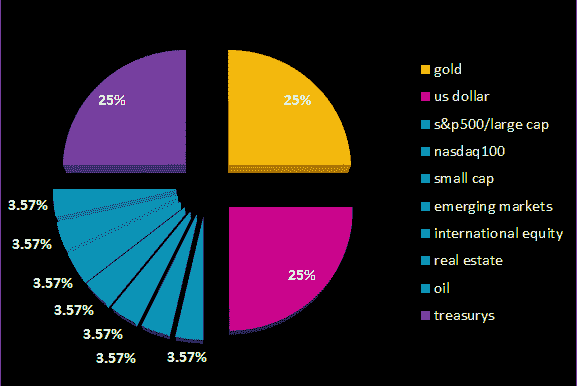

<!--yml
category: 未分类
date: 2024-05-12 18:02:46
-->

# A Visual of Current Major Market Clusters | CSSA

> 来源：[https://cssanalytics.wordpress.com/2013/01/10/a-visual-of-current-major-market-clusters/#0001-01-01](https://cssanalytics.wordpress.com/2013/01/10/a-visual-of-current-major-market-clusters/#0001-01-01)

Here is a  [cluster](https://cssanalytics.wordpress.com/2013/01/03/cluster-risk-parity/ "Cluster Risk Parity") representation  of some of the major markets that are traded internationally. The groupings were formed using data over the past year with a  clustering algorithm that is proprietary (correlation is used as a distance metric). What is interesting is that this particular cluster grouping has persisted  without much change over the past 4 years. Notice that oil has behaved more similarly to equities than it has to gold. This divergence coupled with the fact that the US Dollar has behaved as a distinct cluster suggests that the market is pricing fears of currency debasement as being more likely than commodity inflation (in which case commodities and gold would be grouped together). Another explanation might lie in fact that market sentiment is currently dominated by shifts in the perception of economic growth which outweight the perceived risk of inflation. The grouping of all of the equity indices and even real estate suggest that their risk is being dominated by one or more common factors. Regardless of the explanation, I find it interesting to group clusters and then reverse-engineer a story for market expectations. Interestingly enough, using a 20-day lookback Oil has detached and formed a separate cluster apart from gold, equities and the us dollar….. not sure what to make of that!

