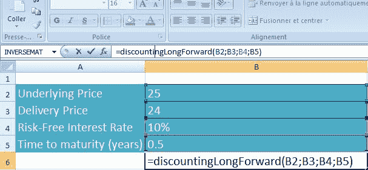
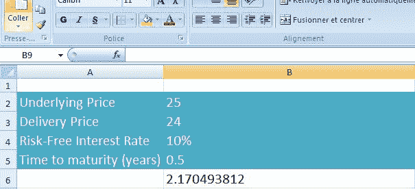

<!--yml
category: 未分类
date: 2024-05-18 08:10:26
-->

# A function defined in C++ and passed on to Excel : a DLL example | Quant Corner

> 来源：[https://quantcorner.wordpress.com/2011/04/02/afunction-defined-in-c-and-used-in-excel-a-dll-exampl/#0001-01-01](https://quantcorner.wordpress.com/2011/04/02/afunction-defined-in-c-and-used-in-excel-a-dll-exampl/#0001-01-01)

Imagine  the function you need is not available in **Excel**, moreover you like better programming with  **C++** than with **Excel VBA**. In this case, you shall want to encapsulate the function defined by yourself into a piece of **C++** code, and write an interface so that to use it with **Excel**. This way you would have the best of both world, that is the power and fast-computing of  **C++**, and the user-friendliness of **Excel**.

This is the purpose of this post. We are going to write a **DLL** made of a standard ***.cpp** file containing  the definition of the function and a ***.def** file (that is a module-definition file). And, we will tell **Excel** about this **DLL** thanks to few **Excel VBA** lines of codes.

Our simple example of a **DLL** integrated together with **Excel** (version 2007) is derived from *Options, futures and other derivatives 7^(th)*(J.C Hull), p.109\. The author there explains how to calculate the value of a forward contract on a investment asset providing no income. We are going to write the code corresponding.

J.C Hull gives the example of an investor who entered a long forward position on a non-dividend-paying underlying, the delivery price being $24 (K=24). The time length to maturity is now 6 months (T=0,5) . The price of the underlying as of today is $25 (S[0]=25), and the risk-free interest (continuous compounding) rate is 10% per annum (R = 10%).

Let **f** be the value of a long forward contract today, f = (F[0] – K ) e ^(–rT) where F[0] = S[0] e^(rT)

_______
S[0] = 25
K = 24
r = 10%
T = 0,5
_______

Please, refer to [Creating a DLL project with MS Visual Basic 2010](https://quantcorner.wordpress.com/2011/03/28/creating-a-dll-project-with-ms-visual-basic-2010) to get started up with the creation of a **DLL** project with **MS Visual Studio 2010**.

First, our ***.cpp** file will contain the definition of the function that computes **f** is :

```
#include<math.h>

double _stdcall discountingLongForward(
	double underlying,
	double K,
	double rate,
	double timeToMaturity)
{
double forward = underlying * (exp (rate * timeToMaturity));
double discountedLongForward = (forward - K) * (exp (-rate * timeToMaturity));
return discountedLongForward;
}
```

The keyword **_stdcall** is a function calling keyword. Here, **discountingLongForward** is the function to be called by **Excel**.

Now, the ***.def** file lists the  function that have to be passed on to **Excel**.
This is straightforward

```
LIBRARY
EXPORTS
	discountingLongForward
```

The line **LIBRARY** is automatically written at the time of adding the ***.def**. Just let it.

At this stage, you have both your ***.cpp** and ***.def** files. It is time to compile in the usual way.

We are now turning to **Excel**. We have to tell it that our **DLL** exists, where it locates, and the nature of its inputs and output.

```
Declare Function discountingLongForward Lib _
"C:\ [folder] ... [your_DLL_file_name.dll]" _
(ByVal underlying As Double, ByVal K As Double, _
ByVal rate As Double, ByVal timeToMaturity As Double) As Double
```

Notice here the **ByVal** keyword, as **ByRef** is the default mode of **Excel**. It is to ensure the calculations gets right. But, one can argues that it is not necessary for this very basic example.

Here it is!

To conclude with, below we show our **DLL** at work. With no surprise, it gets the same calculation result as read in the J.C Hull’s book.

[](https://quantcorner.wordpress.com/wp-content/uploads/2011/04/discountinglongforward_formula.jpg)

[](https://quantcorner.wordpress.com/wp-content/uploads/2011/04/discountinglongforward_calculation_result.jpg)