<!--yml
category: 未分类
date: 2024-05-18 14:17:20
-->

# A journey through microwaves – Sniper In Mahwah & friends

> 来源：[https://sniperinmahwah.wordpress.com/2015/01/05/a-journey-through-microwaves/#0001-01-01](https://sniperinmahwah.wordpress.com/2015/01/05/a-journey-through-microwaves/#0001-01-01)

I’m finishing to write and amend the “HFT in my backyard | Part V”. This long part (about the past and the future of information transmission) should be online tonight or tomorrow. In the meantime, here is a quick note about a project called “The Nor”, “*an investigation into paranoia, electromagnetism, and infrastructure*”. Early November I have been contacted by an English artist, [James Bridle](http://shorttermmemoryloss.com). James is working on a project which is a [part](http://mirrorcity.southbankcentre.co.uk/james-bridle-onlineoffline-residency) of [*MIRRORCITY*](http://mirrorcity.southbankcentre.co.uk), an exhibition at the Hayward Gallery in London. He wanted to know more about the microwave networks used by the HFT firms in the London metropolitan area – *i.e.* between the Equinix data center in Slough and the NYSE facility in Basildon. This area looks like that on my [map](http://www.theatre-operations.com/HFT_EU_09.22.2014.kmz):

[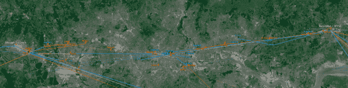](https://sniperinmahwah.wordpress.com/wp-content/uploads/2015/01/capture-d_c3a9cran-2015-01-05-c3a0-12-32-22.png)

London metro area| Slough—Basildon

James wrote: “*I’m currently working on a new commission for the Hayward Gallery in London, as part of an upcoming exhibition. The plan – it’s sort of a residency, rather than a piece in the show – is to walk and document various physical networks and sites of communication and surveillance. Two in particular are London’s networks of CCTV and automated vehicle surveillance, and the air traffic control systems and airfields around the city. Inspired by your work, I’m thinking of including the microwave networks as another ‘circuit’ – I think I’m going to try and walk the entire route from Slough, to the City of London, and out again to Basildon*.” I told the artist he could do a better job than me about the London metro area (this part of my map is really incomplete as I preferred to search for tall towers lost in potato fields than investigating on the millimeter waves used in London – the city is not in my backyard, after all). I advised James to use the Ofcom [website](http://spectruminfo.ofcom.org.uk/spectrumInfo/licences) to find more London locations and it seems he really did it, since he posted yesterday this story titled “[Low Latency](http://shorttermmemoryloss.com/nor/2015/01/04/low-latency/)”, or “*a journey through microwaves*”.

This is an amazing expedition (it reminds me of the moments I spent in my potato fields). “*On Wednesday 17th and Monday 29th of December 2014”,* James Bridle made “*two expeditions by bicycle, the first of forty miles from Slough to the City of London, the second of forty-five, from the City out to Basildon in Essex”. *He followed the [Optiver](http://www.optiver.com) paths and shoot the locations where the Dutch firm (sometimes) mounted dishes:

[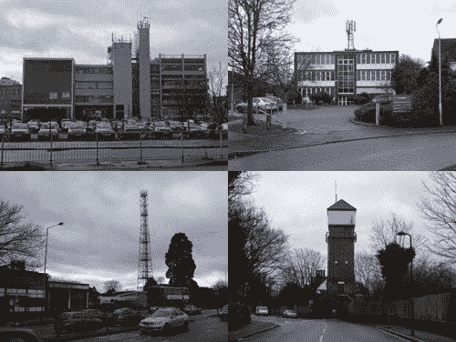](https://sniperinmahwah.wordpress.com/wp-content/uploads/2015/01/microwave-route-one-500x376.jpg)

He also shoot the big dishes installed by [McKay Brothers](http://www.mckay-brothers.com) at the top of the Hilligdon hospital:

[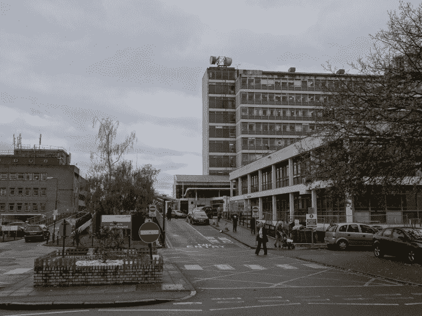](https://sniperinmahwah.wordpress.com/wp-content/uploads/2015/01/16007908280_898e2608bd_k.jpg)

With the help of this other photo, you can see the brand of the dishes (here the thunderbolt graphic is for [Andrew](https://www.google.fr/search?site=&tbm=isch&source=hp&biw=1609&bih=954&q=Andrew+antenna&oq=Andrew+antenna&gs_l=img.12..0i19.487.487.0.1293.1.1.0.0.0.0.251.251.2-1.1.0.msedr...0...1ac.1.60.img..0.1.251.PT2h6ldTbvs) – this kind of information may be interesting: if you know which brand of dish a firm uses, you can sometimes know who is the owner of a dish without having other public information):

[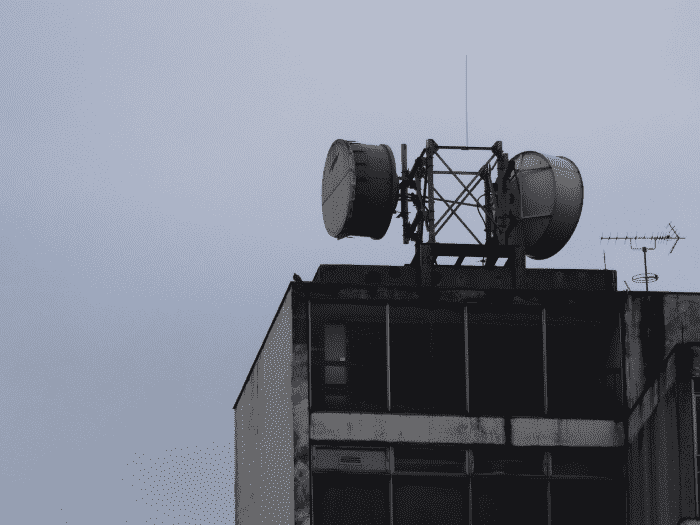](https://www.flickr.com/photos/stml/16194436412/)

He put other photographies on [Flickr](https://www.flickr.com/photos/stml/with/16194411332), so you can admire the NYSE data center in Basildon…

[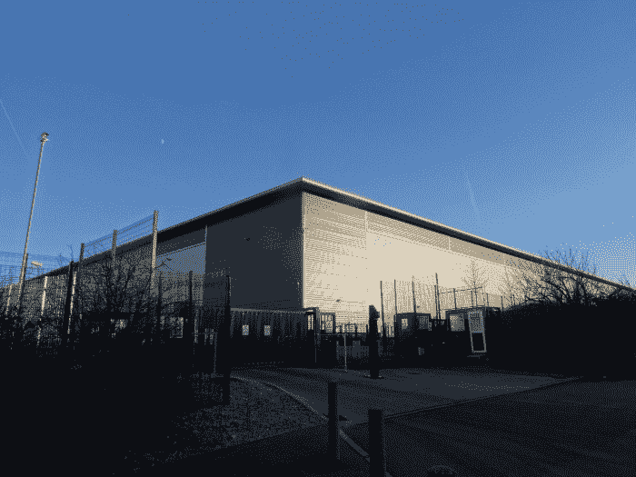](https://www.flickr.com/photos/stml/16009363277/)

…with a word of welcome (I didn’t see the dogs when I visited the exchange)…

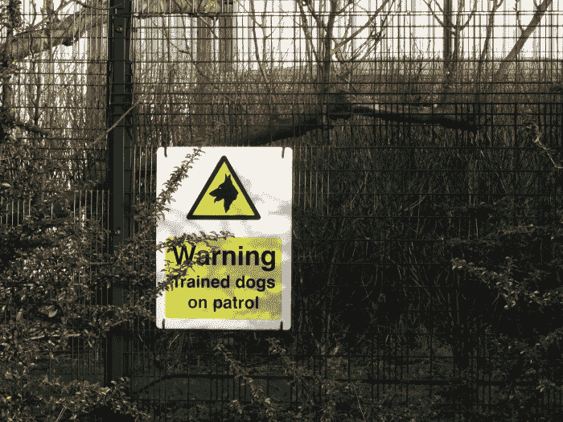

… and a small dish mounted at the top of the facility:

[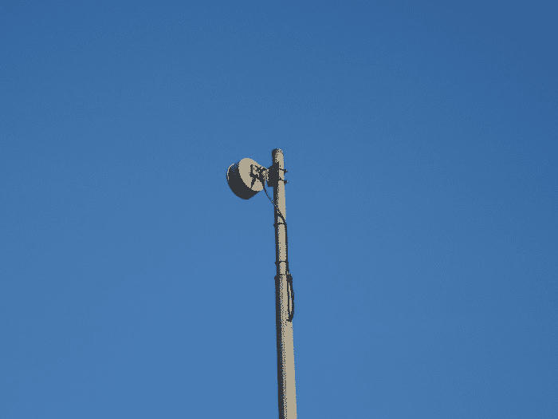](https://www.flickr.com/photos/stml/16007814560/)

I remember that, when I was parsing the Ofcom licences to find those booked by the HFT firms/providers, I was surprised to see some paths were converging in a point in the center of London, as if there were a mandatory stop there within the Basildon-Slough route:

[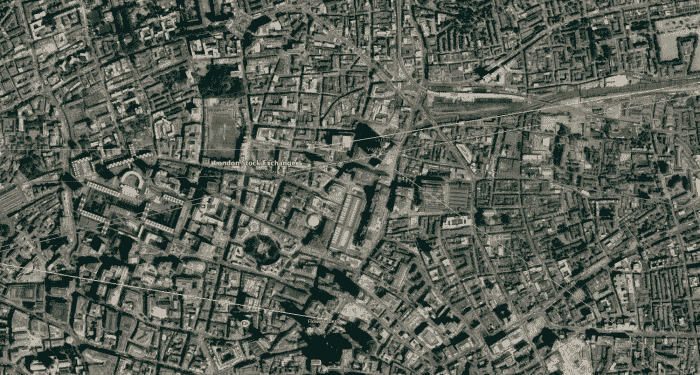](https://sniperinmahwah.wordpress.com/wp-content/uploads/2015/01/capture-d_c3a9cran-2015-01-05-c3a0-13-56-26.png)

It took me hours to find this is where the London Stock Exchange has a data center, on Earl Street, shoot by James:

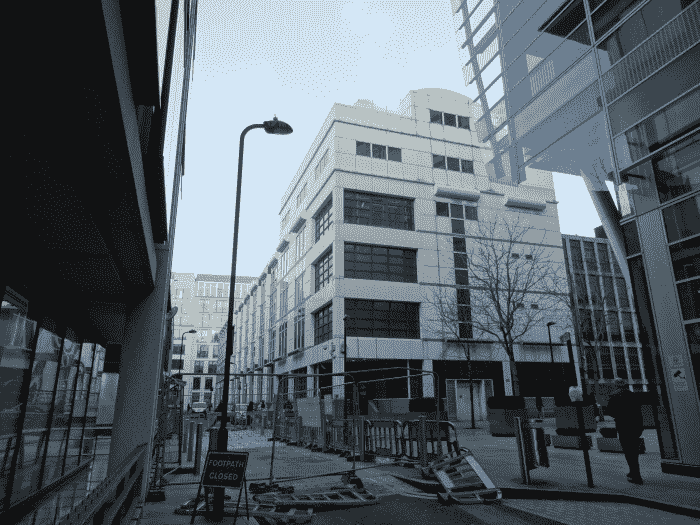

Here is a photo of the BT tower, where [Vigilant, Flow Traders, Jump Trading and Optiver](http://spectruminfo.ofcom.org.uk/spectrumInfo/licences?service=Fixed+Links&code=301010&freqStart=&freqStop=&unit=GHz&ngrloc=&offset=&nw=%2851.52164504744155%2C+-0.13928711414337158%29&ne=%2851.52164504744155%2C+-0.13884186744689941%29&se=%2851.5213680056711%2C+-0.13884186744689941%29&sw=%2851.5213680056711%2C+-0.13928711414337158%29&googloc=%2851.521506526767006%2C+-0.1390644907951355%29&googoffset=0.0&submit=Submit+search) have licences:

[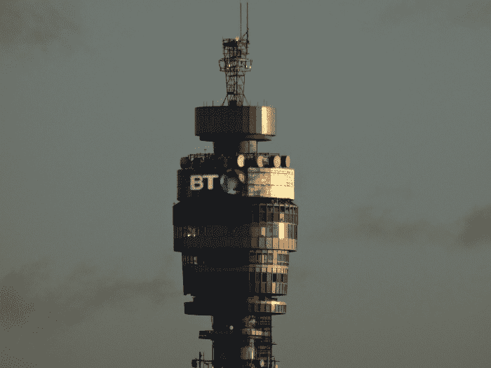](https://www.flickr.com/photos/stml/15572839694/)

As usual, Jump has a [lotttt](http://spectruminfo.ofcom.org.uk/spectrumInfo/licences?googloc=(51.521506526767006%2c+-0.1390644907951355)&code=301010&se=(51.5213680056711%2c+-0.13884186744689941)&googoffset=0.0&nw=(51.52164504744155%2c+-0.13928711414337158)&unit=GHz&ne=(51.52164504744155%2c+-0.13884186744689941)&service=Fixed+Links&sw=(51.5213680056711%2c+-0.13928711414337158)&submit=Submit+search&groupKey=5) of licenses there; for once, Vigilant [too](http://spectruminfo.ofcom.org.uk/spectrumInfo/licences?googloc=(51.521506526767006%2c+-0.1390644907951355)&code=301010&se=(51.5213680056711%2c+-0.13884186744689941)&googoffset=0.0&nw=(51.52164504744155%2c+-0.13928711414337158)&unit=GHz&ne=(51.52164504744155%2c+-0.13884186744689941)&service=Fixed+Links&sw=(51.5213680056711%2c+-0.13928711414337158)&submit=Submit+search&groupKey=3); but Optiver has only the [two](http://spectruminfo.ofcom.org.uk/spectrumInfo/licences?googloc=(51.521506526767006%2c+-0.1390644907951355)&code=301010&se=(51.5213680056711%2c+-0.13884186744689941)&googoffset=0.0&nw=(51.52164504744155%2c+-0.13928711414337158)&unit=GHz&ne=(51.52164504744155%2c+-0.13884186744689941)&service=Fixed+Links&sw=(51.5213680056711%2c+-0.13928711414337158)&submit=Submit+search&groupKey=7) licenses they need (the Dutch style). As James followed the Optiver paths, it’s probable two of the four dishes on the right are owned by Optiver; I bet the two others with the Andrew logo are those of Jump, but we can’t be sure (I’ll have to check the planning applications but I don’t have the time for that anymore).

The Slough post office seems to be invaded by various dishes (and not only HFT dishes):

[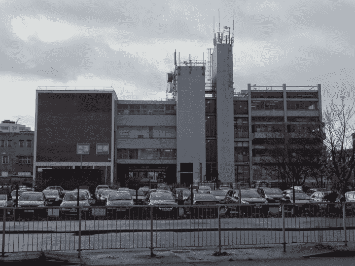](https://www.flickr.com/photos/stml/16007795848/)

Finally, here is the Equinix LD4 data center in Slough (I have never been there):

[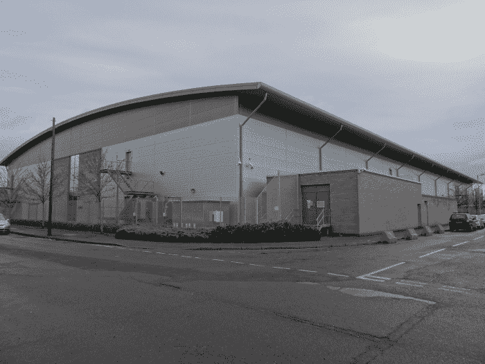](https://www.flickr.com/photos/stml/16193400641/)

And here is the tower sticked to the data center, where (I assume) all the HFT competitors have dishes. See how the top of the tower is blocked – I suppose the first firms who put the dishes asked to be at the top of the top of the tower:

[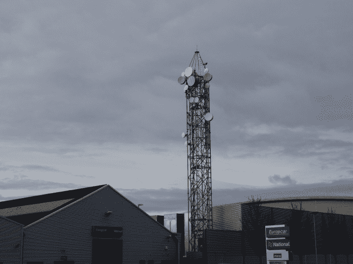](https://www.flickr.com/photos/stml/16009490257/)

Read James’ [story](http://shorttermmemoryloss.com/nor/2015/01/04/low-latency/) to learn more about the locations he visited (history is always interesting). Last but not least, James also built its own tool for querying Ofcom licences, named the “NOR Spectrum Analyser”; you can find it [there](http://shorttermmemoryloss.com/nor/spectrum/). Here is a screenshot:

[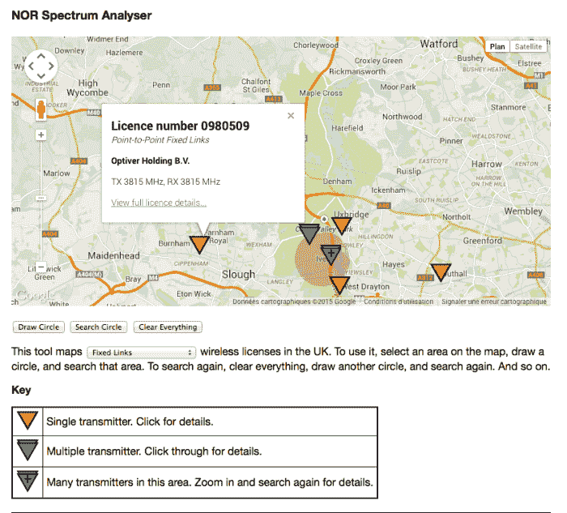](https://sniperinmahwah.wordpress.com/wp-content/uploads/2015/01/capture-d_c3a9cran-2015-01-05-c3a0-13-04-11.png)

Thanks to James Bridle for this field work. In the introduction of the story we can read that “*the locations and associated documents will appear shortly on the map of the Nor*”. The [map](http://shorttermmemoryloss.com/nor/map/) is nearly empty for now…

[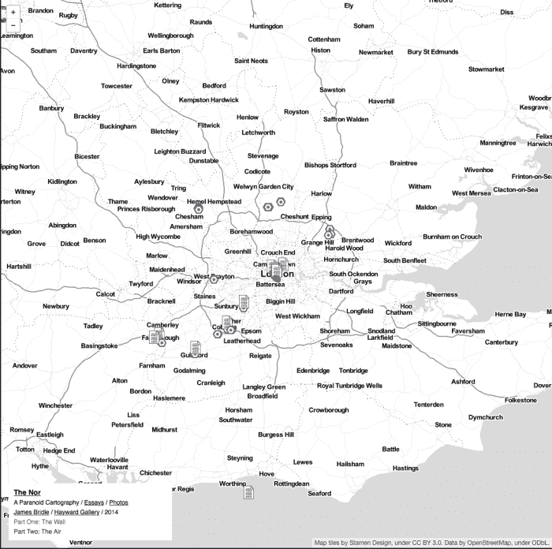](https://sniperinmahwah.wordpress.com/wp-content/uploads/2015/01/capture-d_c3a9cran-2015-01-05-c3a0-16-01-27.png)

… but I am sure that James will be able to give a more accurate visualization of the HFT world in London (he is lucky: just after he started to think about these microwave paths, the Ofcom website was updated with new data about the licenses; I would have been happy to be as lucky as James when I started my investigation). Stay tuned.