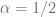
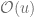
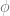
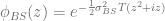
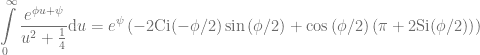
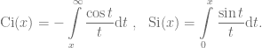
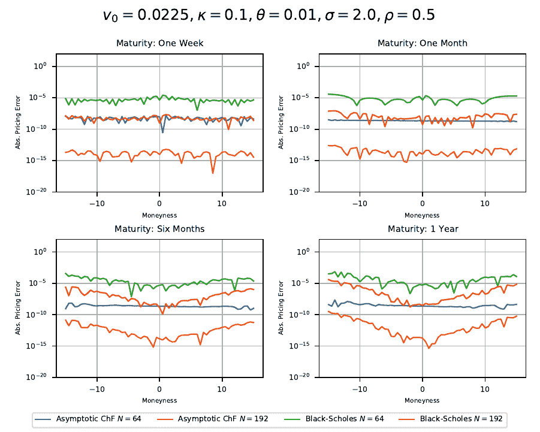
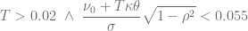

<!--yml
category: 未分类
date: 2024-05-13 00:10:32
-->

# A novel Control Variate for the Heston Model – HPC-QuantLib

> 来源：[https://hpcquantlib.wordpress.com/2020/08/30/a-novel-control-variate-for-the-heston-model/#0001-01-01](https://hpcquantlib.wordpress.com/2020/08/30/a-novel-control-variate-for-the-heston-model/#0001-01-01)

Semi analytical valuation methods for the Heston model often fall short in very high vol of vol scenarios. The reason for these difficulties becomes clearer when looking at the asymptotic behavior of the integrand for a call option price in the Carr-Maden formulation for  (model definition and further references can be seen [here](https://hpcquantlib.wordpress.com/2020/05/17/optimized-heston-model-integration-exponentially-fitted-gauss-laguerre-quadrature-rule/)):

![\begin{array}{rcl} C(S_0, K, T) &=& Fe^{-rT} - \frac{\sqrt{Se^{(r-q)t}K}e^{-rt}}{\pi}\displaystyle\int\limits_{0}^{\infty}{\Re\left( e^{i u \left(\ln\frac{S}{K}+(r-q)T\right) } \frac{\phi_T\left(u-\frac{i}{2}\right)}{u^2+\frac{1}{4}} \right)  \mathrm{d}u}\nonumber \\ \phi_T(z) &=& \exp\left\{\frac{v_0}{\sigma^2}\frac{1-e^{-DT}}{1-Ge^{-DT}}\left(\kappa-i\rho\sigma z-D\right) + \frac{\kappa\theta}{\sigma^2}\left(\left(\kappa-i\rho\sigma z-D\right)T-2\ln\frac{1-Ge^{-DT}}{1-G}\right) \right\} \nonumber \\  D&=&\sqrt{\left(\kappa - i\rho\sigma z\right)^2+\left(z^2+iz\right)\sigma^2} \nonumber \\ G&=&\displaystyle\frac{\kappa -i\rho\sigma z-D}{\kappa -i\rho\sigma z + D}\end{array}](img/f8616e3316626a39e6ad151945aaa1cd.png).

A lengthy calculation of the asymptotic expansion up to  gives

![\phi_T\left(u-\frac{i}{2}\right)\xrightarrow[]{u\rightarrow \infty} e^{\phi u + \psi}](img/852d3577f4418910d88bbd3351f1521e.png)

with

![\displaystyle \begin{array}{rcl} \phi &=& -\frac{1}{\sigma}\left(v_0 + \kappa\theta T \right)(\sqrt{1-\rho^2} + i\rho)\nonumber \\ \psi &=& \frac{1}{\sigma^2}\left[(\kappa - \rho\sigma/2)(v_0+\kappa\theta T) + \kappa\theta\log\left(4-4\rho^2\right) - i\left(\rho^2\sigma/2- \kappa\rho\right)\frac{v_0+\kappa\theta T}{1-\rho^2} + 2i\kappa\theta\arctan{\frac{\rho}{\sqrt{1-\rho^2}}} \right]\end{array}](img/37cb65f79173146f6ac3061ef01acce1.png)

High vol of vol leads to small  and in turn to a very slowly decaying integrand which renders any type of Black-Scholes control variate

useless. On the other side the integral over the asymptotic expansion has an easy to evaluate semi-analytic solution

with the special functions aka trigonometric integrals

This function can act as a highly efficient control variate for these otherwise difficult to handle high vol of vol parameter sets. A comparison with the Black-Scholes control variate is shown in the diagram below using Gauss-Laguerre integration of different orders .

As a rule of thumb the control variate based on the asymptotic expansion of the characteristic function outperforms the standard Black-Scholes control variate if 

.

The QuantLib implementation of the algorithm is part of the [PR#898](https://github.com/lballabio/QuantLib/pull/898).