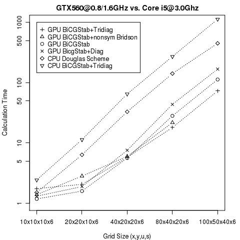

<!--yml
category: 未分类
date: 2024-05-17 23:41:59
-->

# Accelerate VPP Pricing on the GPU using Preconditioner – HPC-QuantLib

> 来源：[https://hpcquantlib.wordpress.com/2012/01/22/accelerate-vpp-pricing-on-the-gpu-using-preconditioner/#0001-01-01](https://hpcquantlib.wordpress.com/2012/01/22/accelerate-vpp-pricing-on-the-gpu-using-preconditioner/#0001-01-01)

As outlined in [Solving Sparse Linear Systems using CUSP and CUDA](../2011/11/13/solving-sparse-linear-systems-using-cusp-and-cuda/ "Permanent Link to Solving Sparse Linear Systems using CUSP and CUDA") a VPP pricing problem can be solved on a GPU using finite difference methods based on the implicit Euler scheme. The matrix inversion is carried out on the GPU using the BiCGStab solver of the numerical library cusp [1]. The  optimal exercise problem for the VPP can be solved using dynamic programming for every time slice on the GPU (see [2]).

The lower convergence order in  of the implicit Euler scheme is not a disadvantage because the hourly optimization step forces  anyhow. This step size is small enough for the implicit Euler scheme to obtain a very good accuracy. The explicit Euler scheme is  numerically unstable, even if . It converged only for large  and .

Clearly the matrix inversion dominates the overall runtime of the pricing routine. Preconditioning is a standard technique to improve the performance of the involved BiCGStab algorithm. The cusp library supports a set of suited preconditioner for this problem.

*   Diagonal: preconditioning is very inexpensive to use, but has often limited effectiveness.
*   Approximate Inverse: Non-symmetric Bridson with different dropping strategies.
*   Smoothed Aggregation: Algebraic Multi-grid preconditioner based on smoothed aggregation.

On a CPU [QuantLib](http://www.quantlib.org) supports preconditioning based on the [Thomas algorithm](http://en.wikipedia.org/wiki/Tridiagonal_matrix_algorithm). This algorithm solves a tridiagonal matrix with  operations. The corresponding preconditioner can be seen as a natural extension of the diagonal preconditioner. Experiments on a CPU indicate that  the tridiagonal preconditioner leads to a significant speed-up for our VPP pricing problem. The upcoming CUSPARSE library of the [CUDA 4.1](http://developer.nvidia.com/cuda-toolkit-41) release contains a tridiagonal solver for the GPU. With the help of a small interface class the CUDA tridiagonal solver can be used as a cusp preconditioner. The source code is available [here](http://www.hpc-quantlib.de/src/gpupred.zip). The code depends on the latest [QuantLib](http://quantlib.org/) version from the [SVN trunk](http://quantlib.svn.sourceforge.net/viewvc/quantlib/).

The testbed is a VPP contract with  and a maturity of 4 weeks (corresponds to  exercise steps). Therefore in addition to the three dimensions for the stochastic model the problem has a fourth dimension of size   to solve the optimization problem via dynamic programming.

The following diagram shows the different run-times of the algorithms on a GPU and a CPU.

The fastest algorithm on the GPU (implicit Euler scheme with BiCGStab and tridiagonal preconditioner) outperforms the best CPU implementation (operator splitting based on the Douglas scheme) roughly by a factor of ten. The non-symmetric Bridson preconditioner with the dropping strategy from Lin & More on the GPU is the second best algorithm but it ran out of memory on larger grids. The diagonal preconditioner slows down the overall performance on the GPU and the BiCGStab algorithm with the smoothed aggregation preconditioner did not converge.

[1] cusp, [Generic Parallel Algorithms for Sparse Matrix and Graph Computations](http://code.google.com/p/cusp-library/)

[2] [Pricing of a Virtual Power Plant on a GPU](../2011/10/03/pricing-of-a-virtual-power-plant-on-a-gpu-with-cuda-4-0/ "Permanent Link to Pricing of a Virtual Power Plant on a GPU")