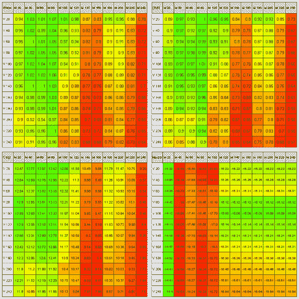
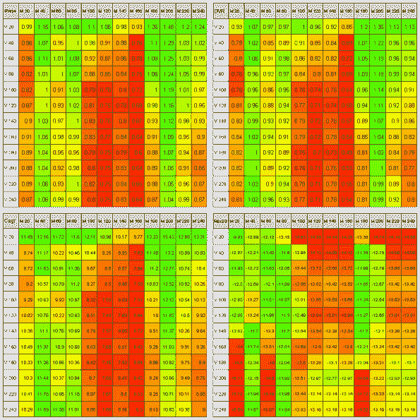

<!--yml
category: 未分类
date: 2024-05-18 14:38:14
-->

# Adaptive Asset Allocation – Sensitivity Analysis | Systematic Investor

> 来源：[https://systematicinvestor.wordpress.com/2012/08/21/adaptive-asset-allocation-sensitivity-analysis/#0001-01-01](https://systematicinvestor.wordpress.com/2012/08/21/adaptive-asset-allocation-sensitivity-analysis/#0001-01-01)

Today I want to continue with [Adaptive Asset Allocation](http://www.macquarieprivatewealth.ca/dafiles/Internet/mgl/ca/en/advice/specialist/darwin/documents/darwin-adaptive-asset-allocation.pdf) theme and examine how the strategy results are sensitive to look-back parameters used for momentum and volatility computations. I will follow the sample steps that were outlined by David Varadi on the [robustness of parameters of the Adaptive Asset Allocation algorithm](http://cssanalytics.wordpress.com/2012/07/17/adaptive-asset-allocation-combining-momentum-with-minimum-variance/) post. Please see my prior [post](https://systematicinvestor.wordpress.com/2012/08/14/adaptive-asset-allocation/) for more infromation.

Let’s start by loading historical prices for 10 ETFs using the [Systematic Investor Toolbox](https://systematicinvestor.wordpress.com/systematic-investor-toolbox/):

```

###############################################################################
# Load Systematic Investor Toolbox (SIT)
# https://systematicinvestor.wordpress.com/systematic-investor-toolbox/
###############################################################################
setInternet2(TRUE)
con = gzcon(url('http://www.systematicportfolio.com/sit.gz', 'rb'))
    source(con)
close(con)

	#*****************************************************************
	# Load historical data
	#****************************************************************** 
	load.packages('quantmod')

	tickers = spl('SPY,EFA,EWJ,EEM,IYR,RWX,IEF,TLT,DBC,GLD')

	data <- new.env()
	getSymbols(tickers, src = 'yahoo', from = '1980-01-01', env = data, auto.assign = T)
		for(i in ls(data)) data[[i]] = adjustOHLC(data[[i]], use.Adjusted=T)							
	bt.prep(data, align='keep.all', dates='2004:12::')

    #*****************************************************************
    # Code Strategies
    #******************************************************************
    prices = data$prices  
    n = ncol(prices)

    models = list()

    # find period ends
    period.ends = endpoints(prices, 'months')
        period.ends = period.ends[period.ends > 0]

```

Next I wrapped the Combo (Momentum and Volatility weighted) strategy and Adaptive Asset Allocation (AAA) strategy into bt.aaa.combo and bt.aaa.minrisk functions respectively. Following is an example how you can use them:

```

	#*****************************************************************
	# Test
	#****************************************************************** 
	models = list()

	models$combo = bt.aaa.combo(data, period.ends, n.top = 5,
					n.mom = 180, n.vol = 20)

	models$aaa = bt.aaa.minrisk(data, period.ends, n.top = 5,
					n.mom = 180, n.vol = 20)

	plotbt.custom.report.part1(models) 

```

Now let’s evaluate all possible combinations of momentum and volatility look back parameters ranging from 1 to 12 months using **Combo** strategy:

```

	#*****************************************************************
	# Sensitivity Analysis: bt.aaa.combo / bt.aaa.minrisk
	#****************************************************************** 
	# length of momentum look back
	mom.lens = ( 1 : 12 ) * 20
	# length of volatility look back
	vol.lens = ( 1 : 12 ) * 20

	models = list()

	# evaluate strategies
	for(n.mom in mom.lens) {
		cat('MOM =', n.mom, '\n')

		for(n.vol in vol.lens) {
			cat('\tVOL =', n.vol, '\n')

			models[[ paste('M', n.mom, 'V', n.vol) ]] = 
				bt.aaa.combo(data, period.ends, n.top = 5,
					n.mom = n.mom, n.vol = n.vol)
		}
	}

	out = plotbt.strategy.sidebyside(models, return.table=T, make.plot = F)

```

Finally let’s plot the Sharpe, Cagr, DVR, MaxDD statistics for the each strategy:

```

	#*****************************************************************
	# Create Report
	#****************************************************************** 
	# allocate matrix to store backtest results
	dummy = matrix('', len(vol.lens), len(mom.lens))
		colnames(dummy) = paste('M', mom.lens)
		rownames(dummy) = paste('V', vol.lens)

	names = spl('Sharpe,Cagr,DVR,MaxDD')

	layout(matrix(1:4,nrow=2))	
	for(i in names) {
		dummy[] = ''

		for(n.mom in mom.lens)
			for(n.vol in vol.lens)
				dummy[paste('V', n.vol), paste('M', n.mom)] =
					out[i, paste('M', n.mom, 'V', n.vol) ]

		plot.table(dummy, smain = i, highlight = T, colorbar = F)

	}

```

[](https://systematicinvestor.wordpress.com/wp-content/uploads/2012/08/plot1-small2.png)

I have also repeated the last two steps for the AAA strategy (bt.aaa.minrisk function):

[](https://systematicinvestor.wordpress.com/wp-content/uploads/2012/08/plot2-small2.png)

The results for AAA and Combo strategies are very similar. The shorter term momentum and shorter term volatility produce the best results, but likely at the cost of higher turnover.

To view the complete source code for this example, please have a look at the [bt.aaa.sensitivity.test() function in bt.test.r at github](https://github.com/systematicinvestor/SIT/blob/master/R/bt.test.r).