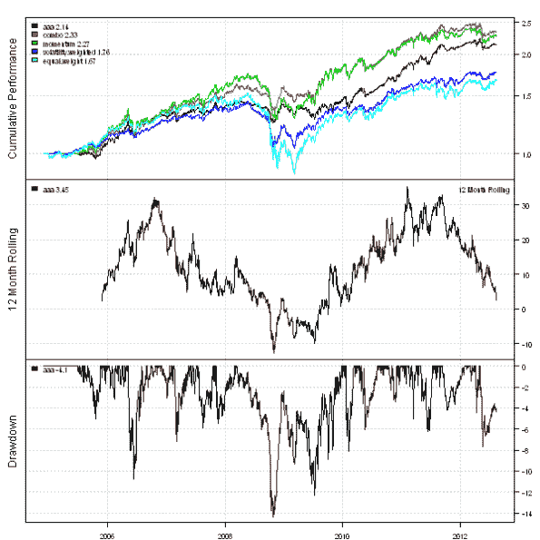
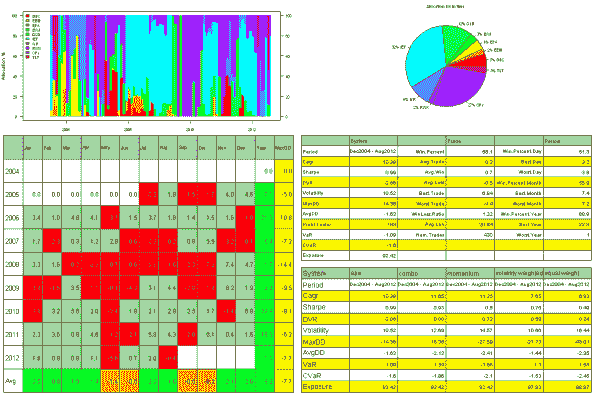
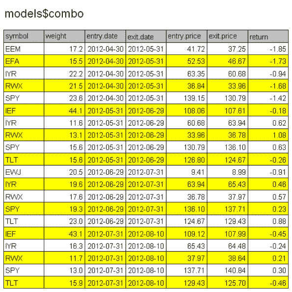
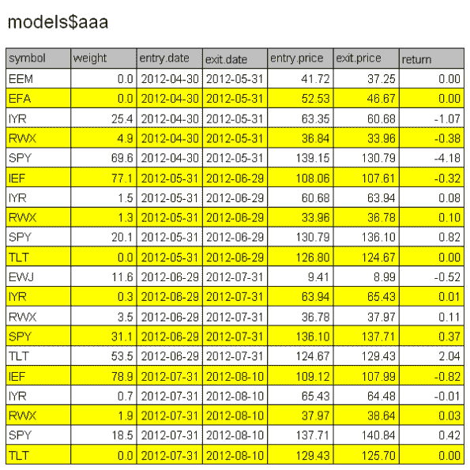

<!--yml
category: 未分类
date: 2024-05-18 14:38:22
-->

# Adaptive Asset Allocation | Systematic Investor

> 来源：[https://systematicinvestor.wordpress.com/2012/08/14/adaptive-asset-allocation/#0001-01-01](https://systematicinvestor.wordpress.com/2012/08/14/adaptive-asset-allocation/#0001-01-01)

Today I want to highlight a whitepaper about [Adaptive Asset Allocation by Butler, Philbrick and Gordillo](http://www.macquarieprivatewealth.ca/dafiles/Internet/mgl/ca/en/advice/specialist/darwin/documents/darwin-adaptive-asset-allocation.pdf) and the discussion by David Varadi on the [robustness of parameters of the Adaptive Asset Allocation algorithm](http://cssanalytics.wordpress.com/2012/07/17/adaptive-asset-allocation-combining-momentum-with-minimum-variance/).

In this post I will follow the steps of the [Adaptive Asset Allocation](http://www.macquarieprivatewealth.ca/dafiles/Internet/mgl/ca/en/advice/specialist/darwin/documents/darwin-adaptive-asset-allocation.pdf) paper, and in the next post I will show how to test the sensitivity of parameters of the of the Adaptive Asset Allocation algorithm.

I will use the 10 ETFs that invest into the same asset classes as presented in the paper:

*   U.S. Stocks ([SPY](http://www.google.com/finance?q=SPY))
*   European Stocks ([EFA](http://www.google.com/finance?q=EFA))
*   Japanese Stocks ([EWJ](http://www.google.com/finance?q=EWJ))
*   Emerging Market Stocks ([EEM](http://www.google.com/finance?q=EEM))
*   U.S. REITs ([IYR](http://www.google.com/finance?q=IYR))
*   International REITs ([RWX](http://www.google.com/finance?q=RWX))
*   U.S. Mid-term Treasuries ([IEF](http://www.google.com/finance?q=IEF))
*   U.S. Long-term Treasuries ([TLT](http://www.google.com/finance?q=TLT))
*   Commodities ([DBC](http://www.google.com/finance?q=DBC))
*   Gold ([GLD](http://www.google.com/finance?q=GLD))

Unfortunately, most of these 10 ETFs only began trading in the end of 2004, so I will only be able to replicate the recent Adaptive Asset Allocation strategy performance.

Let’s start by loading historical prices of 10 ETFs using the [Systematic Investor Toolbox](https://systematicinvestor.wordpress.com/systematic-investor-toolbox/):

```

###############################################################################
# Load Systematic Investor Toolbox (SIT)
# https://systematicinvestor.wordpress.com/systematic-investor-toolbox/
###############################################################################
setInternet2(TRUE)
con = gzcon(url('http://www.systematicportfolio.com/sit.gz', 'rb'))
    source(con)
close(con)

	#*****************************************************************
	# Load historical data
	#****************************************************************** 
	load.packages('quantmod')

	tickers = spl('SPY,EFA,EWJ,EEM,IYR,RWX,IEF,TLT,DBC,GLD')

	data <- new.env()
	getSymbols(tickers, src = 'yahoo', from = '1980-01-01', env = data, auto.assign = T)
		for(i in ls(data)) data[[i]] = adjustOHLC(data[[i]], use.Adjusted=T)							
	bt.prep(data, align='keep.all', dates='2004:12::')

    #*****************************************************************
    # Code Strategies
    #******************************************************************
    prices = data$prices  
    n = ncol(prices)

    models = list()

    # find period ends
    period.ends = endpoints(prices, 'months')
        period.ends = period.ends[period.ends > 0]

	# Adaptive Asset Allocation parameters
	n.top = 5		# number of momentum positions
	n.mom = 6*22	# length of momentum look back
	n.vol = 1*22 	# length of volatility look back   

```

Next, let’s create portfolios as outlined in the whitepaper:

```

    #*****************************************************************
    # Equal Weight
    #******************************************************************
    data$weight[] = NA
        data$weight[period.ends,] = ntop(prices[period.ends,], n)   
    models$equal.weight = bt.run.share(data, clean.signal=F)

    #*****************************************************************
    # Volatliliy Position Sizing
    #******************************************************************
    ret.log = bt.apply.matrix(prices, ROC, type='continuous')
    hist.vol = bt.apply.matrix(ret.log, runSD, n = n.vol)

    adj.vol = 1/hist.vol[period.ends,]

    data$weight[] = NA
        data$weight[period.ends,] = adj.vol / rowSums(adj.vol, na.rm=T)    
    models$volatility.weighted = bt.run.share(data, clean.signal=F)

    #*****************************************************************
    # Momentum Portfolio
    #*****************************************************************
    momentum = prices / mlag(prices, n.mom)

    data$weight[] = NA
        data$weight[period.ends,] = ntop(momentum[period.ends,], n.top)   
    models$momentum = bt.run.share(data, clean.signal=F)

    #*****************************************************************
    # Combo: weight positions in the Momentum Portfolio according to Volatliliy
    #*****************************************************************
    weight = ntop(momentum[period.ends,], n.top) * adj.vol

    data$weight[] = NA
        data$weight[period.ends,] = weight / rowSums(weight, na.rm=T)   
    models$combo = bt.run.share(data, clean.signal=F,trade.summary = TRUE)

```

Finally let’s create the Adaptive Asset Allocation portfolio:

```

    #*****************************************************************   
    # Adaptive Asset Allocation (AAA)
    # weight positions in the Momentum Portfolio according to 
    # the minimum variance algorithm
    #*****************************************************************   
    weight = NA * prices
        weight[period.ends,] = ntop(momentum[period.ends,], n.top)

    for( i in period.ends[period.ends >= n.mom] ) {
    	hist = ret.log[ (i - n.vol + 1):i, ]

		# require all assets to have full price history
		include.index = count(hist)== n.vol      

		# also only consider assets in the Momentum Portfolio
        index = ( weight[i,] > 0 ) & include.index
        n = sum(index)

		if(n > 0) {					
			hist = hist[ , index]

	        # create historical input assumptions
	        ia = create.historical.ia(hist, 252)
	            s0 = apply(coredata(hist),2,sd)       
	            ia$cov = cor(coredata(hist), use='complete.obs',method='pearson') * (s0 %*% t(s0))

			# create constraints: 0<=x<=1, sum(x) = 1
			constraints = new.constraints(n, lb = 0, ub = 1)
			constraints = add.constraints(rep(1, n), 1, type = '=', constraints)       

			# compute minimum variance weights				            
	        weight[i,] = 0        
	        weight[i,index] = min.risk.portfolio(ia, constraints)
        }
    }

    # Adaptive Asset Allocation (AAA)
    data$weight[] = NA
        data$weight[period.ends,] = weight[period.ends,]   
    models$aaa = bt.run.share(data, clean.signal=F,trade.summary = TRUE)

```

The last step is create reports for all models:

```

    #*****************************************************************
    # Create Report
    #******************************************************************    
    models = rev(models)

    plotbt.custom.report.part1(models)       
    plotbt.custom.report.part2(models)       
    plotbt.custom.report.part3(models$combo, trade.summary = TRUE)       
    plotbt.custom.report.part3(models$aaa, trade.summary = TRUE)       

```

[](https://systematicinvestor.wordpress.com/wp-content/uploads/2012/08/plot1-small1.png)

[](https://systematicinvestor.wordpress.com/wp-content/uploads/2012/08/plot2-small1.png)

[](https://systematicinvestor.wordpress.com/wp-content/uploads/2012/08/plot3-small1.png)

[](https://systematicinvestor.wordpress.com/wp-content/uploads/2012/08/plot4-small1.png)

The AAA portfolio performs very well, producing the highest Sharpe ratio and smallest draw-down across all strategies. In the next post I will look at the sensitivity of AAA parameters.

To view the complete source code for this example, please have a look at the [bt.aaa.test() function in bt.test.r at github](https://github.com/systematicinvestor/SIT/blob/master/R/bt.test.r).