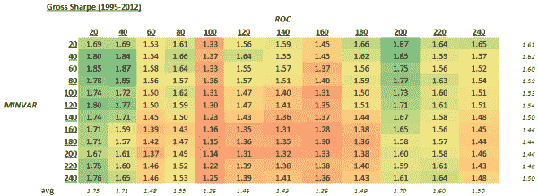
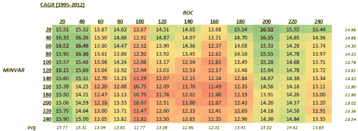
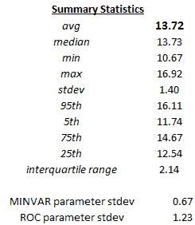

<!--yml
category: 未分类
date: 2024-05-12 18:05:58
-->

# Adaptive Asset Allocation: Combining Momentum with Minimum Variance | CSSA

> 来源：[https://cssanalytics.wordpress.com/2012/07/17/adaptive-asset-allocation-combining-momentum-with-minimum-variance/#0001-01-01](https://cssanalytics.wordpress.com/2012/07/17/adaptive-asset-allocation-combining-momentum-with-minimum-variance/#0001-01-01)

The concept of Adaptive Asset Allocation (AAA) was presented in a whitepaper by Butler, Philbrick and Gordillo this summer: [Adaptive Asset Allocation](http://www.macquarieprivatewealth.ca/dafiles/Internet/mgl/ca/en/advice/specialist/darwin/documents/darwin-adaptive-asset-allocation.pdf "Adaptive Asset Allocation PDF"). One of the core principles of  AAA is that portfolio allocation should be dynamic versus strategic– in other words, an investor’s portfolio composition should adapt over time to respond to changes in both the expected return of different asset classes and also the overall risk of the portfolio.  This theoretically ensures that investors can adequately grow and preserve their capital and withdraw to meet liabilities through different economic regimes (deflation, inflation, and many other variants).

The alluring promise of AAA rests upon the ability to dynamically adjust to different economic conditions. In a world where assets compete for capital, the  best way to forecast economic conditions is to observe the relative pricing of the most liquid securities across markets.  The time series of major asset classes represent observed variables that allow investors to detect changes in the economy. Equity markets give us the ability to observe expected business conditions, commodities give us the ability to observe expected changes in inflation, while bonds give us the ability to observe expected changes in interest rates. Real Estate is a market that provides insight into all three factors, and is a direct measure of consumer purchasing power.  Observing world equity markets can tell us how business conditions are evolving globally.  These asset classes are akin to a diverse ecosystem where different species thrive at different times due to changes in the environment.  If we can detect shifts in the system, we can understand in a probabilistic sense which species will do the best across a range of likely scenarios.  By analyzing the financial network of asset classes,  it is possible to express our views more concisely through a portfolio allocation across assets that maximizes the chance of being right while minimizing the cost of being wrong.

The analysis of major assets classes through time series data requires integrating historical returns, correlations and measurements of volatility to create an efficient portfolio allocation. The goal of this framework is to dynamically identify the best performing asset classes and to manage risk at the portfolio level. The paper presents an example of a strategy (not the actual proprietary strategy) that effectively integrates these three variables into simple  and robust framework. The logic for this example is very straightforward yet powerful in its simplicity and is validated by academic research. Momentum is chosen as the method to integrate expected returns information since the rank of historical returns (versus the raw return) represents a robust method of dynamically identifying  which assets will perform the best in the near future (2 weeks to 3 months). It is currently well-accepted by even the greatest skeptics that momentum is a powerful and reliable anomaly.  Minimum-variance optimization (MVO) is chosen as the method to manage risk at the portfolio level. It is well-accepted that MVO is effective at managing portfolio risk because it minimizes variance as a function of both  asset cross-correlations and volatilities. Since MVO does not use expected returns and instead relies on the highly forecastable elements of volatility and correlation, it is considerably more robust  to estimation error than classic mean-variance optimization and performs better out of sample in terms of  ex-post sharpe than all other existing conventional portfolio algorithms. Besides the theoretical appeal of MVO, these claims have also been validated by numerous academic studies.

The test presented in the paper uses a 6-month parameter (120-day) for momentum that selects the top 50% of asset classes and uses a weighted version of minimum-variance with an approximate lookback of 20 days to calculate portfolio allocations. The holding period for rebalancing was monthly. The obvious question is whether this particular combination of momentum and minimum-variance parameters were “lucky” and whether this represents a particular case of data snooping.  The charts below summarize backtests that were run from 1995 to 2012 using the assets provided in the whitepaper with different momentum (ROC) and minimum-variance (MINVAR) parameters. What is clear from the tables is that the performance in absolute (CAGR) and risk-adjusted terms (Gross Sharpe) is very consistent across parameters. While performance is more sensitive to the momentum parameters than minimum-variance, both are very stable. It is quite rare in system development to see this type of consistency. When the average performance is very close to the optimal performance and the standard deviation of performance is low, the chance of regret by selecting any pair of parameters is also quite low. Of course, one can avoid this pitfall by simply investing  in the pool of all possible combinations.  The methodology of this toy strategy can be vastly improved to increase risk-adjusted returns and robustness, but that is perhaps a subject for another post.

