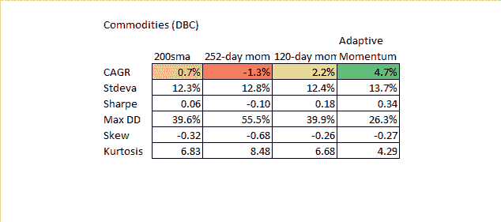
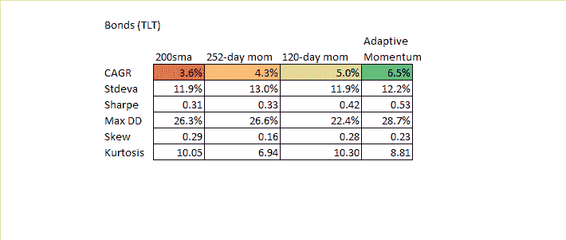

<!--yml
category: 未分类
date: 2024-05-12 17:37:59
-->

# Adaptive Momentum on Major Asset Classes | CSSA

> 来源：[https://cssanalytics.wordpress.com/2021/01/06/adaptive-momentum-on-major-asset-classes/#0001-01-01](https://cssanalytics.wordpress.com/2021/01/06/adaptive-momentum-on-major-asset-classes/#0001-01-01)

In the [last post on Adaptive Momentum](https://cssanalytics.wordpress.com/2020/12/23/how-should-trend-followers-adjust-to-the-modern-environment-enter-adaptive-momentum/) I presented a backtest on the S&P500 via SPY. Since this was an exploratory post, I had not tried the methodology on other asset classes. I wasn’t sure how effective it would be on markets such as commodities since the leverage effect was less likely to be present. I was also curious to see how the indicator would perform on bonds and international equity markets. The results showed once again that adaptive momentum was a more profitable approach than traditional methods which was encouraging. The data tables are presented below:

Overall the results are very encouraging. Some experimentation shows that significant improvement can be made with parameter optimization and that a broad range of parameters perform quite well (default settings were by no means optimal). I like this approach as it allows for a more flexible momentum response. In contrast using fixed lookbacks or all lookbacks in a portfolio didn’t seem to address the basic issues associated with adapting to market speed. The signals for using this methodology will be added to the Investor IQ website at CSS Analytics at some point in the near future for hundreds of tickers. The performance of existing analytics on this site this year has been outstanding so this is just another tool to use. If you haven’t already joined please subscribe to this free resource using your email address.