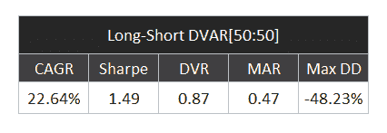
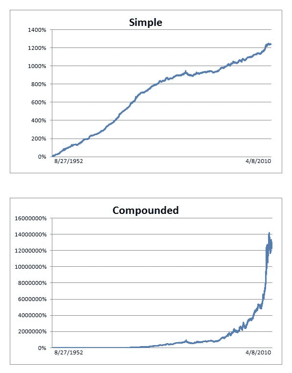
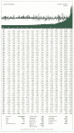

<!--yml
category: 未分类
date: 2024-05-12 18:31:28
-->

# Adaptive RSI on S&P500 Index 1952- Present | CSSA

> 来源：[https://cssanalytics.wordpress.com/2010/04/10/adaptive-rsi-on-sp500-index-1952-present/#0001-01-01](https://cssanalytics.wordpress.com/2010/04/10/adaptive-rsi-on-sp500-index-1952-present/#0001-01-01)

****Trading ^GSPC from 8/27/1952 to 4/8/2010****

Monthly Report