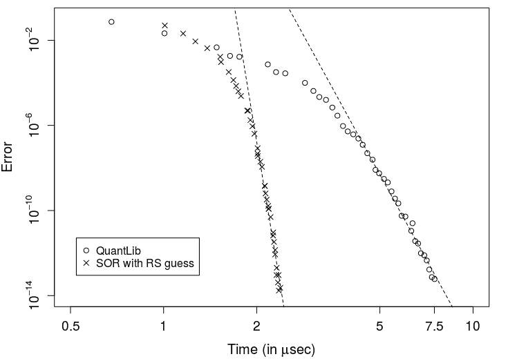

<!--yml
category: 未分类
date: 2024-05-13 00:18:23
-->

# Adaptive SOR Method for Implied Volatility Calculation – HPC-QuantLib

> 来源：[https://hpcquantlib.wordpress.com/2017/08/06/adaptive-sor-method-for-implied-volatility-calculation/#0001-01-01](https://hpcquantlib.wordpress.com/2017/08/06/adaptive-sor-method-for-implied-volatility-calculation/#0001-01-01)

In a recent blog contribution Fabien Le Floc’h [1] suggests to combine the adaptive successive over-relexation method [2] with an improved explicit approximate implied volatility formula [3] to calculate the initial guess. The implementation of both algorithms is straight forward.

A large set of OTM and ITM options together with different displacement factors has been identified to serve as a benchmark portfolio to compare the performance with the original QuantLib implementation. As can be seen in the diagram below the new method is – depending on the accuracy – two to three times faster than the current QuantLib implementation.

The implementation is available [here](https://github.com/lballabio/QuantLib/pull/286/files), the diagram above is derived from the test case testImpliedVolAdaptiveSuccessiveOverRelaxation in the class BlackFormulaTest.

[1] Le Floc_h, F (2017) [Implied Volatility from Black Scholes Price](http://chasethedevil.github.io/post/implied-volatility-from-black-scholes-price/)

[2] Li, M. (2008) [An Adaptive Successive Over-relaxation Method for Computing the](http://mpra.ub.uni-muenchen.de/6867/) [Black-Scholes Implied Volatility](http://mpra.ub.uni-muenchen.de/6867/)

[3] J. Gatheral, I. Matic, R. Radoicic, D. Stefanica (2017), [Tighter Bounds for Implied Volatility](https://papers.ssrn.com/sol3/papers.cfm?abstract_id=2922742)