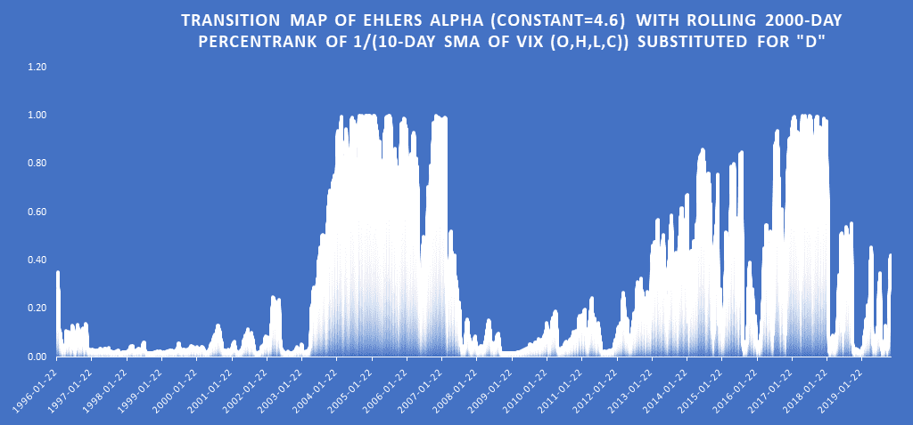
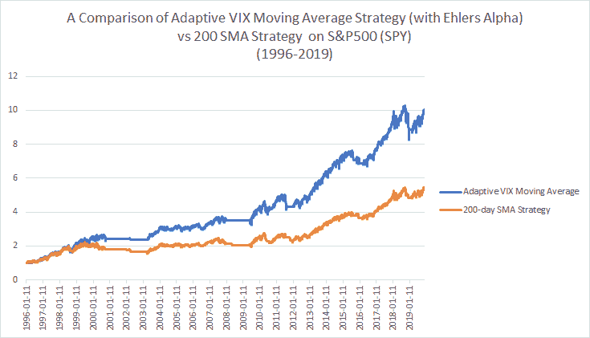
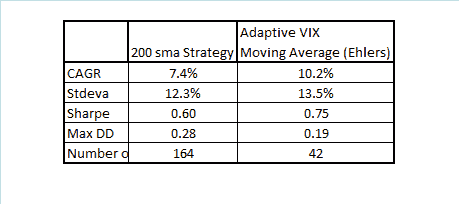

<!--yml
category: 未分类
date: 2024-05-12 17:39:16
-->

# Adaptive VIX Moving Average with Ehlers Alpha Formula | CSSA

> 来源：[https://cssanalytics.wordpress.com/2019/12/04/adaptive-vix-moving-average-with-ehlers-alpha-formula/#0001-01-01](https://cssanalytics.wordpress.com/2019/12/04/adaptive-vix-moving-average-with-ehlers-alpha-formula/#0001-01-01)

In the [last post](https://cssanalytics.wordpress.com/2019/11/26/adaptive-vix-moving-average/) I described a relatively simply method to incorporate the VIX into the well-known AMA or Adaptive Moving Average framework. The alpha formula requires two separate parameters- a short and a long-term constant which requires greater specification by the user. Ideally the fewer parameters you have to specify the better (although it is important to note that logical requirements for maximum lag and minimum responsiveness often tends to dicate the bounds).

Ehlers suggests in his paper on the [“Fractal Adaptive Moving Average”](http://www.stockspotter.com/Files/frama.pdf) using the following formula to [compute the alpha in the exponential average](https://www.investopedia.com/ask/answers/122314/what-exponential-moving-average-ema-formula-and-how-ema-calculated.asp):

**alpha= exp(- 4.6*(D -1))**

where D is analogous to the “VI” or trend factor in the previous post. Note that this formula was adapted in a different way for creating an adaptive volatility measure [in this post](https://cssanalytics.wordpress.com/2017/11/15/adaptive-volatility/). I find it to be quite useful and intuitive so it represents a viable alternative to the AMA framework in the last post.

Based on reader feedback I will simplify the percentrank function to be a rolling lookback of 2000 days to make it easier to avoid confusion in replication (the previous used an anchored lookback or “expanding time window”). We can substitute the percentrank of 1/(10-day sma of VIX) for “D” in the formula and calculate the EMA/Exponential moving average of SPY using the alpha output. Here is what the adaptive alpha should look like going back to 1996:

Note that a higher alpha means a faster moving average (less smoothing and lag) while a lower alpha means a slower moving average (more smoothing and lag). We can see in the above chart that the alpha is higher most of the time in bull markets and lower in bear markets (with the 90’s being an exception). No doubt there is a relationship between the VIX and mean-reversion which tended to work well on SPY in periods when the alpha was low. My research in fact shows that profitability was 4x higher buying on down days when this alpha measure was low versus high. What this implies is that you are smoothing more when price is noisy or mean-reverting and smoothing less when price is a decent estimate of tomorrow’s price. Obviously this is exactly what we are looking for when creating an adaptive filter.

Let’s now take a look at how this new transition calculation performs in the adaptive moving average framework. Once again we will compare the strategy of buying when the close of SPY is > 200sma versus the AMA> 200sma.

Consistent with the previous post the AMA strategy is superior to the basic 200sma strategy with fewer trades. The Ehlers alpha method in this case leads to very similar results as using the classic AMA framework for calculating alpha but with even fewer trades. Note that a “D” of 4 vs 4.6 produced a near identical match to the performance and number of trades as the classic AMA framework. In either case I hope this shows the robustness of using the VIX (or you could use historical volatility or GARCH) in an adaptive moving average as a substitute for using the price. In my opinion it is logical to use an adaptive method for smoothing rather than using static smoothing methods or worse yet the actual price in a trend-following strategy.