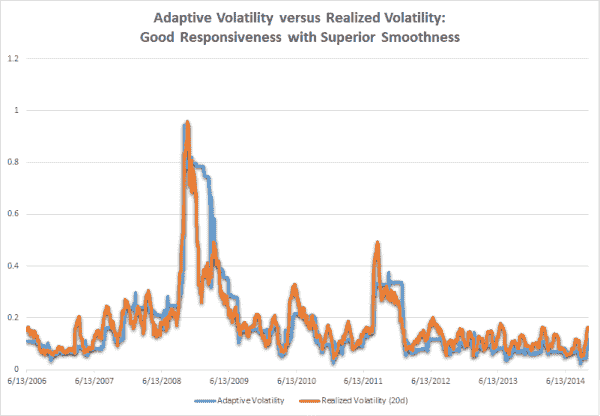
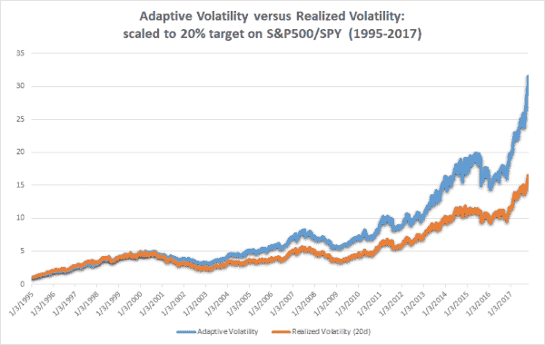
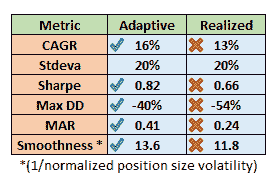

<!--yml
category: 未分类
date: 2024-05-12 17:44:39
-->

# Adaptive Volatility | CSSA

> 来源：[https://cssanalytics.wordpress.com/2017/11/15/adaptive-volatility/#0001-01-01](https://cssanalytics.wordpress.com/2017/11/15/adaptive-volatility/#0001-01-01)

One of the inherent challenges in designing strategies is the need to specify certain parameters. Volatility parameters tend to work fairly well regardless of lookback, but there are inherent trade-offs to using short-term versus longer-term volatility. The former is more responsive to current market conditions while the latter is more stable. One approach is to use a range of lookbacks which reduces the variance of the estimator or strategy-  i.e. you have less risk of being wrong. The flip side is that you have not increased accuracy or reduced bias. Ultimately you don’t want to underfit relevant features as much as you do not want to overfit random noise in the data. Forecasting volatility can be beneficial towards achieving a solution but is more complicated to implement and exchanges lookback parameters for a new set of parameters. Using market-based measures such as the options market has the fewest parameters and inherent assumptions, and can theoretically improve accuracy but the data is not easily accessible, and it is more useful for individual equities rather than macro markets.

An alternative  approach is to create an “adaptive” volatility measure that varies its lookback as a function of market conditions. Using an exponential moving average framework we can apply a transition function that uses some variable that can help us decide what conditions should require shorter or longer lookbacks. More specifically, we vary the smoothing constant or alpha of the EMA using a mathematical transform of a chosen predictor variable.  The benefit of this approach is that it can potentially improve outcomes by switching to short or longer volatility as a function of market conditions, and it can be superior to picking a single parameter or basket of multiple parameters. Furthermore, it can achieve a better trade-off between responsiveness and smoothness which can lead to better outcomes when transaction costs become an issue.

How do we choose this predictor variable? There are  two observations about volatility that can help us determine what to use:

1.  Volatility can be mean-reverting within a particular market regime- this favors longer lookbacks for volatility to avoid making inefficient and counterproductive changes in position size
2.  Volatility can trend higher or lower during a transition to a new market regime- this favors shorter lookbacks for volatility to rapidly respond by increasing or decreasing position size

We can’t predict what regime we are in necessarily so the simplest way to address these issues is to look at whether the market is trending or mean-reverting. The simplest method is to use the R-squared of the underlying price of a chosen market with respect to time. A high r-squared indicates a strong linear fit, or high degree of trend while the opposite indicates a rangebound or sideways market. If the market is trending (r-squared is higher), then we want to shorten our lookbacks in order to ensure we can capture any sudden or abrupt changes in volatility. If the market is trendless or mean-reverting (r-squared is low) then we want to lengthen our lookbacks since we would also expect that volatility should revert to its historical long-term mean.

**Transition Function:**

In order to translate the R-squared value into a smoothing constant (SC) or alpha for an exponential moving average we need a mathematical transform. Since markets are lognormally distributed an exponential function makes the most sense.

**SC=  EXP(-10 x (1- R-squared(price/time, length))**

**MIN( SC, .5)**

To get a more stable measure of R-squared we use a lookback of 20-days, but values between 15 to 60 days are all reasonable (shorter is noisier, longer has greater lag). By choosing -10 in the above formula, this will default to an almost anchored or all-time lookback for historical volatility for the underlying, which we expect to serve as an indication of “fair value” during periods in which volatility is mean-reverting. (Technically speaking if the r-squared is  zero then  substituting (2-SC)/SC gives an effective lookback of 44052.) By choosing a MAX SC of .5 we are limiting the smoothing period to a minimum lookback of effectively 3 days (2/(n+1)=SC). Therefore the adaptive volatility metric can vary its effective lookback window between 3 days and all history.

This formula gets applied to take the exponential moving average of squared returns. Translating this to annualized volatility, you need to take the square root of the final value and multiply by the square root of 252 trading days.  We can compare this to the often used 20-day realized volatility on the S&P500 (SPY) to visualize the differences:

Considering that the adaptive volatility uses a much longer average lookback than 20-days we can see that it has comparable responsiveness during periods of trending volatility, and has flat or unchanging volatility during periods of mean-reverting volatility. This leads to an ideal combination of greater accuracy and lower turnover. Even without considering transaction costs the results are impressive (note that leverage in the example below has not been constrained in order to isolate the pure differences):

The results show that adaptive volatility outperforms realized volatility, and while not shown this is true across all realized lookback windows. Relative to 20-day realized, adaptive volatility outperforms by 3% annually with the same standard deviation. Factoring in transaction costs would increase this gap in returns significantly.  Risk-adjusted returns are higher, but more impressively this comes with lower drawdowns even at the same level of volatility. This is due to the better combination of responsiveness and smoothness.  In either case,  I believe that adaptive volatility is an area worth considering as an alternative tool to research. One can come up with a variety of different predictors and transition formulas to research that may be superior– the purpose of using r-squared was that it happens to be straightforward and intuitive along with the exponential transition function.