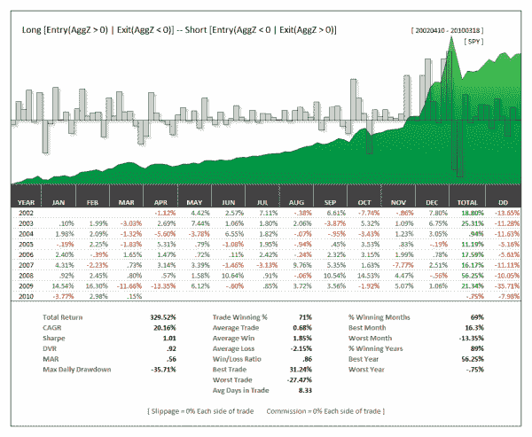

<!--yml
category: 未分类
date: 2024-05-12 18:33:50
-->

# AggZ: Another Composite Trend/Mean Reversion Indicator | CSSA

> 来源：[https://cssanalytics.wordpress.com/2010/03/19/aggz-another-composite-trendmean-reversion-indicator/#0001-01-01](https://cssanalytics.wordpress.com/2010/03/19/aggz-another-composite-trendmean-reversion-indicator/#0001-01-01)

Here is a super simple indicator with dozens of applications. Similar to AggM, the AggZ is a composite trend and mean-reversion indicator rolled into one. The concept of both is to anchor a long term trending measure to a short-term mean-reverting measure so that you can have an indicator that can be traded for both long and short-term intervals. The AggZ did 20% CAGR over the last 2000 bars on the CAGR using dividend adjusted data on the SPY. The calculation is dead simple:

AggZ= (-1x( 10-day z-score)+(200-day z-score))/2

where z-score = (close-sma (closing prices over last n periods))/(standard deviation( closing prices over last n periods))

buy above 0, sell below 0 as a basic strategy.

Users may try different variations of z-lengths as well as entry/exits. On a side note, ***expect DV Indicators for Amibroker to be out next week—we are finally done!*** More information to follow.

