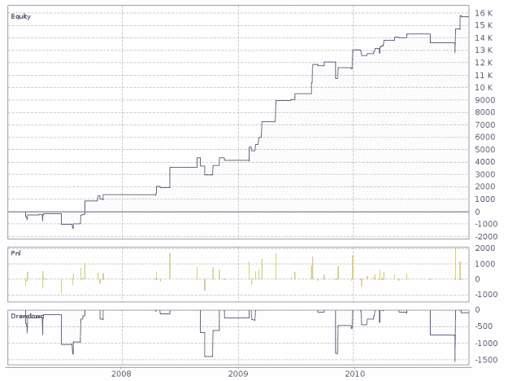
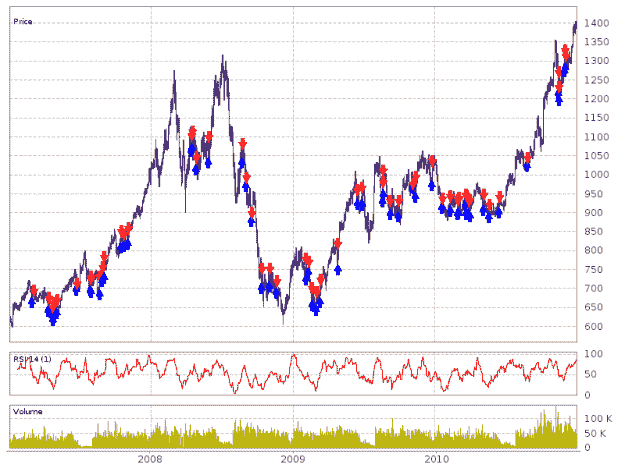

<!--yml
category: 未分类
date: 2024-05-18 08:10:10
-->

# Algodeal (2) A first automated trading and profitable strategy! | Quant Corner

> 来源：[https://quantcorner.wordpress.com/2011/06/13/algodeal-2-a-first-automated-trading-and-profitable-strategy/#0001-01-01](https://quantcorner.wordpress.com/2011/06/13/algodeal-2-a-first-automated-trading-and-profitable-strategy/#0001-01-01)

## Introduction

Today, we write a first automated trading strategy using the **Market Runner** development environment in **Java** developed by the **Algodeal** team. Then, we will send it out to the **Algodeal** servers that is we will run our strategy to see how well it performs in pseudo real conditions.

Beforehand, we did our homework that is we did market research seeking to understand the behaviour of a stock/index/future price. Then, we determined a trading framework, entry and exit rules.

There are various way one can come up with a automated trading idea depending on one’s trading experience, knowledge in the field of finance, econometrics, technical analysis, neural networks, support vector machine, … It is a mix of science and experience (and luck ?) .

For this first code, this research step is restricted to the observation of common technical analysis indicators, and knowledge of the underlying.

As far as coding in **Java** is concerned, we will derive the code examples given by the **Algodeal** team. The structure of our code draw from the tutorials available.

## The underlying and trading rules

We selected an **agricultural commodity future**, called *Underlying* in our code.

We make use of the **RSI** (Relative Strength Index) technical indicator, coupled with the drop (in %) of the underlying price on a trading day.

We determined certain levels for both the **RSI** and the price drop. More exactly, we determined two different level for each indicator.

The (pseudo) pseudo code for our strategy is as follows :

_____________________
if  x > RSI > y and  a > drop > b
then buy 1 unit

If y > RSI > z and drop > b
then buy 1 unit

If position = long then
wait 3 bars and close out the position
_____________________

Here, x < y < z , and a < b.

One can see it is really basic, somehow *heterodox*, and *a priori* risky as there are no safeguards. Notice this strategy will require cash as it is of *buy first then sell* type. But, it is OK for now!

## The code of the strategy in Java

We follow the general code structures showed at beta.algodeal.com.

Our code starts with fundamental instructions :

```
@Instruments(futures = {Underlying})
@MarketData(start = "yyyy/mm/dd", end = "yyyy/mm/dd")
```

As it is showed in the **Algodeal** code examples, we extend the AbstractStrategy class:

```
public class StrategyName extends AbstractStrategy {}
```

Then, we define all our variables :

```
double drop;
double smallerDrop = val1;
double higherDrop = val2;   

RSI rsi;
int smallerRSI = val3;
int higherRSI = val4;
int hold = 0;
int barHolding = val5;
```

This way it will be easy to change the values hoping to better score by trial and error.

Then, we declare our variable rsi and we draw it on a graph as such :

```
rsi = newIndicator().rsi().withLength(14).on(Bar.TO_LOW).draw(RED, DrawMode.INDEPENDENT).get();
```

*Please refer to the MarketRunner API documentation for the details of the parameters.*

Finally, we get to the heart of the strategy. All our conditions, loops, etc … are contained in a single **onClose()** callback.

The whole code snippet looks like :

```
package PackageName;

import static com.algodeal.marketData.instruments.Futures.*;
import static java.awt.Color.*;
import com.algodeal.marketData.prices.Bar;
import com.algodeal.marketrunner.indicators.*;
import com.algodeal.marketrunner.recorders.records.IndicatorConfigRecord.DrawMode;
import com.algodeal.marketrunner.strategies.AbstractStrategy;
import com.algodeal.marketrunner.strategies.Instruments;
import com.algodeal.marketrunner.strategies.MarketData;

@Instruments(futures = {Underlying})
@MarketData(start = "yyyy/mm/dd", end = "yyyy/mm/dd")

public class StrategyName extends AbstractStrategy {

    double drop;
    double smallerDrop = val1;
    double higherDrop = val2;   

    RSI rsi;
    int smallerRSI = val3;
    int higherRSI = val4;

    int hold = 0;
    int barHolding = val5;

    @Override
    public void onStrategyStart() {
        rsi = newIndicator().rsi().withLength(14).on(Bar.TO_LOW).draw(RED, DrawMode.INDEPENDENT).get();
    }

    @Override
    public void onClose (Bar bar){

        drop = Math.log(getBars().ago(0).getOpen() - getBars().ago(0).getClose());

        if (rsi.getValue() < smallerRSI) {
            if (drop >= smallerDrop){
                if (drop < higherDrop) {
                    buy(1, "Buy!");
                    }
                }
            }

        if (rsi.getValue() >= smallerRSI ) {
            if (rsi.getValue() <= higherRSI){
                if (drop >= higherDrop) {
                    buy(1, "Buy!");
                    }
                }
            }

        if (getPosition().isLong()){
            if (hold < barHolding){
                hold++;
            }else{
                closePosition("Close out!");
            }
        }
    }
}
```

## Running the strategy

*Last but not least*, we run our strategy in ‘real’ conditions by sending out our code towards the **Algodeal** grid of servers. In no time, we receive back a series of performance indicators of our trading strategy.

The overall performance of our strategy :

[](https://quantcorner.wordpress.com/wp-content/uploads/2011/06/equitychartsoybean.png)

[](https://quantcorner.wordpress.com/wp-content/uploads/2011/06/barchartsoybean1.png)
OK, it is far from perfect, and this strategy has many caveats as it is oversimplified. But, can you believe it ? It is profitable! This should convince one that it worth spending time doing market research, defining automated trading strategies and coding them using the **Algodeal.**

Once an author wrote that  *knowledge is all around waiting to be articulated*. Now, it is tempting to derive this assertion as *wealth is all around waiting to be coded*. 🙂