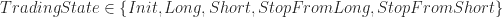
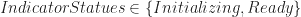
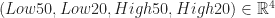
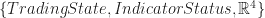
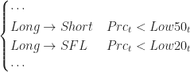
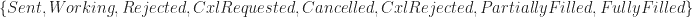

<!--yml
category: 未分类
date: 2024-05-18 13:59:50
-->

# Algorithm design and correctness – Quantum Financier

> 来源：[https://quantumfinancier.wordpress.com/2018/02/24/algorithm-design-and-correctness/#0001-01-01](https://quantumfinancier.wordpress.com/2018/02/24/algorithm-design-and-correctness/#0001-01-01)

Giving software you wrote access to your or your firm’s cash account is a scary thing. Making a mistake when manually executing a trade is bad enough when it happens (you can take my word for it if you haven’t yet), but when unintended transactions are made by a piece of software in a tight loop it has the potential to be an extinction event. In other words, there is no faster way to self-immolate than to have incorrect software interacting with markets. It is obvious that correctness is a critical part of the design of an algorithm. How does one go about ensuring^([1](#fn1)) it then?

Abstractly, a trading algorithm is simply a set of specific actions to be taken depending on the state of things. That state can be internal to the algorithm itself (such has open position, working orders etc.) or associated to the external world (current/historical market state, cash balance, risk parameters etc.). It is then natural for me to think of them as finite state machines (FSM). That presents a couple immediate advantages. FSMs are a very well-studied abstraction in the computer science world, there is then no need to reinvent the wheel as best practices are well accepted. Since they are so often used, just about certain that you will be able to find examples of FSMs implemented for you language of choice. For instance, on the Python Package Index a search for “finite state machine” returns over 100 different frameworks. I am confident the results would be similar for just about any modern language. That being said, let’s backup before we dive deeper on some application of the pattern.

Per Wikipedia, a FSM is an abstract machine that can be in exactly one of a finite number of states at any given time. The FSM can change from one state to another in response to some external inputs; the change from one state to another is called a transition. A FSM is defined by a list of its states, its initial state, and the conditions for each transition. We will use the Turtle trading system 2 rules as an example. The rules are summarized below:

**Entry: Go long (short) when the price crosses above (below) the high (low) of the preceding 55 days.**
**Exit: Cover long (short) when the price crosses below (above) the low (high) of the preceding 20 days.**

As we learned previously, to fully define a FSM we need a list of its states, its initial state and the conditions for each transitions. We then have to convert these trading rules to a proper FSM definition.

From the rules above I would define the following trading states:  In addition the trading state, the following states would be defined as well as they are relevant to the strategy:  and finally . That is to say then that the state space of our algorithm is defined by the following triplet 

If you can forgive my abuse of notation, the following outlines the state transitions and their respective conditions:

![\begin{cases} Init\rightarrow Init & IndicatorStatus=Initializing \\Init\rightarrow Long & IndicatorStatus=Ready\land Prc_{t}>High50_{t} \\Init\rightarrow Short & IndicatorStatus=Ready\land Prc_{t}<Low50_{t} \\Init\rightarrow SFL & \emptyset \\Init\rightarrow SFS & \emptyset \\ \\Long\rightarrow Init & \emptyset \\Long\rightarrow Long & Prc_{t}\ge Low20_{t} \\Long\rightarrow Short & Prc_{t}<Low50_{t} \\Long\rightarrow SFL & Low50_{t}\le Prc_{t}<Low20_{t} \\Long\rightarrow SFS & \emptyset \\ \\Short\rightarrow Init & \emptyset \\Short\rightarrow Long & Prc_{t}>High50_{t} \\Short\rightarrow Short & Prc_{t}\le High20_{t} \\Short\rightarrow SFL & \emptyset \\Short\rightarrow SFS & High20_{t}<Prc_{t}\le High50_{t} \\ \\SFL\rightarrow Init & \emptyset \\SFL\rightarrow Long & Prc_{t}>High50_{t} \\SFL\rightarrow Short & Prc_{t}<Low50_{t} \\SFL\rightarrow SFL & Low50_{t}\le Prc_{t}\le High50_{t} \\SFL\rightarrow SFS & \emptyset \\ \\SFS\rightarrow Init & \emptyset \\SFS\rightarrow Long & Prc_{t}>High50_{t} \\SFS\rightarrow Short & Prc_{t}<Low50_{t} \\SFS\rightarrow SFL & \emptyset \\SFS\rightarrow SFS & Low50_{t}\le Prc_{t}\le High50_{t} \end{cases}](img/1b7d638274224e67954875e3498a0b13.png)

Knowing the possible state transitions, we can determine what trading actions are needed in each instance:

![\begin{cases} Init\rightarrow Init & \emptyset \\Init\rightarrow Long & Send\ buy\ order\ for\ N\ units \\Init\rightarrow Short & Send\ sell\ order\ for\ N\ units \\Init\rightarrow SFL & \emptyset \\Init\rightarrow SFS & \emptyset \\ \\Long\rightarrow Init & \emptyset \\Long\rightarrow Long & \emptyset \\Long\rightarrow Short & Send\ sell\ order\ for\ 2N\ units \\Long\rightarrow SFL & Send\ sell\ order\ for\ N\ units \\Long\rightarrow SFS & \emptyset \\ \\Short\rightarrow Init & \emptyset \\Short\rightarrow Long & Send\ buy\ order\ for\ 2N\ units \\Short\rightarrow Short & \emptyset \\Short\rightarrow SFL & \emptyset \\Short\rightarrow SFS & Send\ buy\ order\ for\ N\ units \\ \\SFL\rightarrow Init & \emptyset \\SFL\rightarrow Long & Send\ buy\ order\ for\ N\ units \\SFL\rightarrow Short & Send\ sell\ order\ for\ N\ units \\SFL\rightarrow SFL & \emptyset \\SFL\rightarrow SFS & \emptyset \\ \\SFS\rightarrow Init & \emptyset \\SFS\rightarrow Long & Send\ buy\ order\ for\ N\ units \\SFS\rightarrow Short & Send\ sell\ order\ for\ N\ units \\SFS\rightarrow SFL & \emptyset \\SFS\rightarrow SFS & \emptyset \end{cases}](img/004e692b97d3324bb664fb7a8a48a7f4.png)

This is obviously a simplistic example meant to illustrate my point but lets consider the design for a moment. First it is obvious that each state is mutually exclusive which is a prerequisite for a valid FSM. That in plain terms means that at any point in time I can evaluate the state and figure out clearly what the algorithm was trying to do since there can only be one possible transition given the state at that specific point in time. That would not have been the case had I decided to define the following transition:

In that case, it would be possible for both the conditions to evaluate true and therefore there are more than one possible state transitions. How would you know looking at the logs what this algorithm tried to do? In this case it is again obvious but in more complex FSM I always find it worth the time to carefully consider the entire state space and clearly define the algorithm behavior in a similar fashion to the above. This might seem very long winded but it is something I do on paper religiously before I ever write a line of production code.

The same pattern can also be used in other parts of your trading stack. For instance, your order management system could define orders as a FSM with the following states: . The transitions in this case will have to do with the reception of exchange order events such as acknowledgement, reject messages etc. If you stop to think about it, you could design a whole trading stack with almost nothing but FSMs. By using FSMs you can design to insure correctness of your algorithms and eliminate a whole class of potential design flaws that might sneak in otherwise.

The pattern fits nicely in object-oriented design where state and related behaviors can be grouped in nicely decoupled classes. That said, some functional languages provide you a type system that can provide you with additional guarantees when used properly and can help you build some very powerful abstractions. We will examine an example in  a following post. In the meantime, I would be very interested, as always, to hear which patterns you have found useful in your work.

* * *

^(1\. [Or as close as one can get to certainty anyway!][↩](#ref1 "Jump back to footnote 1 in the text."))