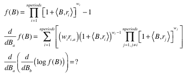
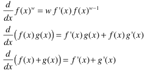

<!--yml
category: 未分类
date: 2024-05-18 15:34:58
-->

# Algorithmic Differentiation | Tr8dr

> 来源：[https://tr8dr.wordpress.com/2010/01/11/algorithmic-differentiation/#0001-01-01](https://tr8dr.wordpress.com/2010/01/11/algorithmic-differentiation/#0001-01-01)

In the previous post I outlined a portfolio utility function with a penalty for risk:

One of the components of this function, E[r], is specified as a weighted geometric average.   By itself I could transform to use a log sum but does not simplify with the added risk term:

I need to construct a gradient and hessian for the above function:

It is not that the 2nd partial derivative is intractable, indeed it just requires the application of the chain rule.  Unfortunately it expands to an enormously complicated expression that grows quadratically with the number of variables.

Computing the derivative via finite differencing works for some applications, but presents problems where the “perturbations” need to be small.   The 2nd derivative using a central weighing scheme:

One can see that the differenced approach is susceptible underflow.   Choosing a value of **h** **< 1e-7** will produce a value which exceeds the precision of a double (consider the denominator).   Once the precision of double is exceeded, results will be meaningless.

**Algorithmic Approach**
I began to think of a recursive approach to evaluating the nth partial derivative, as I had trouble coming up with a pattern that fit into a single expression for generalized number of periods and dimension.   It turns out that many others have thought along these lines.   This approach is called “Algorithmic Differentiation”.

The above equation can be simplified with respect to just 2 of its N variables for the purposes of calculating 1 coordinate in the hessian as:

We understand how to differentiate the above by means of the chain rule, which states that compositional functions, such as f(g(x)) can be differentiated as f'(g(x)) g'(x).   This implies a series of basic rules:

We can decompose an expression into an (implicit or explicit) expression tree and use the rules for derivatives to recombine to an ultimate result.   For instance, here is a tree for f(x,y) = x y sin(x^2).   (the graph for my function would be much too large to render here):

There are a number of libraries (for C++ and Java) which allow one to express a function in normal-looking code, but implicitly calculate the first or second derivatives at the same time.   A “dual” representing f(x) and f'(x) is tracked through the evaluation of the expression.

Unfortunately, the size of the expression (tree) for my utility function is enormous, particularly for the 2nd derivative.   I will avoid computing the hessian and use the BFGS minimizer for part of my optimization, as will end up being cheaper than evaluating the hessian.