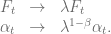
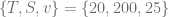
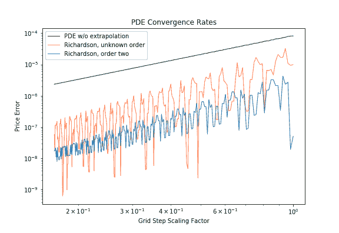
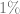
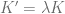
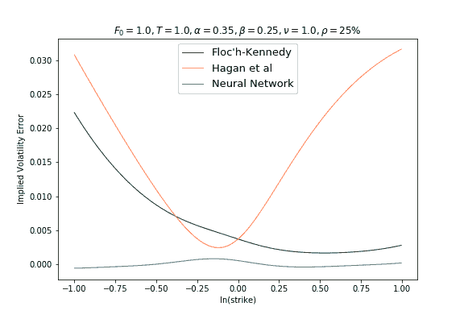
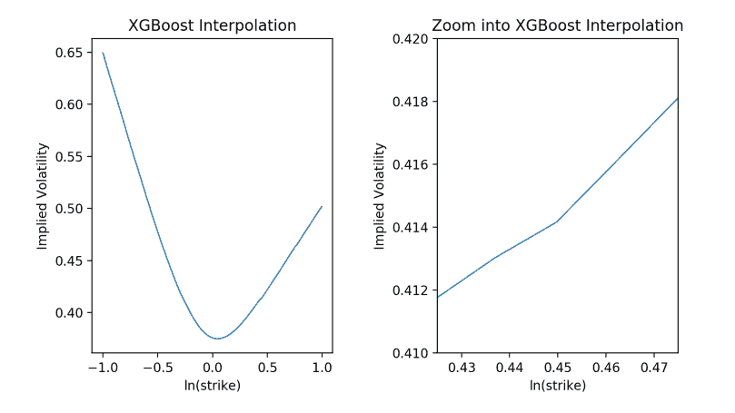

<!--yml
category: 未分类
date: 2024-05-13 00:14:10
-->

# Almost exact SABR Interpolation using Neural Networks and Gradient Boosted Trees – HPC-QuantLib

> 来源：[https://hpcquantlib.wordpress.com/2019/10/12/almost-exact-sabr-interpolation-using-neural-networks-and-gradient-boosted-trees/#0001-01-01](https://hpcquantlib.wordpress.com/2019/10/12/almost-exact-sabr-interpolation-using-neural-networks-and-gradient-boosted-trees/#0001-01-01)

**Update 03-11-2019**: Added arbitrage free SABR calibration based on neural networks.

Very efficient approximations exist for the SABR model


like the original Hagan et. al. formula [1] or variants of it [2] but these analytic formulas are in general not arbitrage free. Solving the corresponding partial differential equation leads to an arbitrage free solution


but is computationally demanding. The basic idea here is to use a neural network or gradient boosted trees to interpolate (predict) the difference between the analytic approximation and the exact result from the partial differential equation for a large variate of model parameters.

First step is to reduce the number of dimensions of the parameter space  by utilizing the scaling symmetry of the SABR model [3]



so that we can focus on the case  without lose of generality

.

This in turns also limits the “natural” parameter space for  which will be set to

![\displaystyle \alpha \in [0, 1], \ \beta \in [0, 1], \ \nu \in [0, 1]](img/68bd130cb6e98079add2ea6efa213183.png).

Next on the list is to set-up an efficient PDE solver to prepare the training data. The QuantLib solver supports already the two standard error reduction techniques, namely adaptive grid refinement around important points and cell averaging around special points of the payoff. The latter one ensure a smooth second order convergence in spatial direction [4]. The Hundsdorfer-Viewer ADI scheme is also of second order in the time direction and additional Rannacher smoothing steps at the beginning will ensure a smooth convergence in the time direction as well [5].  Hence the Richardson extrapolation can be used to improve the convergence order of the overall algorithm. An example pricing for


is shown in the diagram below to demonstrate the efficiency of the Richardson extrapolation. The original grid size for scaling factor 1.0 is .


The training data was generated by a five dimensional quasi Monte-Carlo Sobol sequence for the parameter ranges

![\displaystyle \alpha \in [0, 1], \ \beta \in [0, 1], \ \rho \in [-1, 1], \ \nu \in [0, 1], T\in [\frac{1}{12}, 1]](img/2dd7bbbc34c6adf7d3784b69fbcd24d6.png).

The strikes are equally distributed between the  and  quantile of the risk neutral density distribution w.r.t to the ATM volatility of the SABR model. The PDE solver will not only calculate the fair value for  but for a range of spot values around . Using the scaling symmetry of the SABR model this can be utilized to calculate more prices with new  and  values for .

The training set includes 617K samples values.  The network is trained to fit the difference between the correct SABR volatility from the solution of the partial differential equation and the Floc’h-Kennedy approximation. It does not need a large neural network to interpolate the parameter space, e.g. the following Tensorflow/Keras model definition with 46K parameters has been used in the examples below

```
model = Sequential()
model.add(Dense(20, activation='linear', input_shape=(7, )))
model.add(Dense(100, activation='linear'))
model.add(Dense(400, activation='sigmoid'))
model.add(Dense(10, activation='tanh'))
model.add(Dense(1, activation='sigmoid'))
model.compile(loss='mae', optimizer='adam')

```

As always it is important for the predictive power of the neural network to normalize the input data e.g. by using sklearn.preprocessing.MinMaxScaler. The out-of-sample mean absolute error of the neural network is around 0.00025 in annualized volatility, far better than the Kennedy-Floc’h or Hagan et al approximation.

The diagram below shows the difference between the correct volatility and the different approximations using the parameter example from the previous [post](https://hpcquantlib.wordpress.com/2019/01/11/finite-difference-solver-for-the-sabr-model/). One could also used gradient tree boosting algorithms like XGBoost or LightGBM. For example the models

```
xgb_model = xgb.XGBRegressor(nthread=-1,
                             max_depth=50,
                             n_estimators=100,
                             eval_metric ="mae")

gbm_model = lgb.train({'objective': 'mae',
                       'num_leaves': 500 }
                      lgb.Dataset(train_X, train_Y),
                      num_boost_round=2000,
                      valid_sets=lgb_eval,
                      early_stopping_rounds=20)

```

result in similar out-of-sample mean absolute errors of 0.00030 for XGBoost and 0.00035 for LightGBM. On the first glance the interpolation looks smooth as can be seen in the diagram below using the same SABR model parameters, but zooming into it exposes non differentiable points, which defeats the object of stable greeks.

The average run time for the different approximations is shown in the tabular below.


With this highly efficient pricing routines calibration of the full SABR model can be done in a fraction of a second. To test this approach several Heston parameter configurations have been used to calculated the implied volatility of 15 benchmark options for a single expiry. The full SABR model has been calibrated against these volatility sets with help of a standard Levenberg-Marquardt optimizer by either using the PDE pricer or the neural network pricer. As expected the neural network calibration routine has only taken 0.2 seconds but the PDE calibration has taken over half an hour on average.

[1] P. Hagan, D. Kumar, A. Lesnieski, D. Woodward: [Managing Smile Risk.](http://web.math.ku.dk/~rolf/SABR.pdf)
[2] F. Le Floc’h, G. Kennedy: [Explicit SABR Calibration through Simple Expansions.](https://papers.ssrn.com/sol3/papers.cfm?abstract_id=2467231)
[3] H. Park: [Efficient valuation method for the SABR model.](https://arxiv.org/pdf/1308.0665.pdf)
[4] K. in’t Hout: [Numerical Partial Differential Equations in Finance explained](https://www.palgrave.com/de/book/9781137435682).
[5] K. in’t Hout, M. Wyns: Convergence of the Hundsdorfer–Verwer scheme for two-dimensional convection-diffusion equations with mixed derivative term