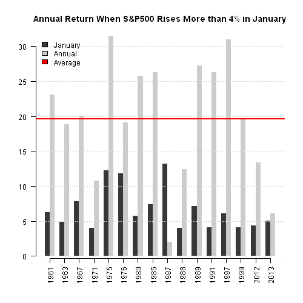
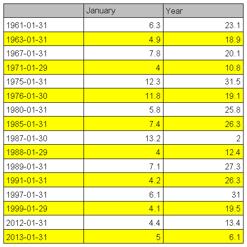

<!--yml
category: 未分类
date: 2024-05-18 14:34:17
-->

# An Example of Seasonality Analysis | Systematic Investor

> 来源：[https://systematicinvestor.wordpress.com/2013/02/04/an-example-of-seasonality-analysis/#0001-01-01](https://systematicinvestor.wordpress.com/2013/02/04/an-example-of-seasonality-analysis/#0001-01-01)

Today, I want to demonstrate how easy it is to create a seasonality analysis study and produce a sample summary report. As an example study, I will use [S&P Annual Performance After a Big January](http://www.avondaleam.com/2013/02/s-annual-performance-after-big-january.html) post by [Avondale Asset Management](http://www.avondaleam.com).

The first step is to load historical prices and find Big Januaries.

```

###############################################################################
# Load Systematic Investor Toolbox (SIT)
# https://systematicinvestor.wordpress.com/systematic-investor-toolbox/
###############################################################################
setInternet2(TRUE)
con = gzcon(url('http://www.systematicportfolio.com/sit.gz', 'rb'))
    source(con)
close(con)

	#*****************************************************************
	# Load historical data
	#****************************************************************** 
	load.packages('quantmod')

	price = getSymbols('^GSPC', src = 'yahoo', from = '1900-01-01', auto.assign = F)

	# convert to monthly
	price = Cl(to.monthly(price, indexAt='endof'))				
	ret = price / mlag(price) - 1

	#*****************************************************************
	# Find Januaries with return > 4%
	#****************************************************************** 
	index =  which( date.month(index(ret)) == 1 & ret > 4/100 )

	# create summary table with return in January and return for the whole year
	temp = c(coredata(ret),rep(0,12))
	out = cbind(ret[index], sapply(index, function(i) prod(1 + temp[i:(i+11)])-1))
		colnames(out) = spl('January,Year')

```

All the hard work is done now, let’s create a chart and table to summarize the [S&P Annual Performance After a Big January](http://www.avondaleam.com/2013/02/s-annual-performance-after-big-january.html) numbers.

```

	#*****************************************************************
	# Create Plot
	#****************************************************************** 
	col=col.add.alpha(spl('black,gray'),200)
	pos = barplot(100*out, border=NA, beside=T, axisnames = F, axes = FALSE,
		col=col, main='Annual Return When S&P500 Rises More than 4% in January')
		axis(1, at = colMeans(pos), labels = date.year(index(out)), las=2)
		axis(2, las=1)
	grid(NA, NULL)
	abline(h= 100*mean(out$Year), col='red', lwd=2)		
	plota.legend(spl('January,Annual,Average'),  c(col,'red'))

	# plot table
	plot.table(round(100*as.matrix(out),1))

```

[](https://systematicinvestor.wordpress.com/wp-content/uploads/2013/02/plot1.png)

[](https://systematicinvestor.wordpress.com/wp-content/uploads/2013/02/plot21.png)

That is it, we are done.

Takeaways: It is very easy to create a seasonality analysis study. Next you might want to schedule to run the study script at specific times through out the year and send you a remainder email in case the study conditions are met.

To view the complete source code for this example, please have a look at the [bt.seasonality.january.test() function in bt.test.r at github](https://github.com/systematicinvestor/SIT/blob/master/R/bt.test.r).