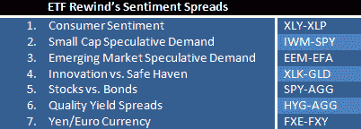
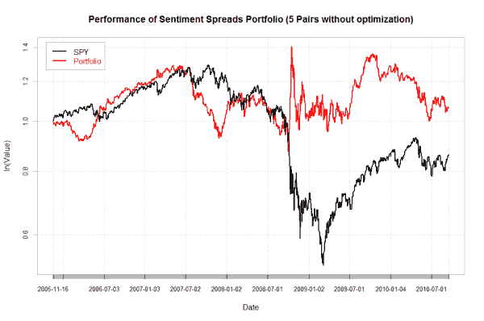
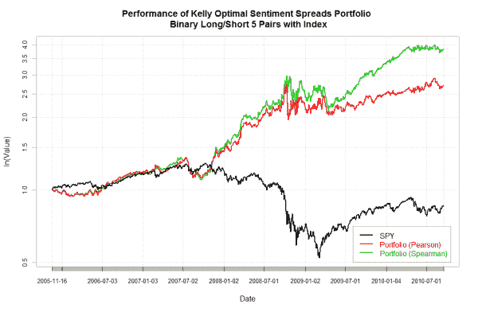
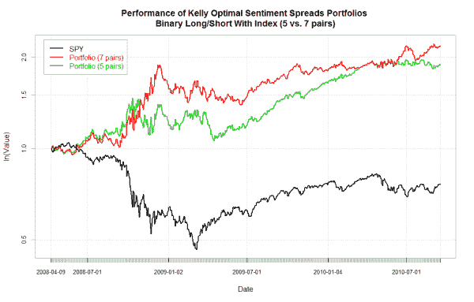

<!--yml
category: 未分类
date: 2024-05-12 18:18:23
-->

# An Intermarket Ensemble Model for the S&P500 Using ETF Rewind’s “Sentiment Spreads” | CSSA

> 来源：[https://cssanalytics.wordpress.com/2010/09/19/creating-an-ensemble-intermarket-spy-model-with-etf-rewinds-sentiment-spreads/#0001-01-01](https://cssanalytics.wordpress.com/2010/09/19/creating-an-ensemble-intermarket-spy-model-with-etf-rewinds-sentiment-spreads/#0001-01-01)

David Varadi with Henry Bee

An “ensemble” is a term borrowed from the field of computational intelligence to describe the process of using multiple inputs or variables in combination to create a prediction, or a composite signal. Typically a good ensemble will be superior than any of the individual components, or at the very least be much more stable and robust out of sample. This ensemble approach is the most powerful and appropriate way of combining technical indicators or fundamental variables (or both). However, this method is even more important for intermarket analysis because of the instability and transient nature of such relationships. I decided that exploring intermarket analysis was a valuable exercise since most people focus on technical analysis and seasonality. However, I required a broad yet compact set of intermarket variables to work with. In browsing many of my key sources, one of the most interesting intermarket indicators that caught my eye as being potentially valuable was on **ETF Rewind**– a nightly product that I use which is a wealth of information and also contains several valuable tools. [http://etfrewind.blogspot.com/](http://etfrewind.blogspot.com/) .

The indicator is called “sentiment spreads” and represents the sum of the difference in 1-day returns between 8 different pairs of markets. It also nicely captures a wide range of intermarket relationships (or variables) and thus was a compact set to work with for further analysis. There are only 7 spreads listed excluding the 8th spread- VXX-VXZ – due to insufficient historical data.  The indicator according to Jeff Pietsch (who is the creator of ETF Rewind) is most valuable for intraday-trading as an indicator that captures the market’s sentiment towards risk assets. A positive spread or positive differential return implies that the market is willing to take risk and thus likely to go higher. By extension, the more spreads that are positive, or the greater the sum of the spreads, the more likely the market will go up and vice versa. However, the spreads also happen to represent a good overall base input for creating an intermarket model to predict the S&P500\. First lets look at how the spreads perform used as a composite indicator–in this example we include the 5-spreads that have the longest data history (the first 5 listed) used to predict the SPY exactly like the sentiment spreads indicator. We trade the SPY long if the sum of spreads is positive and short if the sum is negative.

As you can see, the base spread model outperforms the S&P500 (SPY) with higher risk-adjusted returns. Even though their intended use is not for predicting next day performance (it is best for day-trading), the indicator does a reasonable job nonetheless. One of the problems with the indicator is that it is static and does not change with market conditions. Since intermarket relationships change far more rapidly than technical relationships, it would make sense to incorporate something that can adjust to different regimes. Furthermore, the simple aggregation process itself is prone to error : 1) some spreads are more volatile than others and thus have more contribution weight even if this was unintended 2) some spreads will invariably be more important than others in determining the S&P direction 3) the spreads will vary in terms of correlation to one another during certain periods and thus redundancy can exist within using certain spread signals.  The natural question is whether using the model components with a dynamic allocation and an adaptive process could improve upon this result. This is a good task for the Kelly Optimzation model where the inputs are each spread as a trading system to trade the SPY and the final exposure is aggregated or summed just like the sentiment spread model. The new model represents a simple ensemble model and is updated each day and tested out-of-sample to demonstrate the ability to adapt over time.

As you can see the model does substantially better than the non-optimized version. The Spearman model that uses a non-parametric correlation is superior to the Pearson model which uses a linear correlation. Overall the results are quite good. In fact, the returns and risk-adjusted returns  rival many of the technical indicators tested on the blogosphere. What is important to point out is that a turnkey ensemble intermarket model such as the one presented is uncorrelated to say the DV2 or to RSI2\.  Therefore it can add value within a larger composite model that takes multiple factors into account.  While I will leave this subject for another day, lets take a look at a shorter sample that includes more of the sentiment spreads to see if performance is improved by including more information. As it turns out this is in fact the case:

This shows that using the extra two pairs- quality spreads and the yen-euro relationship- increased returns as well as risk-adjusted returns. Recent performance was also improved. It stands to reason that including even more uncorrelated spreads would substantially improve the model as well as its robustness over time. Adding different time frames beyond just a 252-day lookback would also strengthen results. There are more complex methods that can be used such as boosting or bagging, but this is a very intuitive and less computationally-intensive approach that is arguably more robust.