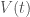
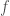
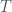
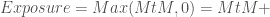
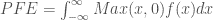
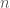
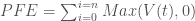
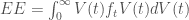
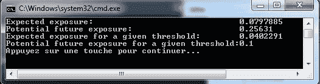

<!--yml
category: 未分类
date: 2024-05-18 08:08:42
-->

# Analytical credit exposure, an example code in C++ | Quant Corner

> 来源：[https://quantcorner.wordpress.com/2013/02/27/analytical-credit-exposure-in-c/#0001-01-01](https://quantcorner.wordpress.com/2013/02/27/analytical-credit-exposure-in-c/#0001-01-01)

In this post we quickly review some concepts related to **counterparty risk**, and we provide a **C++** code computing some measures of **credit exposure**.

If you read Jon Gregory’s***** book **Counterparty credit risk and credit value adjustment: A continuing challenge for global financial markets**, you should recognize that we actually ‘ported’ to **C++ **Jon Gregory’s spreadsheets **Spreadsheet2.2** and **Spreadsheet2.2b** from the workbook **chapter2.xls** available at [CVA Central](http://www.cvacentral.com "CVA Central").

First, let’s consider a single asset (*eg* an OTC option) and let:
– **** be the value of the asset at time ,
– **** be the probability density function (pdf) of  and
– **** be the time to expiration.

# MARK-TO-MARKET (MtM)

**MtM** represents the value that could be potentially lost if a counterparty defaulted.

# REPLACEMENT COST

Replacement cost may be different from **MtM** (*eg* on illiquid markets). Nonetheless, it is standard practice to base **credit exposure** on the current **MtM** value of the given transactions.

# EXPOSURE and POSITIVE EXPOSURE

There is an asymmetry of potential losses with respect to **MtM**. That is an institution loses if their **MtM** is positive. But, it does not gain if **MtM** is negative. Thus, only *positive* exposure is of interest as far as **credit risk** is concerned.



**POTENTIAL FUTURE EXPOSURE (PFE)**

**PFE** aims at characterising **MtM** at some point in time in the future. It is the possible exposure over a given *time horizon* to a given *confidence level*. **PFE** has much in common with the concept of [**value-at-risk**](https://quantcorner.wordpress.com/2012/09/12/var-with-normally-distributed-returns-using-boos/ "VaR with normally distributed returns using Boost").



In practice, **credit exposure** is computed by taking the sum of all positive values or replacement costs of the asset over discrete simulation horizons ().



# EXPECTED EXPOSURE

The **current exposure** is the cost of replacement of the exposures as of today. The **expected exposure** at time  is the **mean exposure** at time , that is



We are now turning fo the **C++** code that is a class definition file, a class implementation file, and a test file:

```
// Analytical_Credit_Exposure.hpp

// Édouard Tallent @ TaGoMa.Tech
// February 2013
// QuantCorner: https://quantcorner.wordpress.com

#ifndef ANALYTICAL_CREDIT_EXPOSURE
#define ANALYTICAL_CREDIT_EXPOSURE

class AnalyticalCE
{
public:
    double EE() const;
    double PFE() const;
    double EEThreshold() const;
    double PFEThreshold() const;

public:
    double mu;      // expected MtM
    double sig;     // s.d of the MtM
    double alpha;   // confidence level
    double t;       // threshold variable

public:
    AnalyticalCE(); // Default constructor
    AnalyticalCE(const AnalyticalCE& ace);  // Copy constructor
    virtual ~AnalyticalCE();    // Virtual destructor
    AnalyticalCE& operator = (const AnalyticalCE& cred);    // Assignment operator 

};
#endif
```

```
// Analytical_Credit_Exposure.cpp

// Édouard Tallent @ TaGoMa.Tech
// February 2013
// QuantCorner: https://quantcorner.wordpress.com

#include <cmath>
#include <boost\math\distributions\normal.hpp>
#include "Analytical_Credit_Exposure.hpp"

double AnalyticalCE::EE() const
{
    return mu * boost::math::cdf(boost::math::normal(), mu/sig) +
        sig * boost::math::pdf(boost::math::normal(), mu/sig);
}

double AnalyticalCE::PFE() const
{
    return mu + boost::math::quantile(boost::math::normal(), alpha) * sig;
}

double AnalyticalCE::EEThreshold() const
{
    return mu * (boost::math::cdf(boost::math::normal(), mu/sig) -
        boost::math::cdf(boost::math::normal(), (mu - t)/sig)) +
        sig * (boost::math::pdf(boost::math::normal(), mu/sig) -
        boost::math::pdf(boost::math::normal(), (mu - t)/sig)) +
        t * boost::math::cdf(boost::math::normal(), (mu - t)/sig);
}

double AnalyticalCE::PFEThreshold() const
{
    return std::min(t , mu + boost::math::quantile(boost::math::normal(), alpha) * sig);
}

AnalyticalCE::AnalyticalCE() : mu(0.0), sig(20.0), alpha(0.95), t(0.10)
{
    // Constructor initializer
}

AnalyticalCE::AnalyticalCE(const AnalyticalCE& ace) : mu(ace.mu),
    sig(ace.sig), alpha(ace.alpha), t(ace.t)
{
    // Copy constructor
}

AnalyticalCE::~AnalyticalCE()
{
    // Destructor
}

AnalyticalCE& AnalyticalCE::operator = (const AnalyticalCE& cred)
{
    if (this == &cred)
        return *this;
}
```

```
// Analytical_Credit_Exposure_test.cpp

// Édouard Tallent @ TaGoMa.Tech
// February 2013
// QuantCorner: https://quantcorner.wordpress.com

#include "Analytical_Credit_Exposure.hpp"
#include <iostream>

int main()
{
    try
    {
        // Creation of an AnalyticalCE object
        AnalyticalCE risk;
        risk.mu = 0.00;
        risk.sig = 0.20;
        risk.alpha = 0.90;
        risk.t = 0.10;

        // Print out to the console
        std::cout << "Expected exposure:\t\t\t\t" << risk.EE() << std::endl;
        std::cout << "Potential future exposure:\t\t\t" << risk.PFE() << std::endl;
        std::cout << "Expected exposure for a given threshold:\t" << risk.EEThreshold() << std::endl;
        std::cout << "Potential future exposure for a given threshold:" << risk.PFEThreshold() << std::endl;
    }
    catch(std::exception& e)
    {
        std::cout << "Error Message:\t" << e.what() << std::endl;
    }

    return 0;
}
```

Eventually, the console output:
[](https://quantcorner.wordpress.com/wp-content/uploads/2013/02/analytical-credit-exposure-console.jpg)

** Thank you to Jon Gregoy for taking the time to answer my questions by email.*