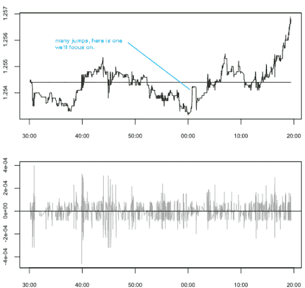
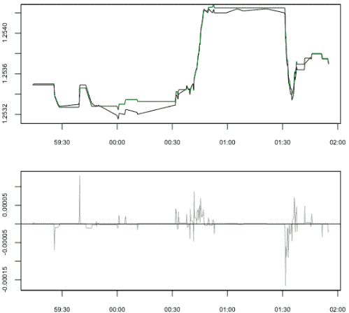
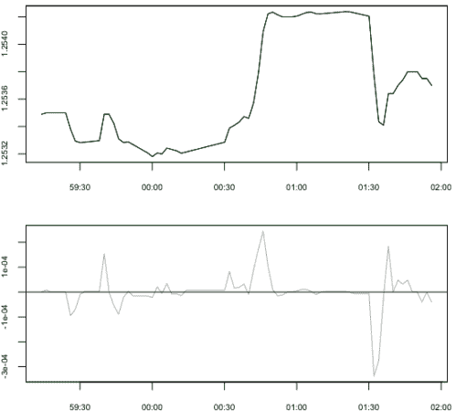
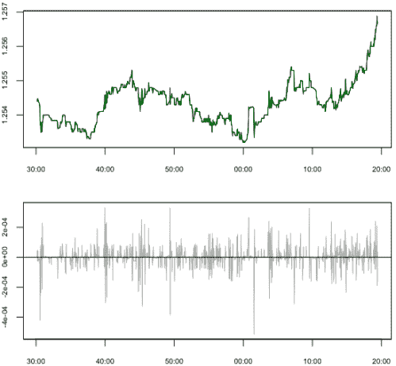

<!--yml
category: 未分类
date: 2024-05-18 15:37:03
-->

# Anatomy of a Spike | Tr8dr

> 来源：[https://tr8dr.wordpress.com/2009/11/27/anatomy-of-a-spike/#0001-01-01](https://tr8dr.wordpress.com/2009/11/27/anatomy-of-a-spike/#0001-01-01)

November 27, 2009 · 11:36 am

Spikes manifest in intra-day markets frequently.   These are often short-lived and associated with buying/selling programs more often than change in fundamental factors, particularly in low-liquidity periods.   In evaluating duration and variance measures was trying to determine reasonable jump thresholds.

Below is a price series demonstrating a variety of spiking behavior:

Taking a look at the region around the jump at high frequency, we note that the jump did not occur with one trade rather with multiple within a short space of time:

From a duration perspective, if we want to capture the spike as one event of a given magnitude we either need to consider the cumulative return over a given window or sample with a longer period.   Here is the same with a 2 second sample:

Here is the 2 second sampling of the original range.   With the longer sample period, the spikes in return are more evident (compare to the first graph in the post):

