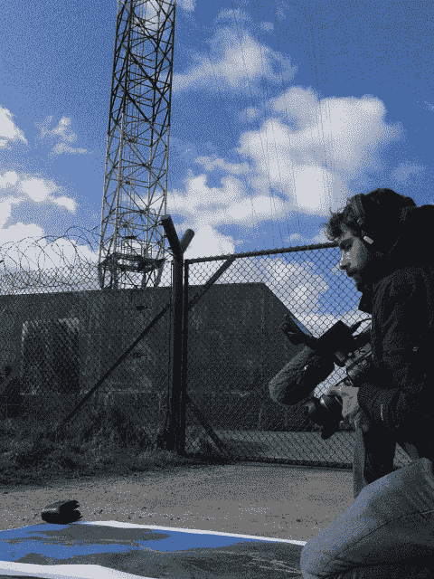

<!--yml
category: 未分类
date: 2024-05-18 14:15:31
-->

# And the SEC said “Nope” – Sniper In Mahwah & friends

> 来源：[https://sniperinmahwah.wordpress.com/2015/03/27/and-the-sec-said-nope/#0001-01-01](https://sniperinmahwah.wordpress.com/2015/03/27/and-the-sec-said-nope/#0001-01-01)

I don’t watch a lot of TV (I am not a fan of TV) but two or three weeks ago I came across *Le Grand Journal* talk show on Canal+ – let’s say *Le Grand Journal* is more or less the French equivalent of the (deceased) *Colbert Report* or the* David Letterman Show* but, well, without the talent of Stephen Colbert. This kind of program is not my cup of tea but three guys (one journalist and two scientist I think) were invited to talk about artificial intelligence – the way “AI will change our world” and so on. That’s true: AI raises a lot of fascinating and ethical questions about our future and the way human beings will interact with machines, but when asked about the potential fatal consequences of artificial intelligence, the journalist responded: we already had a disaster caused by artificial intelligence, it was on May 6, 2010 and it’s called “The Flash Crash”. Wow! Both Nanex and Waddell and Reed will love this one. The SEC too.

I was really surprised because this journalist invited me to talk about my book last year (by the way, I’ll write a short post about my book as I have been asked frequently if there is an English translation of it; the answer is not… yet). He is the presenter of [La Tête au Carré](http://www.franceinter.fr/emission-la-tete-au-carre), which is one of the best programs about science aired by the French national channel France Inter. I remember this [program](http://www.franceinter.fr/emission-la-tete-au-carre-trading-haute-frequence-la-finance-a-toute-vitesse) very well because I was accompanied by [Frédéric Abergel](https://www.linkedin.com/in/abergel), who works at the laboratory of Mathematics Applied to Systems at Ecole Centrale (Paris) – some of its ex-students are now employees of HFT firms in Chicago – and previously worked for Natixis and Barclays Capital. (Frédéric is also in the organizing committee of the Paris conference [Market Microstructure: Confronting Many Viewpoints](http://market-microstructure.institutlouisbachelier.org/search.aspx?q=&mode=bio&rezp=1000&lng=FR#.VRVngVqBBbl) where I have been invited to talk last December.) This was the first joint interview interview I gave with a quant and I remember both of us insisted on the “human side” of algorithmic trading – saying that beyond speed, algorithms are written and managed by human beings, and so on. That’s why I was very surprised to hear the journalist about AI and the Flash Crash since that was not exactly what Frédéric and I tried to explain on air – even if, recently, we learnt that hedge fund “[Bridgewater Is Said to Start Artificial-Intelligence Team](http://www.bloomberg.com/news/articles/2015-02-27/bridgewater-is-said-to-start-artificial-intelligence-team)” but it’s not about high-frequency trading (HFT).

As this anecdote illustrates an important issue: in France (if not elsewhere) most of the press coverage of market structure and HFT is crappy (no offence, but that’s true). I understand that some HFT-related problems are complex (and I don’t pretend to get myself all these issues) but a lot of journalists don’t even try to really understand what they are talking about. One example was the “Cash Investigation” broadcast aired in June 2012 on the French national TV station France 2\. Titled “Finance folle – L’attaque des robots traders” (roughly translated: “Crazy Finance – The attack of trading robots”), the 90-minute reportage was a disaster (check this AmsterdamTrader [post](http://www.amsterdamtrader.com/2012/06/french-television-discover-evil-traders.html) for a fair review in English). Not only the “reportage” (big brackets are needed here) was a disaster, but the way the journalists tried to trap some interviewees was really disgusting. Jean-Philippe Bouchaud, Capital Fund Managment’s CEO, will recall it for long – the journalists tried to force him to admit CFM was a high-frequency trading firm as the company posted a job offer related to HFT; the fact is: even if CFM is colocated at one or two exchanges, these foolish journalists did not understand that a hedge fund known to take long positions needs to understand how orders are executed in the new high-frequency world. That’s quite simple, no?

In France, this pseudo TV reportage traumatized a lot of people in the financial industry (99% of the people I met since 2012 asked me: “Have you seen this terrible movie on HFT?”). The consequence of this media disaster is: no one from the industry now wants to talk to journalists about HFT anymore (and this is understandable). But a new (and more serious) French documentary about market structure and HFT is in progress. Produced by Canal+ (the main cable TV channel known to provide the best documentaries in France), it will cover the history and the recent events related to HFT. I have been contacted by the team one year ago now and I must admit they really tried to understand what they will talk about, so I accepted to be part of this project – that means: being interviewed and filmed. I am not really comfortable with that, as I don’t like TV, but I did it like I wrote my book, *i.e.* with a single objective: trying to explain the concrete reality of things.

I learnt interesting facts from the journalist: indeed, in France, most of the people don’t want to talk anymore because of this previous reportage that traumatized them; some people from the HFT/market industry accepted to be interviewed only because they knew I was involved – I assume they were reassured to learn that the documentary won’t be a conspiracy against HFTs and/or markets, as I told the journalist to have a balanced view of the situation; I also learnt that most of the HFT firms declined to be featured/interviewed, saying: “No, sorry, Michael Lewis’ book *Flash Boys* has made a lot of noise, so we are not talking” (HFTs are chickens, or what?); even the SEC said “Nope”, for the same reasons; and a big Dutch market maker has also declined. So, in France we had this terrible TV reportage, and in the US they had *Flash Boys* – two different products with the same consequences.

That said, as far as I know, some challenging people will appear in this 90-minute documentary due to be aired in April. Some were previously featured in other movies (Haim Bodek, Dave Lauer, Eric Hunsader and Remco Lenterman – I bet the last two won’t say the same thing); others, like IEX’s Brad Katsuyama, will appear for the first time on French TV; and apart from me, other French folks will be in too, like mathematician Mathieu Rosenbaum and McKay Brothers’ co-CEO Stéphane Tyc – you’ll see in the movie one of the McKay dish I talk about in the “[HFT in my backyard](https://sniperinmahwah.wordpress.com/2014/09/22/hft-in-my-backyard-part-i/)” series. As for me, the interview lasted 6 hours – it was really exhausting – and the next day we moved to Houtem, where I was filmed around the Jump Trading tower, talking about my investigation on the HFT microwave networks. I tried to do my best, and that was not easy – at all. I hope all those who participated in this documentary won’t regret it.

