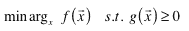

<!--yml
category: 未分类
date: 2024-05-18 15:35:21
-->

# Approximating |x| | Tr8dr

> 来源：[https://tr8dr.wordpress.com/2010/01/02/approximating-abs-x/#0001-01-01](https://tr8dr.wordpress.com/2010/01/02/approximating-abs-x/#0001-01-01)

I am changing my portfolio strategy to use an interior point optimizer for non-linear problems with constraints.  The approach solves nonlinear problems of the form:

where f(x) is the primary function to minimize and g(x) represents one or more constraints (equalities or inequalities).   There are a number of good [papers](http://www.math.kth.se/~andersf/doc/sirev41494.pdf) on interior point methods for solving such problems so will not go into the method here.

In my case one of the constraints is as follows:

As simple as this looks it presents a problem because the interior points algorithm requires that the constraints be twice differentiable.   |x| is continuous but not differentiable at 0\.   In formulating the solution I need to construct the gradient (jacobian) and hessian matrices of the constraints.

I began to think of other ways to describe the constraints.  Basically I want to allow my portfolio to allocate both long and short positions between trading periods.  The above constraint treats long and short capital as symmetrical (which suits my purposes).   I.e., if I have just two assets in a portfolio and allocate -0.75% short to one asset and 0.25% long to the other asset, I consider that to be fully allocated (from a risk capital point of view).

I did a few thought experiments, considered variations of:

But this is clearly wrong, in that will allow for allocation > 100%.   I began to think about the derivative function of |x|.   See (in blue |x| and red the derivative):

It occurred to me that the derivative can be asymptotically approximated by the sigmoid function with a shift and accelerated exponent:

By making β large enough we can approach the derivative of |x| to arbitrary resolution.

Unfortunately the integral of the sigmoid function has no solution in **R**, and only has a solution on the complex plane, meaning that if we are to deploy this approach will have to evaluate g(x) with Σ|x| and the derivatives with the scaled and translated sigmoid function.

Unfortunately, a hybrid approach with |x| for constraint evaluation and sigmoid for the derivatives will lead to instabilities.   One needs to have an approximation to the derivative that has an integral.

**Addendum**
It turns out this is a common problem in machine learning and optimisation.   Chen and Mangasarian defined an approximation to the sigmoid integral.    The problem can be reformulated as follows.   Break the problem into two pieces, x ≥ 0 and  x ≤ 0\.    If we can solve it for x ≥ 0 then we also have a solution for x ≤ 0:

Based on an approximation to the sigmoid integral, they determined (x)+ to be:

As with the sigmoid function, increasing β allows us to get asymptotically close to |x|.   We now have a function for |x| with derivatives defined around 0.