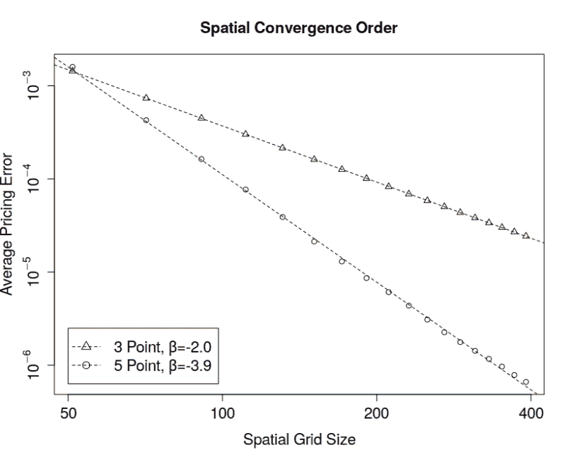
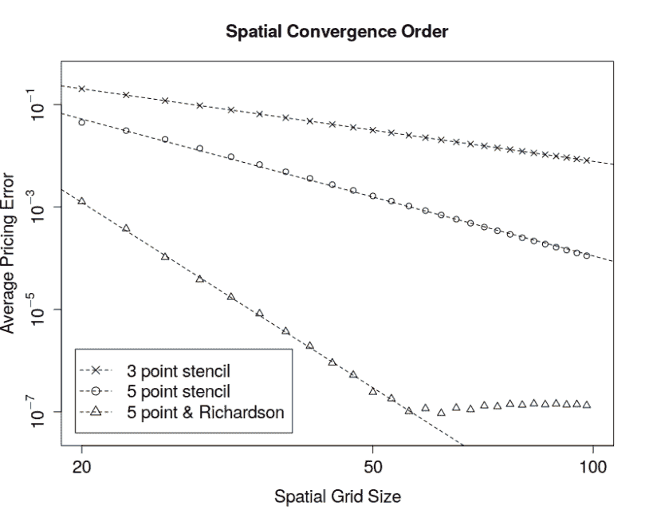

<!--yml
category: 未分类
date: 2024-05-13 00:16:38
-->

# Arbitrary Number of Stencil Points – HPC-QuantLib

> 来源：[https://hpcquantlib.wordpress.com/2018/06/05/arbitrary-number-of-stencil-points/#0001-01-01](https://hpcquantlib.wordpress.com/2018/06/05/arbitrary-number-of-stencil-points/#0001-01-01)

The standard finite difference implementations of derivative pricing algorithms based on partial differential equations have a spatial order of convergence of two. Reason is that these implementations are using a three point central stencil for the first and second order derivatives. The three point stencil leads to a tridiagonal matrix. Such linear systems can be solved efficiently with help of the Thomas algorithm.

Higher order of spatial accuracy relies on stencils with more points. The corresponding linear systems can no longer be solved by the Thomas algorithm but by the BiCGStab iterative solver with the classical three point stencil as a very efficient preconditioner. The calculation algorithm for the coefficients of larger stencils on arbitrary grids is outlined in [1].

Before using higher order stencils one should first make sure, that the two standard error reduction techniques are in place, namely adaptive grid refinement around important points [2] and cell averaging around special points of the payoff at maturity or – equally effective for vanilla options – put the strike in the middle between two grid points. Let’s focus on the Black-Scholes-Merton PDE

after [transforming it to the heat equation](https://quant.stackexchange.com/questions/84/transformation-from-the-black-scholes-differential-equation-to-the-diffusion-equ)

to demonstrate the convergence improvements. The spatial pricing error is defined as the RMSE for a set of benchmark options. In this example the benchmark portfolio consists of OTM call or put options with strikes

.

The other parameters in this example are

.

The Crank-Nicolson scheme with “more than enough” time steps was used to integrate the PDE in time direction such that only the spatial error remains.

As can be seen in the diagram above the spatial order of convergence increases from second order to fourth order when moving from the standard three point to the five point stencil. On the other hand solving the resulting linear systems takes longer now. All in all only if the target RMSE is below , the five point stencil will be faster than the standard three point discretization.

The diagram below shoes the effective combination of a five point stencil and the Richardson extrapolation.

Diagrams are based on the test cases testHigerOrderBSOptionPricing and
testHigerOrderAndRichardsonExtrapolationg in the PR [#483](https://github.com/lballabio/QuantLib/pull/483/files).

[1] B. Fornberg, [1988], [Generation of Finite Difference Formulas on Arbitrarily Spaced Grids.](http://amath.colorado.edu/faculty/fornberg/Docs/MathComp_88_FD_formulas.pdf)
[2] Tavella, D. and C.Randall [2000], Pricing Financial Instruments The Finite Dierence Method, Wiley Series In Financial Engineering, John Wiley & Sons, New York