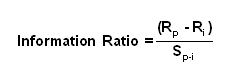
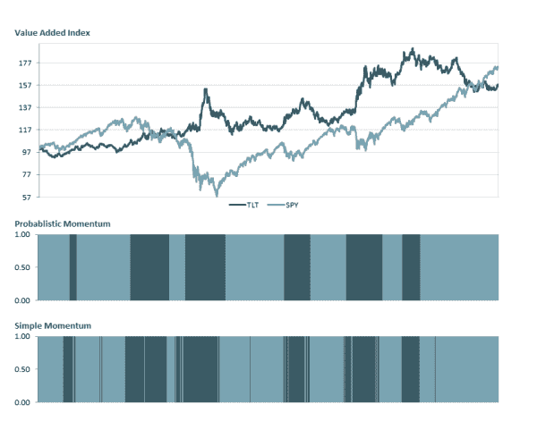
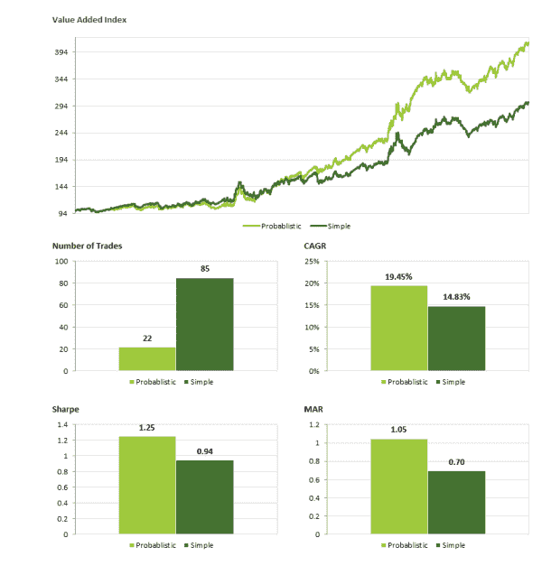
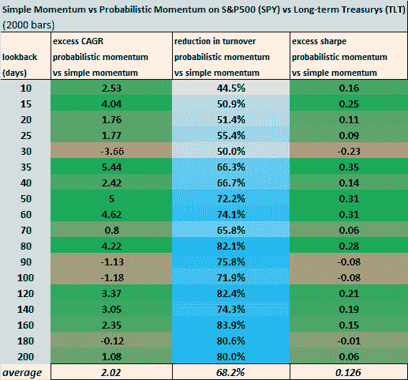

<!--yml
category: 未分类
date: 2024-05-12 17:55:28
-->

# Are Simple Momentum Strategies Too Dumb? Introducing Probabilistic Momentum | CSSA

> 来源：[https://cssanalytics.wordpress.com/2014/01/28/are-simple-momentum-strategies-too-dumb-introducing-probabilistic-momentum/#0001-01-01](https://cssanalytics.wordpress.com/2014/01/28/are-simple-momentum-strategies-too-dumb-introducing-probabilistic-momentum/#0001-01-01)

Momentum remains the most cherished and frequently used strategy for tactical investors and quantitative systems. Empirical support for momentum as a ubiqutous anomaly across global financial markets is virtually iron-clad– supported by even the most skeptical high priests of academic finance. Simple momentum strategies seek to buy the best performers by comparing the average or compound return between two assets or a group of assets. The beauty of this approach is its inherent simplicity– from a quantitative standpoint this increases the chances that a strategy will be robust and work in the future. The downside to this approach is that it does not capture some important pieces of information that can lead to: 1) incorrect preferences 2) make the system more susceptible to random noise, and  3) also dramatically magnify trading costs.

Consider the picture of the two horses above. If we are watching a horse race and try to determine which horse is going to take the lead over some time interval (say the next 10 seconds) our simplest strategy is to pick the horse that is currently winning now. For those of you who have observed a horse race, often two horses that are close will frequently shift positions in taking the lead. Sometimes they will alternate (negatively correlated) and other times they will accelerate and slow down at the same time (correlated). Certain horses tend to be less consistent and are prone to bursts of speed followed by a more measured pace (high volatility), while others are very steady (low volatility). Depending on how the horses are paired together, it may be difficult to accurately pick which one will lead just by simple momentum alone. Intuitively, the human eye can notice that one horse will lead the other with a consistent performance- and despite shifting positions occasionally, these shifts are small and and the leading horse is clearly gaining a significant lead. Ultimately, we must acknowledge that to determine whether one horse or one stock is outperforming the other, we need to capture the relationship between the two and also their relative noise in addition to just a simple measure of distance versus time.

In terms of investing, what we really want to know is how to determine the probability or confidence that one asset is going to outperform the other. Surely if the odds of outperformance are only 51% for example, this is not much better than flipping a coin. It is unlikely that two assets are statistically different from one another in that context. But how do we determine such a probability as it relates to momentum? Suppose we have assets A and B. We want to determine the probability that A will outperform B. This implies that B will serve as an index or benchmark to A. In standard finance curriculum, we know that the Information Ratio is an easy way to capture the relative returns in relation to the risk versus some benchmark. It is calculated as:

Where Rp= return on the portfolio or asset in question and

Ri= return on the index or benchmark

Sp-i= the tracking error of the portfolio versus the benchmark

The next question is how do we translate this to a probability? Typically one would use a normal distribution to find the probability using the information ratio (IR) as an input. However, the normal distribution is only appropriate with a large sample size. For smaller sample sizes that are prevalent with momentum lookbacks it is more appropriate to use a t-distribution. Thus

**Probabilistic Momentum (A vs B)= Tconf (IR)**

Probabilistic Momentum (B vs A)= 1-Probabilistic Momentum (A vs B)

This number for A vs B is subtracted from 1 if the information ratio is positive and kept as is if the information ratio is negative. The degrees of freedom is equal to the number of periods in the lookback minus one. In one neat calculation we have compressed the momentum measurement into a probability– one that incorporates the correlation and relative volatility of the two assets as well as their momentum. This allows us to make more intelligent momentum trades while also avoiding excessive transaction costs. The next aspect of probabilistic momentum is to make use of the concept of [hysteresis](http://en.wikipedia.org/wiki/Hysteresis).  Since markets are noisy it is difficult to tell whether one asset is outperforming the other. One effective filter is to avoid switching in between two boundaries. This implies switching assets only when the confidence of one being greater than the other is greater than a certain threshold. For example, if I specify a confidence level of 60%, I will switch only when each asset has a 60% probability of being greater than the other.  This leaves a buffer zone of 20% ( 2x(60%-50%)) to avoid noise in making the switch. The result is a smooth transition from one asset to the other. Lets first look at how probabilistic momentum appears versus a simple momentum scheme that uses just the relative return to make the switch between assets.

Notice that the switch between trading SPY and TLT (S&P500 and Treasurys) using probabilistic momentum are much smoother than using simple momentum. The timing of the trades also appears superior in many cases. Now lets look at a backtest of using probablistic momentum with a 60-day lookback versus a simple momentum system on both SPY and TLT with a confidence level of 60%.

As you can see, using probabilistic momentum manages to: 1) increase return 2) dramatically reduce turnover 3) increases the sharpe ratio of return to risk.  This is accomplished gross of trading costs, comparisons net of a reasonable trading cost are even more compelling. From a client standpoint, there is no question that fewer trades (especially avoiding insignificant trades that fail to capture the right direction) also is highly appealing, putting aside the obvious tax implications of more frequent trading. Is this concept robust? On average across a wide range of pairs and time frames the answer is yes. For example here is a broad sample of lookbacks for SPY vs TLT:

In this example, probabilistic momentum outperforms simple momentum over virtually all lookbacks with an incredible edge of over 2% cagr.  Turnover is reduced by an average of almost 70%. The sharpe ratio is on average roughly .13 higher for probabilistic versus simple. While this comparison is by no means conclusive, it shows the power of using this approach. There are a few caveats: 1) **the threshold for confidence** is a parameter that needs to be determined–although most work well. using larger thresholds creates greater lag and fewer trades, and vice versa and this tradeoff needs to be determined. As a guide for shorter lookbacks under 30 days a larger threshold  (75% or as high as 95% works for very short time frames)  is more appropriate. For longer lookbacks a confidence level between 55% and 75% tends to work better. 2)  **the trendier one asset is versus the other**, the smaller the advantage of using a large confidence level– this makes sense since perfect prediction would imply no filter to switch. 3) **distribution assumptions**— this is a long and boring story for another day.

This method of probabilistic momentum has a lot of potential extensions and applications. It also requires some additional complexity to integrate into a multi-asset context. But it is conceptually and theoretically appealing, and preliminary testing shows that even in its raw form there is substantial added value especially when transaction costs are factored in.