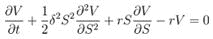
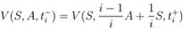
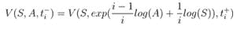

<!--yml
category: 未分类
date: 2024-05-18 08:10:46
-->

# Asian options and C++/Quantlib | Quant Corner

> 来源：[https://quantcorner.wordpress.com/2011/02/04/asian-options-and-cquantlib/#0001-01-01](https://quantcorner.wordpress.com/2011/02/04/asian-options-and-cquantlib/#0001-01-01)

Put simply, an **Asian option** is an option contract the payoff of which is determined by the averaging of the underlying over a certain period of time. As P.Wilmott (2006) and E.G.Haug (2007) both point out, Asian options are popular in the OTC energy markets and in other commodity markets lacking liquidity. In fact, averaging implies reduced price volatility, cheaper option prices, and market manipulations are less-likely.

Now, Asian options can be classified along several dimensions, that is:
– Average strike option vs average rate option
– Arithmetically vs geometrically averaging
– Discrete vs continuous averaging
– American vs European exercise

### **Average rate/price option vs average strike option**

Asian options are classified as **average rate** (**or average price**) or **average strike**. For detailed discussions, please refer to P.Wilmott (2006), J.C.Hull (2008), and C.Alexander’s (2008). The following table shows the possible payoffs:

| **Payoffs** | Call | Put |
| Average strike option | max (S-A, 0) | max (A-S, 0) |
| Average rate option (or average price option) | max (A-E, 0) | max (E-S, 0) |

**S** = underlying price
**E** = exercise (strike) price
**A** = averaged strike price

In this article, our interest goes to average rate/price options.

### **Continuous vs discrete/averaging**

In the **continuous case**, the **continuously sampled average** is modelled as an **integral**. In the **discrete case,** one averages a finite number of option values picked up during the life of the option. For example, we may use a weekly fixing.

In practice (due to legal and practical issues), **Asian options** are generally monitored at **discrete time**. And, we will only consider equal time lengths between fixings.

### **The Black-Scholes world and Asian options**

In the **discrete case**, one can get the price of an Asian option dealing with the **Black-Scholes stochastic differential equation** (**SDE**) for a defined so-called **updating rule**

In the arithmetic case, one has to tackle the problem of solving the standard **Black-Scholes** equation
[](https://quantcorner.wordpress.com/wp-content/uploads/2011/02/normal-black-scholes.jpg)for V(S, A, t) with
[](https://quantcorner.wordpress.com/wp-content/uploads/2011/02/v-a-t-arithmetic.jpg)but there is no **closed-form solution**.

In the geometric case, the average is the exponential sum of all the logarithms of the constituent prices, that we divide by the of discretely sampled prices (we restrict ourselves to equal time-steps).

Again, we take the normal **Black Scholes** equation

[](https://quantcorner.wordpress.com/wp-content/uploads/2011/02/normal-black-scholes.jpg)But, now the jump condition becomes:

[](https://quantcorner.wordpress.com/wp-content/uploads/2011/02/v_a_t_geometric1.jpg)

There exist **closed-form solutions** for **geometrically averaged Asian options**, as geometric averaging of lognormal random variables preserves lognormality. And, this is what we are going to code using **Quantlib**. In fact, **Quantlib** is endowed with a special option engine to **analytically** compute the price of discretely and geometrically averaged Asian options using that is the **AnalyticDiscreteGeometricAveragePriceAsianEngine** class.

We could compare our analytical calculation results with ones drawing from a **Monte Carlo simulation** if we wish. And, one may wish to price a arithmetic average option thanks to **MCDiscreteArithmeticAPEngine**.

### **The C++/Quantlib code**

We now turn to coding
___________________________
Option type                      :      put
Strike:                                 :      36
Underlying:                      :      40
Option expiration          :      December 10, 2011
Risk-free interest rate  :      6%
Dividend yield                 :      risk-free interest rate – (0,5 x (volatility²))
Time step between
successive fixings      :    7 days
Previous fixings         :    none
Volatility                    :    20% ______________________

```
#include<ql\quantlib.hpp>
#include <iostream>

using namespace QuantLib;

#if defined(QL_ENABLE_SESSIONS)
namespace QuantLib {

    Integer sessionId() { return 0; }
}
#endif

int main(int, char* []) {

    try {

		// Calendar set up
		Calendar calendar = TARGET();
		Date todaysDate(5, February, 2011);
		Settings::instance().evaluationDate() = todaysDate;

		// Option parameters
		Option::Type optionType(Option::Put);
		Average::Type averageType = Average::Geometric;
		Real strike = 40;
		Real underlying = 38;
		Rate riskFreeRate = 0.05;
		Volatility volatility = 0.20;
		Spread dividendYield = riskFreeRate-(0.5*volatility*volatility);
		Date maturity (10, December, 2011);
		DayCounter dayCounter = Actual365Fixed();
		Real runningSum = 1.0;
		Size pastFixings = 0;
		std::vector<Date> fixingDates;
		for (Date incrementedDate=todaysDate+7; incrementedDate<=maturity; incrementedDate += 7)
			fixingDates.push_back(incrementedDate);

		// Option exercise type
		boost::shared_ptr<Exercise> europeanExercise(
			new EuropeanExercise(
			maturity));

		// Quote handling
		Handle<Quote> underlyingH(
			boost::shared_ptr<Quote>(
			new SimpleQuote(
			underlying)));

		// Yield term structure handling
		Handle<YieldTermStructure> flatTermStructure(
			boost::shared_ptr<YieldTermStructure>(
			new FlatForward(
			todaysDate,
			riskFreeRate,
			dayCounter)));

		// Dividend term structure handling
		Handle<YieldTermStructure> flatDividendTermStructure(
			boost::shared_ptr<YieldTermStructure>(
			new FlatForward(
			todaysDate,
			dividendYield,
			dayCounter)));

		// Volatility structure handling
		Handle<BlackVolTermStructure> flatVolTermStructure(
			boost::shared_ptr<BlackVolTermStructure>(
			new BlackConstantVol(
			todaysDate,
			calendar,
			volatility,
			dayCounter)));

		// the BS equation behind
		boost::shared_ptr<BlackScholesMertonProcess> bsmProcess(
			new BlackScholesMertonProcess(
			underlyingH,
			flatDividendTermStructure,
			flatTermStructure,
			flatVolTermStructure));

		// Payoff
		boost::shared_ptr<StrikedTypePayoff> payoffAsianOption (
			new PlainVanillaPayoff(
			Option::Type(optionType),
			strike));

		// Discretely-averaged Asian option
		DiscreteAveragingAsianOption discreteAsianAverageOption(
			averageType,
			runningSum,
			pastFixings,
			fixingDates,
			payoffAsianOption,
			europeanExercise);

		// Pricing engine
		discreteAsianAverageOption.setPricingEngine(
		boost::shared_ptr<PricingEngine>(
		new AnalyticDiscreteGeometricAveragePriceAsianEngine(
		bsmProcess)));

		// Ouputting on the screen
		std::cout << "Option type = " << optionType << std::endl;
		std::cout << "Option maturity = " << maturity << std::endl;
		std::cout << "Underlying  = " << underlying << std::endl;
		std::cout << "Strike = " << strike << std::endl;
		std::cout << "Risk-free interest rate = " <<  std::setprecision(2) << io::rate(riskFreeRate) << std::endl;
		std::cout << "Dividend yield = " << std::setprecision(2) << io::rate(dividendYield) << std::endl;
		std::cout << "Volatility = " <<  std::setprecision(2) << io::volatility(volatility) << std::endl;
		std::cout << "Time-length between successive fixings = weekly time step" << std::endl;
		std::cout << "Previous fixings = " << pastFixings << std::endl;
		std::cout << std::endl;
		std::cout << "Option price : " << discreteAsianAverageOption.NPV() << std::endl;

		system("pause");
		return 0;

		} 
		catch (std::exception& e)
		{
		std::cerr << e.what() << std::endl;
		return 1;
		}
		catch (...)
		{
		std::cerr << "unknown error" << std::endl;
		return 1;
		}
}
```