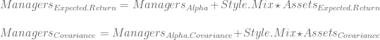

<!--yml
category: 未分类
date: 2024-05-18 14:45:43
-->

# Asset Allocation Process Summary | Systematic Investor

> 来源：[https://systematicinvestor.wordpress.com/2011/11/22/asset-allocation-process-summary/#0001-01-01](https://systematicinvestor.wordpress.com/2011/11/22/asset-allocation-process-summary/#0001-01-01)

I want to review the series of posts I wrote about Asset Allocation and Portfolio Construction and show how all of them fit into portfolio management framework.

**The first step of the Asset Allocation process** is to create the Input Assumptions: Expected Return, Risk, and Covariance. This is more art than science because we are trying to forecast future join realization for all asset classes. There are a number of approaches to create input assumptions, for example:

The robust estimation of covariance matrix is usually preferred. For example, the Covariance Shrinkage Estimator is nicely explained in [Honey, I Shrunk the Sample Covariance matrix by Olivier Ledoit and Michael Wolf (2003)](http://www.ledoit.net/honey.pdf).

Introduction of new asset classes with short historical information is problematic when using historical input assumptions. For example, Treasury Inflation-Protected Securities (TIPS) were introduced by the U.S. Treasury Department in 1997\. This is an attractive asset class that helps fight inflation. To incorporate TIPS, I suggest following methods outlined in [Analyzing investments whose histories differ in length by R. Stambaugh (1997)](http://www.cib.espol.edu.ec/Digipath/D_Papers/38608.pdf).

**The next step of the Asset Allocation process** to create efficient frontier and select target portfolio. I recommend looking at different risk measures in addition to the traditional standard deviation of the portfolio’s return. For example, [Maximum Loss, Mean-Absolute Deviation](https://systematicinvestor.wordpress.com/2011/10/14/maximum-loss-and-mean-absolute-deviation-risk-measures/), and [Expected shortfall (CVaR) and Conditional Drawdown at Risk (CDaR)](https://systematicinvestor.wordpress.com/2011/10/25/expected-shortfall-cvar-and-conditional-drawdown-at-risk-cdar-risk-measures/) risk measures. To select a target portfolio look at the portfolios on the efficient frontier and select one that satisfies both your quantitative and qualitative requirements. For example, a quantitative requirement can be a low historic drawdown, and a qualitative requirement can be a sensible weights. For example, if model suggest 13.2343% allocation to Fixed Income, round it down to 13%.

I also recommend looking at your target portfolio in reference to [the geometric efficient frontier](https://systematicinvestor.wordpress.com/2011/11/09/geometric-efficient-frontier/) to make sure your are properly compensated for the risk of your target portfolio. If you have a view on the possible future economic or market scenarios, please stress test your target portfolio to see how it will behave during these scenarios. For example read [A scenarios approach to asset allocation](http://www.mlc.com.au/resources/MLC/Marketing/Static%20Files/pdf/A_scenario_approach_to_asset_allocation.pdf) article.

Sometimes, we want to combine short-term tactical models with long-term strategic target portfolio. I think the best way to introduce tactical information into the strategic asset mix is to use Black-Litterman model. Please read my post [The Black-Litterman model](https://systematicinvestor.wordpress.com/2011/11/16/black-litterman-model/) for a numerical example.

**The next step of the Asset Allocation process** is to implement the target portfolio. If you follow a fund of funds approach and implement the target asset mix using external managers, please perform a [style analysis](https://systematicinvestor.wordpress.com/2011/11/18/style-analysis/) to determine the style mix of each manager and visually study if manager’s style was consistent over time. We want to invest into the managers that follow their investment mandate, so we can correctly map them into our target asset portfolio.

We can use the information from style analysis to create managers input assumptions. Let’s combine alpha and covariance of tracking error from the style analysis with asset input assumptions to determine managers input assumptions.

Managers Input Assumptions:

Note, we simply add up mean and covariance because Managers Tracking Error and Assets Returns are independent by construction.

Next we can create managers efficient frontier, such that all portfolios on this frontier will have target asset allocation, as implied from each manager’s style analysis.

**The last step of the Asset Allocation process** is to decide how and when to rebalance: update the portfolio to the target mix. You can potentially rebalance daily, but it is very costly. A good alternative is to rebalance every time period, i.e. quarterly, annually, or set boundaries, i.e. if asset class weight is more than 3% from it’s target then rebalance.

In Conclusion, **the Asset Allocation process** consists of four decision steps:

*   create Input Assumptions
*   create Efficient Frontier
*   implement Target Portfolio
*   create Rebalancing Plan

All these steps include some quantitative and qualitative iterations. I highly recommend experimenting as much as possible before committing your hard earned savings to an asset allocation portfolio.