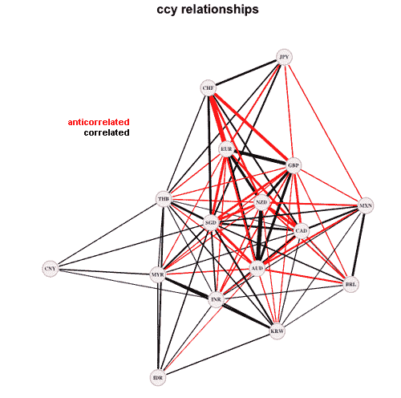
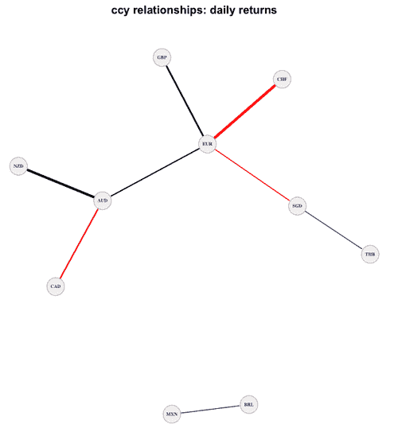
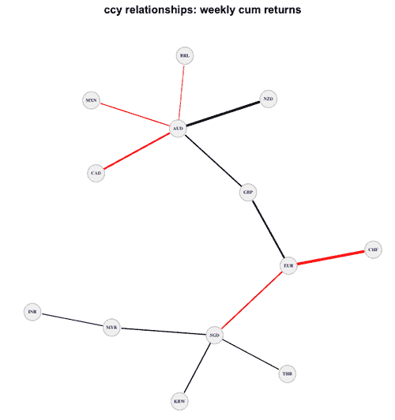
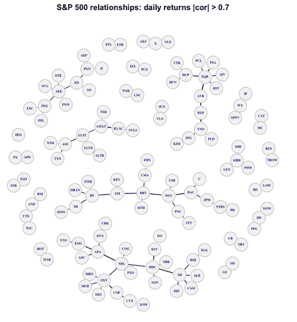

<!--yml
category: 未分类
date: 2024-05-18 15:35:43
-->

# Asset Selection | Tr8dr

> 来源：[https://tr8dr.wordpress.com/2009/12/28/10-years/#0001-01-01](https://tr8dr.wordpress.com/2009/12/28/10-years/#0001-01-01)

December 28, 2009 · 2:01 pm

I have a portfolio-based strategy that uses a probabalistic model to determine the “optimal” portfolio allocation vector for each trading period.    This can be applied either intra-day, daily, or across longer ranges of time. The dynamics and composition of the portfolio may change depending on holding period.

The algorithm uses an online learning and optimization approach.   Because this is computationally expensive, want to do some up-front analysis to determine the composition of the portfolio, i.e. what set of assets will provide a good degree of balance and information for weighting decisions.

So for instance, if we chose the S&P 500 stocks as the pool from which to select, which of these stocks should be selected?   There are many approaches to this and it really depends on the characteristic of your strategy.   A “buy & hold” style mutual fund manager is going to pick based on fundamentals with a view on growth over a medium – long term period and in keeping portfolio volatility within some limit.

In the case of this strategy, I am market neutral and look to have both appreciating and declining assets (provided there is sufficient liquidity).   However, as with buy & hold style portfolio managers I am also looking to provide a certain amount of diversification and balance in the portfolio.

**Maximum Spanning Trees**
A nice way to look at the basic relationships amongst assets is via a maximum spanning tree on the correlations between assets.   The idea is that such a graph spans all assets but each asset connects to only its strongest relationship.

One starts with a “seed” asset and determines the strongest relationship with another from the set and traverses recursively.   Additionally only include assets with relationships above a given correlation threshold weeding out assets with weak relationships.

**10 Years in FX
With a small number of assets, a full graph is reasonably intelligable, though carrying less information than a spanning tree in terms of relationship strength.**

Here is a spanning tree showing the relationships for a selection of currencies on daily returns (with a correlation threshold of 0.4).  In the case of daily returns one does not see strong connections between european currencies and south america currencies:

The same analysis on weekly cumulative returns shows stronger relationships:

**10 Years of the S&P 500** Here are the spanning relationships for the daily returns on S&P 500 stocks with absolute correlations > 0.7:

****