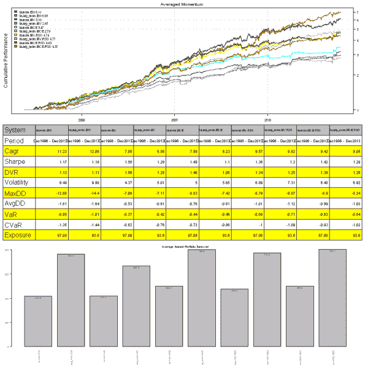
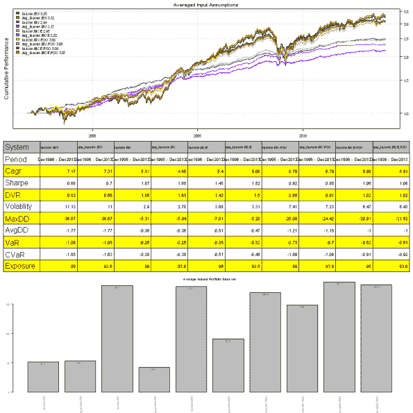
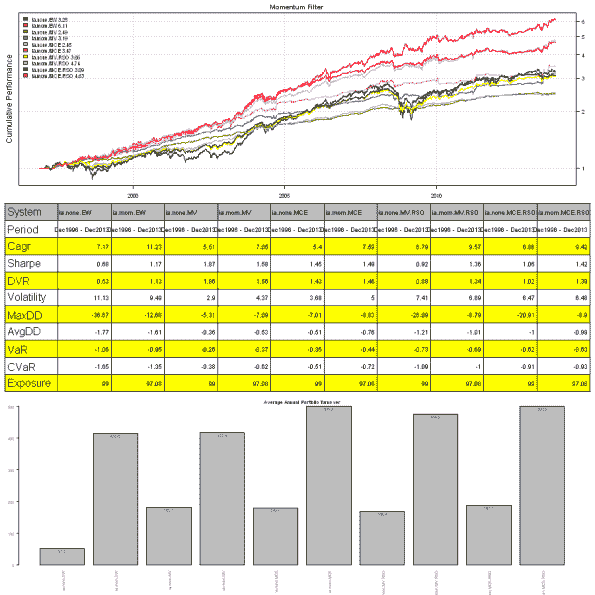
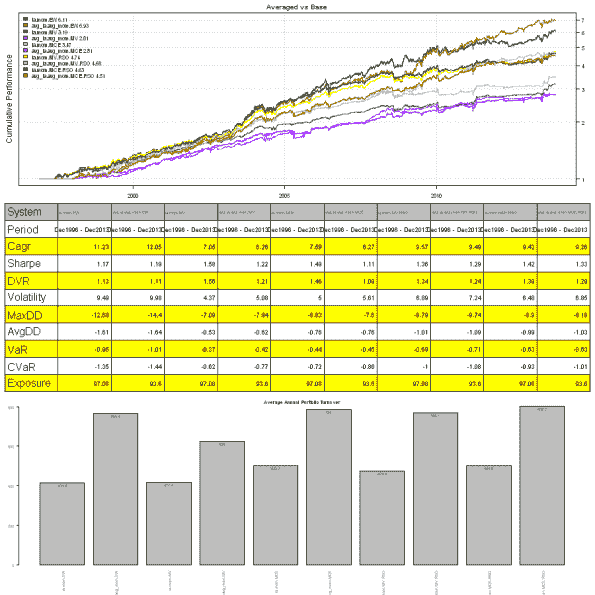

<!--yml
category: 未分类
date: 2024-05-18 14:31:12
-->

# Averaged Input Assumptions and Momentum | Systematic Investor

> 来源：[https://systematicinvestor.wordpress.com/2013/12/05/averaged-input-assumptions-and-momentum/#0001-01-01](https://systematicinvestor.wordpress.com/2013/12/05/averaged-input-assumptions-and-momentum/#0001-01-01)

Today I want to share another interesting idea contributed by Pierre Chretien. Pierre suggested using **Averaged** Input Assumptions and Momentum to create **reasonably quiet** strategy. The **averaging** techniques are used to avoid over-fitting any particular frequency.

To create **Averaged** Input Assumptions we combine returns over different look-back periods, giving more weight to the recent returns, to form overall Input Assumptions.

```

create.ia.averaged <- function(lookbacks, n.lag) {
	lookbacks = lookbacks
	n.lag = n.lag

	function(hist.returns, index=1:ncol(hist.returns), hist.all)
	{	
		nperiods = nrow(hist.returns)

		temp = c()
		for (n.lookback in lookbacks) 
			temp = rbind(temp, hist.returns[(nperiods - n.lookback - n.lag + 1):(nperiods - n.lag), ])
		create.ia(temp, index, hist.all)
	}	
}

```

To create **Averaged** Momentum we take a look-back weighted avaerage of momentums computed over different look-back periods.

```

momentum.averaged <- function(prices, 
	lookbacks = c(20,60,120,250) ,	# length of momentum look back
	n.lag = 3
) {
	momentum = 0 * prices
	for (n.lookback in lookbacks) {
		part.mom = mlag(prices, n.lag) / mlag(prices, n.lookback + n.lag) - 1
		momentum = momentum + 252 / n.lookback * part.mom
	}
	momentum / len(lookbacks)
}

```

Next let’s compare using historical Input Assumptions vs **Averaged** Input Assumptions and Momentum vs **Averaged** Momentum. I will consider Absolute Momentum (not cross sectional), for more information about relative and absolute momentum, please see

```

###############################################################################
# Load Systematic Investor Toolbox (SIT)
# https://systematicinvestor.wordpress.com/systematic-investor-toolbox/
###############################################################################
setInternet2(TRUE)
con = gzcon(url('http://www.systematicportfolio.com/sit.gz', 'rb'))
    source(con)
close(con)

	#*****************************************************************
	# Load historical data
	#****************************************************************** 
	load.packages('quantmod')

	# 10 funds
	tickers = spl('Us.Eq = VTI + VTSMX,
	Eurpoe.Eq = IEV + FIEUX,
	Japan.Eq = EWJ + FJPNX,
	Emer.Eq = EEM + VEIEX,
	Re = RWX + VNQ + VGSIX,		
	Com = DBC + QRAAX,
	Gold = GLD + SCGDX,
	Long.Tr = TLT + VUSTX,
	Mid.Tr = IEF + VFITX,
	Short.Tr = SHY + VFISX') 

	start.date = 1998

	dates = paste(start.date,'::',sep='') 

	data <- new.env()
	getSymbols.extra(tickers, src = 'yahoo', from = '1980-01-01', env = data, set.symbolnames = T, auto.assign = T)
		for(i in data$symbolnames) data[[i]] = adjustOHLC(data[[i]], use.Adjusted=T)
	bt.prep(data, align='keep.all', dates=paste(start.date-2,':12::',sep=''), fill.gaps = T)

	#*****************************************************************
	# Setup
	#****************************************************************** 		
	prices = data$prices   
		n = ncol(prices)
		nperiods = nrow(prices)

	periodicity = 'months'
	period.ends = endpoints(prices, periodicity)
		period.ends = period.ends[period.ends > 0]

	max.product.exposure = 0.6	

	#*****************************************************************
	# Input Assumptions
	#****************************************************************** 	
	lookback.len = 40
	create.ia.fn = create.ia

	# input assumptions are averaged on 20, 40, 60 days using 1 day lag
	ia.array = c(20,40,60)
	avg.create.ia.fn = create.ia.averaged(ia.array, 1)

	#*****************************************************************
	# Momentum
	#****************************************************************** 	
	universe = prices > 0

	mom.lookback.len = 120	
	momentum = prices / mlag(prices, mom.lookback.len) - 1
	mom.universe = ifna(momentum > 0, F)

	# momentum is averaged on 20,60,120,250 days using 3 day lag
	mom.array = c(20,60,120,250)	
	avg.momentum = momentum.averaged(prices, mom.array, 3)
	avgmom.universe = ifna(avg.momentum > 0, F)

	#*****************************************************************
	# Algos
	#****************************************************************** 	
	min.risk.fns = list(
		EW = equal.weight.portfolio,
		MV = min.var.portfolio,
		MCE = min.corr.excel.portfolio,

		MV.RSO = rso.portfolio(min.var.portfolio, 3, 100, const.ub = max.product.exposure),
		MCE.RSO = rso.portfolio(min.corr.excel.portfolio, 3, 100, const.ub = max.product.exposure)
	)

	#*****************************************************************
	# Code Strategies
	#****************************************************************** 	
make.strategy.custom <- function(name, create.ia.fn, lookback.len, universe, env) {
	obj = portfolio.allocation.helper(data$prices, 
		periodicity = periodicity,
		universe = universe,
		lookback.len = lookback.len,
		create.ia.fn = create.ia.fn,
		const.ub = max.product.exposure,
		min.risk.fns = min.risk.fns,
		adjust2positive.definite = F
	)
	env[[name]] = create.strategies(obj, data, prefix=paste(name,'.',sep=''))$models
}

	models <- new.env()	
	make.strategy.custom('ia.none'        , create.ia.fn    , lookback.len, universe       , models)
	make.strategy.custom('ia.mom'         , create.ia.fn    , lookback.len, mom.universe   , models)
	make.strategy.custom('ia.avg_mom'     , create.ia.fn    , lookback.len, avgmom.universe, models)
	make.strategy.custom('avg_ia.none'    , avg.create.ia.fn, 252         , universe       , models)
	make.strategy.custom('avg_ia.mom'     , avg.create.ia.fn, 252         , mom.universe   , models)
	make.strategy.custom('avg_ia.avg_mom' , avg.create.ia.fn, 252         , avgmom.universe, models)

	#*****************************************************************
	# Create Report
	#*****************************************************************		
strategy.snapshot.custom <- function(models, n = 0, title = NULL) {
	if (n > 0)
		models = models[ as.vector(matrix(1:len(models),ncol=n, byrow=T)) ]	

	layout(1:3)	
	plotbt(models, plotX = T, log = 'y', LeftMargin = 3, main = title)
		mtext('Cumulative Performance', side = 2, line = 1)
	plotbt.strategy.sidebyside(models)
	barplot.with.labels(sapply(models, compute.turnover, data), 'Average Annual Portfolio Turnover', T)	
}

	# basic vs basic + momentum => momentum filter has better results
	models.final = c(models$ia.none, models$ia.mom)
	strategy.snapshot.custom(models.final, len(min.risk.fns), 'Momentum Filter')

	# basic vs basic + avg ia => averaged ia reduce turnover
	models.final = c(models$ia.none, models$avg_ia.none)
	strategy.snapshot.custom(models.final, len(min.risk.fns), 'Averaged Input Assumptions')

	# basic + momentum vs basic + avg.momentum => mixed results for averaged momentum
	models.final = c(models$ia.mom, models$ia.avg_mom)
	strategy.snapshot.custom(models.final, len(min.risk.fns), 'Averaged Momentum')

	# basic + momentum vs avg ia + avg.momentum
	models.final = c(models$ia.mom, models$avg_ia.avg_mom)
	strategy.snapshot.custom(models.final, len(min.risk.fns), 'Averaged vs Base')	

```

Above, I compared results for the following 4 cases:
1\. Adding Momentum filter: all algos perfrom better
[](https://systematicinvestor.wordpress.com/wp-content/uploads/2013/12/plot3.png)

2\. Input Assumptions vs **Averaged** Input Assumptions: returns are very similar, but using **Averaged** Input Assumptions helps reduce portfolio turnover.
[](https://systematicinvestor.wordpress.com/wp-content/uploads/2013/12/plot2.png)

3\. Momentum vs **Averaged** Momentum: returns are very similar, but using **Averaged** Momentum increases portfolio turnover.
[](https://systematicinvestor.wordpress.com/wp-content/uploads/2013/12/plot1.png)

4\. historical Input Assumptions + Momentum vs **Averaged** Input Assumptions + **Averaged** Momentum: results are mixed, no consistent advantage of using **Averaged** methods


Overall, the **Averaged** methods is a very interesting idea and I hope you will experiemtn with it and share your findings, like Pierre. Pierre, again thank you very much for sharing.

The full source code and example for the [bt.averaged.test() function is available in bt.test.r at github](https://github.com/systematicinvestor/SIT/blob/master/R/bt.test.r).