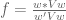
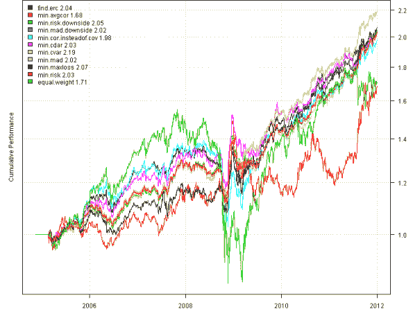
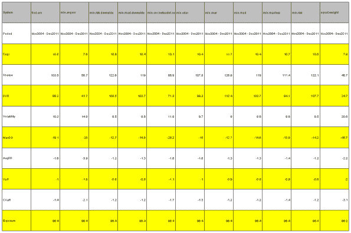
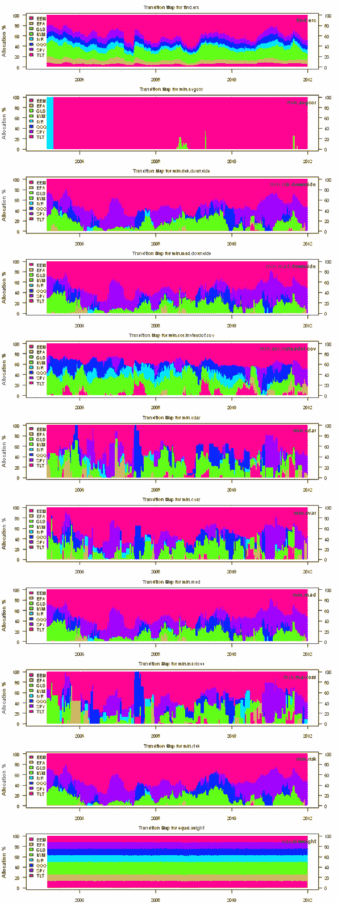
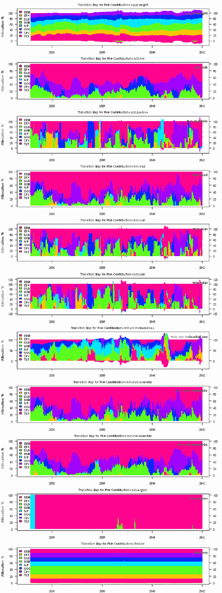
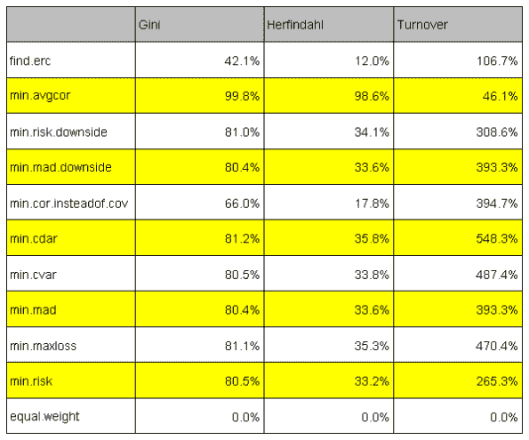

<!--yml
category: 未分类
date: 2024-05-18 14:41:53
-->

# Backtesting Asset Allocation portfolios | Systematic Investor

> 来源：[https://systematicinvestor.wordpress.com/2012/03/19/backtesting-asset-allocation-portfolios/#0001-01-01](https://systematicinvestor.wordpress.com/2012/03/19/backtesting-asset-allocation-portfolios/#0001-01-01)

In the last post, [Portfolio Optimization: Specify constraints with GNU MathProg language](https://systematicinvestor.wordpress.com/2012/03/14/portfolio-optimization-specify-constraints-with-gnu-mathprog-language/), Paolo and MC raised a question: “How would you construct an equal risk contribution portfolio?” Unfortunately, this problem cannot be expressed as a [Linear](http://en.wikipedia.org/wiki/Linear_programming) or [Quadratic Programming](http://en.wikipedia.org/wiki/Quadratic_programming) problem.

The outline for this post:

*   I will show how Equal Risk Contribution portfolio can be formulated and solved using a non-linear solver.
*   I will backtest Equal Risk Contribution portfolio and other Asset Allocation portfolios based on various risk measures I described in the [Asset Allocation](https://systematicinvestor.wordpress.com/?s=asset+allocation) series of post.

Pat Burns wrote an excellent post: [Unproxying weight constraints](http://www.portfolioprobe.com/2011/04/13/unproxying-weight-constraints/) that explains Risk Contribution – partition the variance of a portfolio into pieces attributed to each asset. The Equal Risk Contribution portfolio is a portfolio that splits total portfolio risk equally among its assets. (The concept is similar to 1/N portfolio – a portfolio that splits total portfolio weight equally among its assets.)

Risk Contributions (risk fractions) can be expressed in terms of portfolio weights  and covariance matrix (V):


Our objective is to find portfolio weights  such that Risk Contributions are equal for all assets. This objective function can be easily coded in R:

```

	risk.contribution = w * (cov %*% w)
	sum( abs(risk.contribution - mean(risk.contribution)) )

```

I recommend following references for a detailed discussion of Risk Contributions:

I will use a Nonlinear programming solver, [Rdonlp2](http://arumat.net/Rdonlp2/tutorial.html), which is based on donlp2 routine developed and copyright by [Prof. Dr. Peter Spellucci](http://www.mathematik.tu-darmstadt.de/fbereiche/numerik/staff/spellucci/spellucci.html) to solve for Equal Risk Contribution portfolio. [Please note that following code might not properly execute on your computer because Rdonlp2 package is required and not available on CRAN]

```

#--------------------------------------------------------------------------
# Equal Risk Contribution portfolio
#--------------------------------------------------------------------------
ia = aa.test.create.ia()
n = ia$n		

# 0 <= x.i <= 1
constraints = new.constraints(n, lb = 0, ub = 1)

# SUM x.i = 1
constraints = add.constraints(rep(1, n), 1, type = '=', constraints)		

# find Equal Risk Contribution portfolio 
w = find.erc.portfolio(ia, constraints)	

# compute Risk Contributions 	
risk.contributions = portfolio.risk.contribution(w, ia)

```

Next, I want to expand on the [Backtesting Minimum Variance portfolios](https://systematicinvestor.wordpress.com/2011/12/13/backtesting-minimum-variance-portfolios/) post to include Equal Risk Contribution portfolio and and other Asset Allocation portfolios based on various risk measures I described in the [Asset Allocation](https://systematicinvestor.wordpress.com/?s=asset+allocation) series of post.

```

###############################################################################
# Load Systematic Investor Toolbox (SIT)
# https://systematicinvestor.wordpress.com/systematic-investor-toolbox/
###############################################################################
con = gzcon(url('http://www.systematicportfolio.com/sit.gz', 'rb'))
    source(con)
close(con)

	#*****************************************************************
	# Load historical data
	#****************************************************************** 
	load.packages('quantmod,quadprog,corpcor,lpSolve')
	tickers = spl('SPY,QQQ,EEM,IWM,EFA,TLT,IYR,GLD')

	data <- new.env()
	getSymbols(tickers, src = 'yahoo', from = '1980-01-01', env = data, auto.assign = T)
		for(i in ls(data)) data[[i]] = adjustOHLC(data[[i]], use.Adjusted=T)							
	bt.prep(data, align='remove.na', dates='1990::2011')

	#*****************************************************************
	# Code Strategies
	#****************************************************************** 
	prices = data$prices   
	n = ncol(prices)

	# find week ends
	period.ends = endpoints(prices, 'weeks')
		period.ends = period.ends[period.ends > 0]

	#*****************************************************************
	# Create Constraints
	#*****************************************************************
	constraints = new.constraints(n, lb = 0, ub = 1)

	# SUM x.i = 1
	constraints = add.constraints(rep(1, n), 1, type = '=', constraints)		

	#*****************************************************************
	# Create Portfolios
	#*****************************************************************			
	ret = prices / mlag(prices) - 1
	start.i = which(period.ends >= (63 + 1))[1]

	weight = NA * prices[period.ends,]
	weights = list()
		# Equal Weight 1/N Benchmark
		weights$equal.weight = weight
			weights$equal.weight[] = ntop(prices[period.ends,], n)	
			weights$equal.weight[1:start.i,] = NA

		weights$min.var = weight
		weights$min.maxloss = weight
		weights$min.mad = weight
		weights$min.cvar = weight
		weights$min.cdar = weight
		weights$min.cor.insteadof.cov = weight
		weights$min.mad.downside = weight
		weights$min.risk.downside = weight

		# following optimizations use a non-linear solver
		weights$erc = weight		
		weights$min.avgcor = weight		

	risk.contributions = list()	
		risk.contributions$erc = weight		

	# construct portfolios
	for( j in start.i:len(period.ends) ) {
		i = period.ends[j]

		# one quarter = 63 days
		hist = ret[ (i- 63 +1):i, ]

		# create historical input assumptions
		ia = create.historical.ia(hist, 252)
			s0 = apply(coredata(hist),2,sd)		
			ia$correlation = cor(coredata(hist), use='complete.obs',method='pearson')
			ia$cov = ia$correlation * (s0 %*% t(s0))

		# construct portfolios based on various risk measures
		weights$min.var[j,] = min.risk.portfolio(ia, constraints)
		weights$min.maxloss[j,] = min.maxloss.portfolio(ia, constraints)
		weights$min.mad[j,] = min.mad.portfolio(ia, constraints)
		weights$min.cvar[j,] = min.cvar.portfolio(ia, constraints)
		weights$min.cdar[j,] = min.cdar.portfolio(ia, constraints)
		weights$min.cor.insteadof.cov[j,] = min.cor.insteadof.cov.portfolio(ia, constraints)
		weights$min.mad.downside[j,] = min.mad.downside.portfolio(ia, constraints)
		weights$min.risk.downside[j,] = min.risk.downside.portfolio(ia, constraints)

		# following optimizations use a non-linear solver		
		constraints$x0 = weights$erc[(j-1),]
		weights$erc[j,] = find.erc.portfolio(ia, constraints)		

		constraints$x0 = weights$min.avgcor[(j-1),]
		weights$min.avgcor[j,] = min.avgcor.portfolio(ia, constraints)						

		risk.contributions$erc[j,] = portfolio.risk.contribution(weights$erc[j,], ia)
	}

```

Next let’s backtest these portfolios and create summary statistics:

```

	#*****************************************************************
	# Create strategies
	#****************************************************************** 		
	models = list()
	for(i in names(weights)) {
		data$weight[] = NA
			data$weight[period.ends,] = weights[[i]]	
		models[[i]] = bt.run.share(data, clean.signal = F)
	}

	#*****************************************************************
	# Create Report
	#****************************************************************** 
	models = rev(models)

	# Plot perfromance
	plotbt(models, plotX = T, log = 'y', LeftMargin = 3)	    	
		mtext('Cumulative Performance', side = 2, line = 1)

	# Plot Strategy Statistics  Side by Side
	plotbt.strategy.sidebyside(models)

	# Plot transition maps
	layout(1:len(models))
	for(m in names(models)) {
		plotbt.transition.map(models[[m]]$weight, name=m)
			legend('topright', legend = m, bty = 'n')
	}

	# Plot risk contributions
	layout(1:len(risk.contributions))
	for(m in names(risk.contributions)) {
		plotbt.transition.map(risk.contributions[[m]], name=paste('Risk Contributions',m))
			legend('topright', legend = m, bty = 'n')
	}

	# Compute portfolio concentration and turnover stats based on the
	# On the property of equally-weighted risk contributions portfolios by S. Maillard, 
	# T. Roncalli and J. Teiletche (2008), page 22
	# http://www.thierry-roncalli.com/download/erc.pdf
	out = compute.stats( rev(weights),
		list(Gini=function(w) mean(portfolio.concentration.gini.coefficient(w), na.rm=T),
			Herfindahl=function(w) mean(portfolio.concentration.herfindahl.index(w), na.rm=T),
			Turnover=function(w) 52 * mean(portfolio.turnover(w), na.rm=T)
			)
		)

	out[] = plota.format(100 * out, 1, '', '%')
	plot.table(t(out))

```

[](https://systematicinvestor.wordpress.com/wp-content/uploads/2012/03/plot1-small3.png)

[](https://systematicinvestor.wordpress.com/wp-content/uploads/2012/03/plot2-small3.png)

[](https://systematicinvestor.wordpress.com/wp-content/uploads/2012/03/plot4-small3.png)

[](https://systematicinvestor.wordpress.com/wp-content/uploads/2012/03/plot5-small1.png)

[](https://systematicinvestor.wordpress.com/wp-content/uploads/2012/03/plot7-small.png)

The minimum variance (min.risk) portfolio performed very well during that period with 10.5% CAGR and 14% maximum drawdown. The Equal Risk Contribution portfolio (find.erc) also fares well with 10.5% CAGR and 19% maximum drawdown. The 1/N portfolio (equal.weight) is the worst strategy with 7.8% CAGR and 45% maximum drawdown.

One interesting way to modify this strategy is to consider different measures of volatility used to construct a covariance matrix. For example [TTR package](http://cran.r-project.org/web/packages/TTR/index.html) provides functions for the Garman Klass – Yang Zhang and the Yang Zhang volatility estimation methods. For more details, please have a look at the [Different Volatility Measures Effect on Daily MR by Quantum Financier](http://quantumfinancier.wordpress.com/2010/05/05/different-volatility-measures-effects-on-daily-mr/) post.

Inspired by the [I Dream of Gini by David Varadi](http://cssanalytics.wordpress.com/2012/02/24/i-dream-of-gini/), I will show how to create Gini efficient frontier in the next post.

To view the complete source code for this example, please have a look at the [bt.aa.test() function in bt.test.r at github](https://github.com/systematicinvestor/SIT/blob/master/R/bt.test.r).