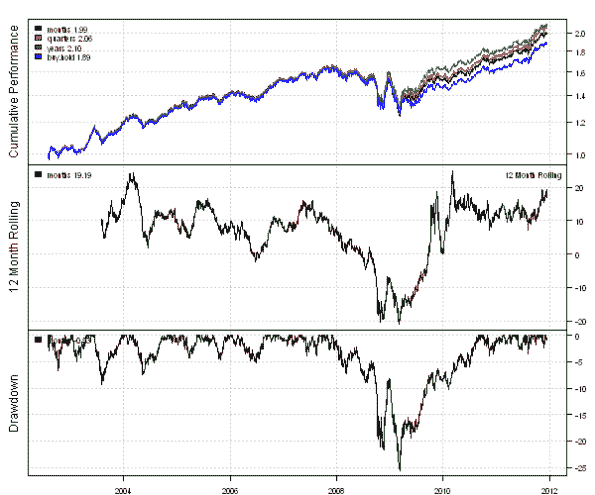
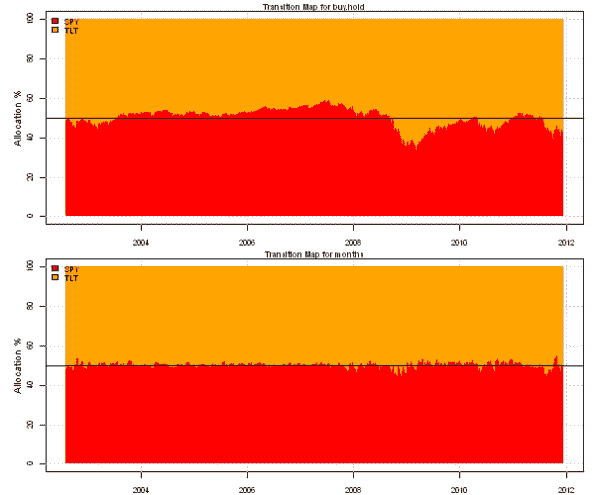
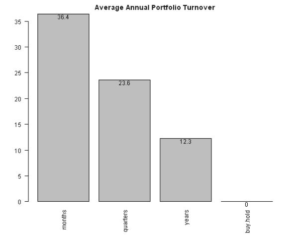
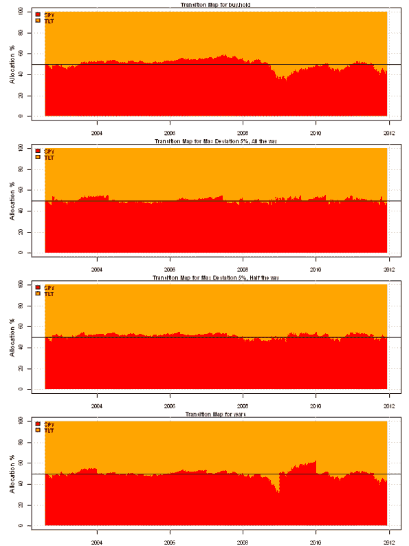
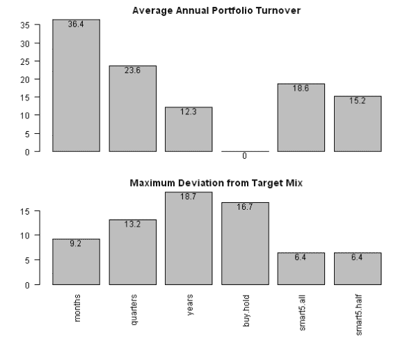
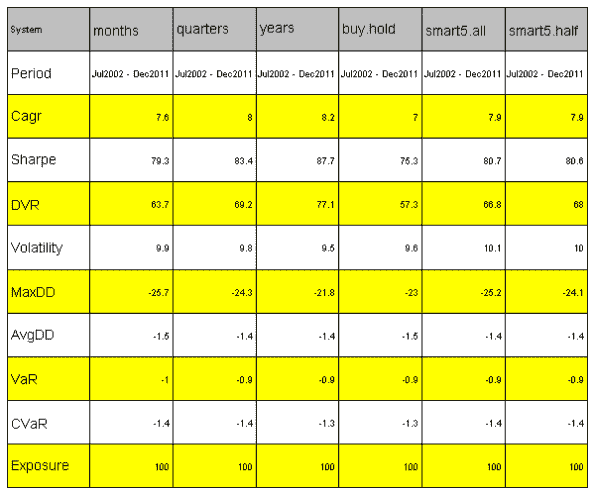

<!--yml
category: 未分类
date: 2024-05-18 14:44:52
-->

# Backtesting Rebalancing methods | Systematic Investor

> 来源：[https://systematicinvestor.wordpress.com/2011/12/16/backtesting-rebalancing-methods/#0001-01-01](https://systematicinvestor.wordpress.com/2011/12/16/backtesting-rebalancing-methods/#0001-01-01)

I wrote about Rebalancing in the [Asset Allocation Process Summary](https://systematicinvestor.wordpress.com/2011/11/22/asset-allocation-process-summary/) post. Deciding how and when to rebalance (update the portfolio to the target mix) is one of the critical steps in the Asset Allocation Process. I want to study the portfolio performance and [turnover](http://wiki.fool.com/Portfolio_turnover) for the following Rebalancing methods:

*   Periodic Rebalancing: rebalance to **the target mix** every month, quarter, year.
*   Maximum Deviation Rebalancing: rebalance to **the target mix** when asset weights deviate more than a given percentage from the target mix.
*   Maximum Deviation Rebalancing: rebalance **half-way to the target mix** when asset weights deviate more than a given percentage from the target mix.

I will study a very simple target mix: 50% allocation to equities ([SPY](http://www.google.com/finance?q=spy)) and 50% allocation to fixed income ([TLT](http://www.google.com/finance?q=tlt)).

First, let’s examine Periodic Rebalancing. Following code implements this strategy using the backtesting library in the [Systematic Investor Toolbox](https://systematicinvestor.wordpress.com/systematic-investor-toolbox/):

```

# Load Systematic Investor Toolbox (SIT)
setInternet2(TRUE)
con = gzcon(url('https://github.com/systematicinvestor/SIT/raw/master/sit.gz', 'rb'))
	source(con)
close(con)

	#*****************************************************************
	# Load historical data
	#****************************************************************** 
	load.packages('quantmod')
	tickers = spl('SPY,TLT')

	data <- new.env()
	getSymbols(tickers, src = 'yahoo', from = '1900-01-01', env = data, auto.assign = T)
		for(i in ls(data)) data[[i]] = adjustOHLC(data[[i]], use.Adjusted=T)
	bt.prep(data, align='remove.na', dates='1900::2011')

	#*****************************************************************
	# Code Strategies
	#****************************************************************** 
	prices = data$prices   
	nperiods = nrow(prices)
	target.allocation = matrix(c(0.5, 0.5), nrow=1)

	# Buy & Hold	
	data$weight[] = NA	
		data$weight[1,] = target.allocation
		capital = 100000
		data$weight[] = (capital / prices) * data$weight
	buy.hold = bt.run(data, type='share', capital=capital)

	# Rebalance periodically
	models = list()
	for(period in spl('months,quarters,years')) {
		data$weight[] = NA	
			data$weight[1,] = target.allocation

			period.ends = endpoints(prices, period)
				period.ends = period.ends[period.ends > 0]		
			data$weight[period.ends,] = repmat(target.allocation, len(period.ends), 1)

			capital = 100000
			data$weight[] = (capital / prices) * data$weight
		models[[period]] = bt.run(data, type='share', capital=capital)	
	}
	models$buy.hold = buy.hold				

	#*****************************************************************
	# Create Report
	#****************************************************************** 		
	plotbt.custom.report(models)		

	# Plot BuyHold and Monthly Rebalancing Weights
	layout(1:2)
	plotbt.transition.map(models$buy.hold$weight, 'buy.hold', spl('red,orange'))
		abline(h=50)
	plotbt.transition.map(models$months$weight, 'months', spl('red,orange'))
		abline(h=50)

	# helper function to create barplot with labels
	barplot.with.labels <- function(data, main, plotX = TRUE) {
		par(mar=c( iif(plotX, 6, 2), 4, 2, 2))
		x = barplot(100 * data, main = main, las = 2, names.arg = iif(plotX, names(data), ''))
		text(x, 100 * data, round(100 * data,1), adj=c(0.5,1), xpd = TRUE)
	}
	# Plot Portfolio Turnover for each Rebalancing method
	layout(1)
	barplot.with.labels(sapply(models, compute.turnover, data), 'Average Annual Portfolio Turnover')

```

[](https://systematicinvestor.wordpress.com/wp-content/uploads/2011/12/plot1-small3.png)

[](https://systematicinvestor.wordpress.com/wp-content/uploads/2011/12/plot2-small3.png)

[](https://systematicinvestor.wordpress.com/wp-content/uploads/2011/12/plot3-small3.png)

As expected, the Buy and Hold strategy has 0 turnover, but deviates a lot from the Target Mix. On the other hand, Monthly Rebalancing keeps portfolio close to the Target Mix, but at the cost of the 36% annual turnover.

Next to trigger Rebalancing based on the Maximum Deviation from the Target Mix, I created a function, bt.max.deviation.rebalancing, that iteratively searches for a violation of Maximum Deviation and forces the rebalancing once the violation took place. This function can rebalance all the way to the target mix or partially based on the rebalancing.ratio. For example, for rebalancing.ratio equal to 0, each time the violation of Maximum Deviation is found, the portfolio is rebalanced all the way to the target mix, and for rebalancing.ratio equal to 0.5, the portfolio is rebalanced half way to the target mix.

```

# Rebalancing method based on maximum deviation
bt.max.deviation.rebalancing <- function
(
	data, 
	model, 
	target.allocation, 
	max.deviation = 3/100, 
	rebalancing.ratio = 0	# 0 means rebalance all-way to target.allocation
				# 0.5 means rebalance half-way to target.allocation
) 
{
	start.index = 1
	nperiods = nrow(model$weight)
	action.index = rep(F, nperiods)

	while(T) {	
		# find rows that violate max.deviation
		weight = model$weight
		index = which( apply(abs(weight - repmat(target.allocation, nperiods, 1)), 1, max) > max.deviation)	

		if( len(index) > 0 ) {
			index = index[ index > start.index ]

			if( len(index) > 0 ) {
				action.index[index[1]] = T

				data$weight[] = NA	
					data$weight[1,] = target.allocation

					temp = repmat(target.allocation, sum(action.index), 1)
					data$weight[action.index,] = temp + 
						rebalancing.ratio * (weight[action.index,] - temp)					

					capital = 100000
					data$weight[] = (capital / data$prices) * data$weight
				model = bt.run(data, type='share', capital=capital, silent=T)	
				start.index = index[1]
			} else break			
		} else break		
	}
	return(model)
}

```

Now, let’s compare 5% Maximum Deviation Rebalancing to the Periodic Rebalancing.

```

	#*****************************************************************
	# Code Strategies that rebalance based on maximum deviation
	#****************************************************************** 

	# rebalance to target.allocation when portfolio weights are 5% away from target.allocation
	models$smart5.all = bt.max.deviation.rebalancing(data, buy.hold, target.allocation, 5/100, 0) 

	# rebalance half-way to target.allocation when portfolio weights are 5% away from target.allocation
	models$smart5.half = bt.max.deviation.rebalancing(data, buy.hold, target.allocation, 5/100, 0.5) 

	#*****************************************************************
	# Create Report
	#****************************************************************** 						
	# Plot BuyHold, Years and Max Deviation Rebalancing Weights	
	layout(1:4)
	plotbt.transition.map(models$buy.hold$weight, 'buy.hold', spl('red,orange'))
		abline(h=50)
	plotbt.transition.map(models$smart5.all$weight, 'Max Deviation 5%, All the way', spl('red,orange'))
		abline(h=50)
	plotbt.transition.map(models$smart5.half$weight, 'Max Deviation 5%, Half the way', spl('red,orange'))
		abline(h=50)
	plotbt.transition.map(models$years$weight, 'years', spl('red,orange'))
		abline(h=50)

	# Plot Portfolio Turnover and Maximum Deviation for each Rebalancing method
	layout(1:2)
	barplot.with.labels(sapply(models, compute.turnover, data), 'Average Annual Portfolio Turnover', F)
	barplot.with.labels(sapply(models, compute.max.deviation, target.allocation), 'Maximum Deviation from Target Mix')

	# Plot Strategy Statistics  Side by Side
	plotbt.strategy.sidebyside(models)

```

[](https://systematicinvestor.wordpress.com/wp-content/uploads/2011/12/plot4-small1.png)

[](https://systematicinvestor.wordpress.com/wp-content/uploads/2011/12/plot5-small1.png)

[](https://systematicinvestor.wordpress.com/wp-content/uploads/2011/12/plot6-small1.png)

As expected, the Maximum Deviation Rebalancing keeps portfolio close to the Target Mix. Moreover, the Maximum Deviation Rebalancing strategy has lower turnover than the Monthly Rebalancing. So in this case the Maximum Deviation Rebalancing wins over Periodic Rebalancing method.

To view the complete source code for this example, please have a look at the [bt.rebalancing.test() function in bt.test.r at github](https://github.com/systematicinvestor/SIT/blob/master/R/bt.test.r).