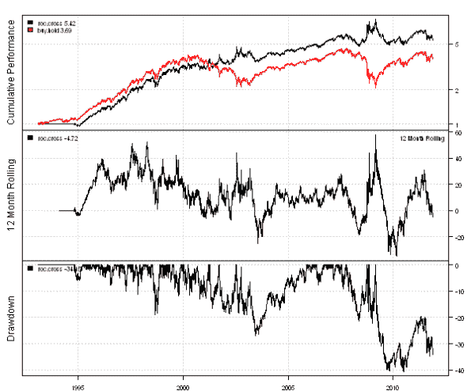
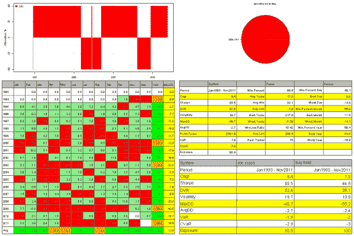
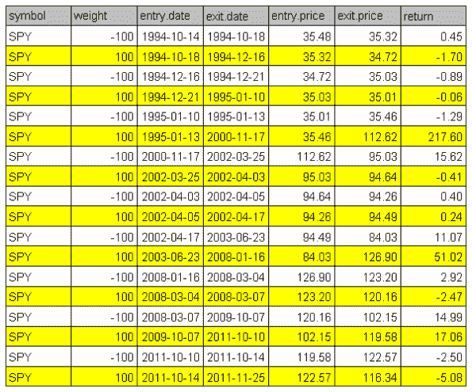
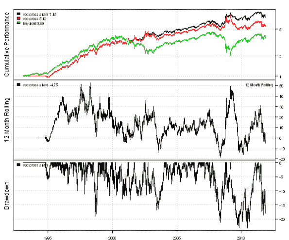
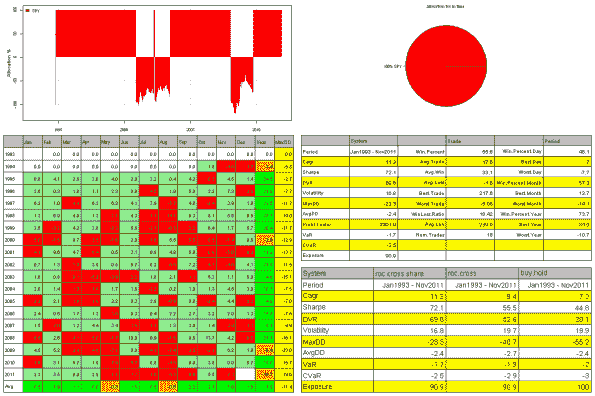

<!--yml
category: 未分类
date: 2024-05-18 14:45:09
-->

# Backtesting with Short positions | Systematic Investor

> 来源：[https://systematicinvestor.wordpress.com/2011/12/02/backtesting-with-short-positions/#0001-01-01](https://systematicinvestor.wordpress.com/2011/12/02/backtesting-with-short-positions/#0001-01-01)

I want to illustrate Backtesting with Short positions using an interesting strategy introduced by [Woodshedder](http://ibankcoin.com/woodshedderblog/author/woodshedder/) in the [Simple, Long-Term Indicator Near to Giving Short Signal](http://ibankcoin.com/woodshedderblog/2011/08/28/simple-long-term-indicator-near-to-giving-short-signal/) post. This strategy was also analyzed in details by MarketSci in [Woodshedder’s Long-Term Indicator](http://marketsci.wordpress.com/2011/10/04/woodshedders-long-term-indicator/) post.

The strategy uses the 5 day rate of change (ROC5) and the 252 day rate of change (ROC252):

*   Buy (or cover short) at the close if yesterday the ROC252 crossed above the ROC5 and today the ROC252 is still above the ROC5.
*   Sell (or open short) at the close if yesterday the ROC5 crossed above the ROC252 and today the ROC5 is still above the ROC252.

Following is a sample code to implement this strategy using the backtesting library in the [Systematic Investor Toolbox](https://systematicinvestor.wordpress.com/systematic-investor-toolbox/):

```

# Load Systematic Investor Toolbox (SIT)
setInternet2(TRUE)
con = gzcon(url('https://github.com/systematicinvestor/SIT/raw/master/sit.gz', 'rb'))
	source(con)
close(con)

	#*****************************************************************
	# Load historical data
	#******************************************************************
	load.packages('quantmod')
	tickers = spl('SPY')

	data 	getSymbols(tickers, src = 'yahoo', from = '1970-01-01', env = data, auto.assign = T)
	bt.prep(data, align='keep.all', dates='1970::2011')

	#*****************************************************************
	# Code Strategies
	#******************************************************************
	prices = data$prices

	# Buy & Hold
	data$weight[] = 1
	buy.hold = bt.run(data)

	# ROC Strategy
	roc5 = prices / mlag(prices,5)
	roc252 = prices / mlag(prices,252)
		roc5.1 = mlag(roc5,1)
		roc5.2 = mlag(roc5,2)
		roc252.1 = mlag(roc252,1)
		roc252.2 = mlag(roc252,2)

	data$weight[] = NA
		data$weight$SPY[] = iif(roc252.2 < roc5.2 & roc252.1 > roc5.1 & roc252 > roc5, 1, data$weight$SPY)
		data$weight$SPY[] = iif(roc252.2 > roc5.2 & roc252.1 < roc5.1 & roc252 < roc5, -1, data$weight$SPY)
	roc.cross = bt.run(data, trade.summary=T)

	#*****************************************************************
	# Create Report
	#******************************************************************
	plotbt.custom.report(roc.cross, buy.hold, trade.summary=T)

```

[](https://systematicinvestor.wordpress.com/wp-content/uploads/2011/11/plot1-small10.png)

[](https://systematicinvestor.wordpress.com/wp-content/uploads/2011/11/plot2-small9.png)

[](https://systematicinvestor.wordpress.com/wp-content/uploads/2011/11/plot3-small7.png)

A quick comparison between the equity curve of the ROC strategy and the equity curve shown by Woodshedder reveals a significant discrepancy. The ROC strategy’s equity curve peaked in 2008-2009, while the equity curve shown by Woodshedder peaked in 2011\. I re-created this strategy in Amibroker and got similar results to the ones reported by Woodshedder. So what is wrong?

The problem lies in a way the backtest is created, I used weights, not shares to create the backtest. Let’s compare the backtest performance using weights or shares of the **long-only** strategy when prices rise 10% each period:

| P0 | P1 | P2 |
| 100 | 110 | 121 |
|  | R1 | R2 |
|  | 10% | 10% |

The total return using one share, [(one share) * P2] / 100 – 1 = 21% and the total return using weights, (1+R1)(1+R2) – 1 = 21%, are identical.

Consider the performance using weights or shares of the **short-only** strategy when prices fall 10% each period:

| P0 | P1 | P2 |
| 100 | 90 | 81 |
|  | R1 | R2 |
|  | -10% | -10% |

The total return using one share, [200 – (one share) * P2] / 100 – 1 = 19% and the total return using weights, (1+R1)(1+R2) – 1 = 21%, are different.

The difference arises because in period 1, prices have dropped 10% and hence we have $10 additional dollars to invest. So if the proceeds are reinvested, the portfolio value in period 0 is $100, in period 1 is $110 = 1.1 * $100, in period 2 is $121 = 1.1 * $110, and the total return is $121 / $100 – 1 = 21%.

Conclusion, if Backtesting with Short positions we cannot use weights * return to compute portfolio return because it assumes that all mark-to-market gains are reinvested right away, instead we should use shares to create the backtest.

Here is the code that implements shares backtest (type=’share’ in bt.run function) :

```

	#*****************************************************************
	# Code Strategies
	#****************************************************************** 	
	# If Backtesting with Short positions, always use type = 'share' backtest to get realistic results.
	data$weight[] = NA
		data$weight$SPY[] = iif(roc252.2 < roc5.2 & roc252.1 > roc5.1 & roc252 > roc5, 1, data$weight$SPY)
		data$weight$SPY[] = iif(roc252.2 > roc5.2 & roc252.1 < roc5.1 & roc252 < roc5, -1, data$weight$SPY)	

		capital = 100000
		data$weight[] = (capital / prices) * bt.exrem(data$weight)
	roc.cross.share = bt.run(data, type='share', trade.summary=T)							

	#*****************************************************************
	# Create Report
	#******************************************************************
	plotbt.custom.report(roc.cross.share, roc.cross, buy.hold, trade.summary=T)

```

[](https://systematicinvestor.wordpress.com/wp-content/uploads/2011/11/plot4-small3.png)

[](https://systematicinvestor.wordpress.com/wp-content/uploads/2011/11/plot5-small2.png)

Finally, the equity curve of the ROC strategy using type=’share’ in backtest is very similar to one reported by Woodshedder.

To view the complete source code for this example, please have a look at the [bt.roc.cross.test() function in bt.test.r at github](https://github.com/systematicinvestor/SIT/blob/master/R/bt.test.r).