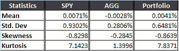
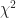
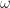
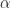
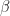
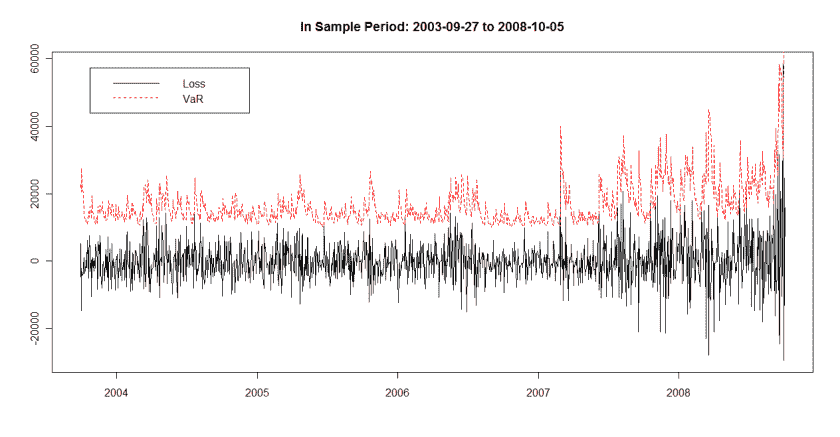
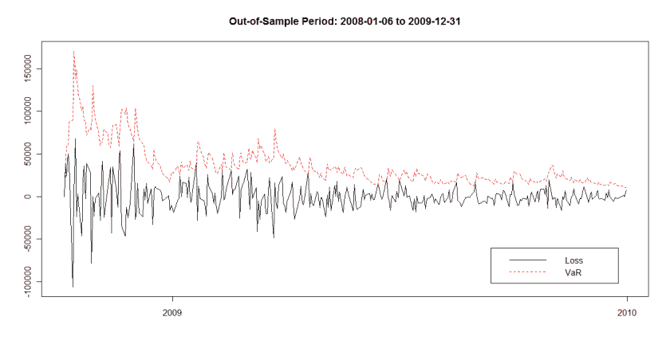
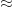

<!--yml
category: 未分类
date: 2024-05-18 14:02:33
-->

# Basic Introduction to GARCH and EGARCH (part 2) – Quantum Financier

> 来源：[https://quantumfinancier.wordpress.com/2010/09/14/basic-introduction-to-garch-and-egarch-part-2/#0001-01-01](https://quantumfinancier.wordpress.com/2010/09/14/basic-introduction-to-garch-and-egarch-part-2/#0001-01-01)

As promised in last post, we will look at a popular implementation of the GARCH(1,1) model: the value-at-risk. I chose this implementation because it is used quite often in academic literature and for its educational purpose. The value-at-risk, also abbreviated VaR, is a measure of the risk for a portfolio. To recap, the 1 percent value at risk is defined as the number of dollars that one can statistically be 99 percent certain exceeds any losses for the next day or alternatively the loss suffered 1 percent of the time for the portfolio. A quick word of caution; it is only yet another risk measure for you to take in consideration when making investments decisions.

For this example, let us rememorize the good ol’ days (not that good) of the recent crisis and test the concept using GARCH and VaR step by step. We will look at the VaR of a $1,000,000 portfolio of 70% stocks (SPY) and 30% bonds (AGG) for the sample period ranging from AGG’s inception 2003-09-27 to the day before the Black week 2008-10-05\. This date is arbitrarily chosen by yours truly since I know it was a volatile period of great fear in the market. Then we will look at the VaR’s performance using the constructed GARCH model in the midst of the crisis for our out-of-sample period from 2008-10-06 to the end of 2009.

First we construct the portfolio, see below the numbers for each individual component and the portfolio in the last column.

From the standard deviation in the table, we see that SPY is far more volatile than AGG. Also note the very fat tail of SPY (normal value is 3). Finally, the negative skewness indicates that the left tail (negative returns) is longer, translating into more extreme losses.

Next, we look for the presence of an ARCH effect. We fit an ARCH model of order 1 to our sample of portfolio returns, than we compute the squared residuals. From the 15 lags autocorrelation values, we see that there seems to be a significant autocorrelation effect in our squared residuals (the autocorrelation are but for the first one positive and fairly high). But in disciplined investors that we are, we don’t always believe the first numbers we get. Thus, we will test the significance of the ARCH effect using a Ljung box test resulting in a  statistic of 179.4636, significant at the .05 confidence level. We are now statistically confident in the presence of ARCH effect in our data.

At this point we are ready to fit our GARCH(1,1) model once we are done, we get the following coefficients  = 4.604e-06,  = 3.090e-01 and finally  = 6.485e-01\. Now that we have the model, we can forecast our standard deviation (volatility). After this step is completed, we want to find the 1 percent quantile of our volatility for our VaR. We obtain 0.003995719, now to find our VaR we have a choice on the distribution assumption. We can assume it is normally distributed and multiply this by 2.327, because 1 percent of a normal random variable lays 2.327 standard deviations below the mean. Now I don’t like that since I usually prefer to steer clear of the normality assumption when dealing with financial data. I would rather use the empirical distribution of the error observed in my model. Simply standardize the model residual and observe its empirical distribution to find the 1 percent quantile; we obtain a result of 2.619797.

Using this data, we can now estimate our VaR. We simply multiply our 1 percent quantile for our forecast (0.003995719) and our standardized residuals (2.619797) and the portfolio capital. We obtain a VaR of $10,467.97, compare it to the $9298.04 when assuming normal distribution. Now we could rinse and repeat every day predicting for tomorrow. Just to complete the analysis, take a look at the graph below where the daily loss is plotted with the daily VaR. Note that the axis are reversed (positive numbers are a loss, negative a gain).

Now following the same methodology, we use the model (not recalculated, only updated with the new data) on our out-of-sample data, starting from Black week on Oct. 6, until the end of 2009\. Same principle applies for the axis.

Note how the value-at-risk for the portfolio is above the suffered loss for almost all data points for the period ( 97%). It looks as if the VaR measure was mostly conservative for the period. There you have it; I hope that this step by step application post was useful and clear and that it sheds a bit of light on an at times obscure topic. Stay tuned for the last post in this series on EGARCH.

QF